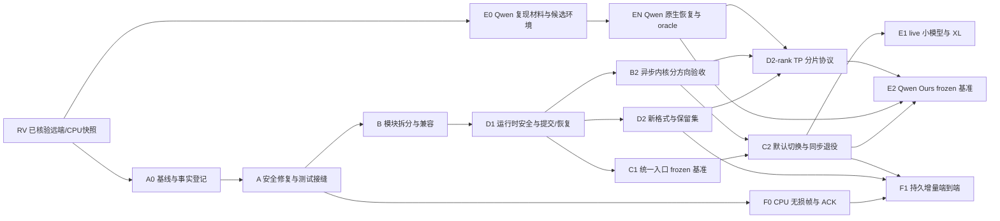

# NPU-NVMe 长期开发与验收计划

> **状态**：正式生效的长期计划；版本 v1.3，2026-09-11。本文件是后续实施顺序、契约和阶段状态的唯一维护入口。
> **固定远端快照**：本轮已执行 `git fetch origin --prune`；`origin/master=5b164b69ba8b4bdeb1f2eb7c454da0e3e9dc9e98`，`origin/exp/ppt-evidence-20260829=ef21f922deeaa9f6d684f7dc3b14b9484a8f74fe`。采集时刻与本地差异摘要见 [工作区快照](../results/development-plan-review-20260911/workspace_snapshot.json)。
> **源码审查基线**：`5b164b69ba8b4bdeb1f2eb7c454da0e3e9dc9e98`（下称 `BASE`）；`python/direct_checkpoint.py` blob `2b0295cc…`、`src/npu_nvme.c` blob `c7b12334…`。当前实验工作树并非 BASE，不得用其文件行号替代主线引用。
> **继承来源**：临时规划 v1.2 的 SHA-256 为 `077b2c9201f5cd2203534355f7c078bab157b72f921f6c3c610af7fe646a2cd4`。原稿引用的 `MODULE_IMPLEMENTATION_EXPECTATIONS_20260910.md`、`npu-nvme-module-report.md`、`npu-nvme-6module-facts.md`、`delta_subsystem_review.md`、`AUDIT_REPORT_COMPARISON_20260910_rev.md` 未在本轮工作区检索中找到；原稿记载的来源 hash/探针结论按历史摘要保留，未重新认证。本计划自包含，缺原报告不阻断独立源码审查；缺原始证据的断言必须降级或重做。
> **审查结论**：路线有条件可行；优先 FULL 安全与正确性，继而拆分、统一入口与异步收敛，Qwen 原生恢复独立推进。范围、工期与迁入条件见 §0.7；[本轮进展与可行性审查](DEVELOPMENT_PROGRESS_REVIEW_20260911.md) 保存具体依据。
> **执行边界**：规划审查轮次只做只读核查与 CPU 测试。后续实施已在独立 `codex/long-term-v1.3` 工作树完成 A 软件门禁、推进 B 拆分并执行 Native Qwen TP4 训练/恢复；已在用户授权的 0000:83:00.0 整盘范围执行 V2 格式化、H01-compat、H02 子集和 FULL-IO；未做环境安装变更、主线合并或推送。实施证据与未完成项见 §8.4/§9；规划审查的历史描述不回写为新实测。

## 第 0 部分　如何使用本文

### 0.1 三类读者的读法

| 角色 | 必读 | 产出 |
|---|---|---|
| 实施者 | §1 契约、§3 对应门禁、§7 阶段合同、§9 工作单、§4.3 依赖、§8.5 命令 | 代码 + 门禁运行记录 |
| 验收者 | §2 测试基础设施、§3 门禁的"判据"与"不能证明"、§4.4 冻结规则 | 签署的门禁结论（含环境哈希） |
| 决策者 | §1.3 优先级裁决、§4.3 阶段依赖图、§6.1 风险登记册、§4.7 资源与归属 | 范围裁剪、里程碑批准 |

### 0.2 行号引用规则

除 §0.7/§9 明示的本地新增入口外，本文既有 `文件:行号` 均指 `BASE`。核对方式**必须使用提交与 blob**，不得使用行数或要求当前工作树切换到 BASE：

```bash
git rev-parse HEAD                                    # 记录实际工作树身份
git rev-parse 5b164b6:python/direct_checkpoint.py       # BASE blob，2b0295cc…
git rev-parse 5b164b6:src/npu_nvme.c                    # BASE blob，c7b12334…
git show 5b164b6:python/direct_checkpoint.py | sed -n '459,478p'   # 抽查任一引用
```

> **已知陷阱（务必记录）**：PowerShell `(Get-Content f | Measure-Object -Line).Lines` 计的是**非空行**。对 `src/npu_nvme.c` 会得到 2118，而物理行数是 2341；差值 223 即空行数。任何用该命令得出的行数不得写进结论。

### 0.3 证据等级

沿用原报告分级，并限定“负证据”的适用条件：

| 等级 | 含义 | 允许用它下的结论 |
|---|---|---|
| **E1 可复核实测** | 明确一次 run 对应的提交、脚本、输入、环境及原始输出；覆盖层级单列 | "该输入的当前行为是 X" |
| **E2 源码确认** | 可直接定位实现与控制流 | "代码在此处如此实现" |
| **E3 条件性风险** | 需并发时序/特定输入/设备行为，未在 910B 触发 | "在条件 C 下存在风险"，**不得**写成"已发生" |
| **H 历史证据** | 仓库已保存的结果 | "当时的记录声称 X"；不得写成"本次复现" |
| **P 拟议契约** | 需实现与门禁后才可承诺 | "目标行为是 X"，**不得**写成"已支持" |
| **N 负证据** | 探针**未能**复现某说法 | "该说法未被证实"，**不得**反推为"该说法为假" |

`N` 只用于确实执行过且未复现的探针；未运行、未知厂商契约属于待验证，不自动归为负证据。§8.3 按 E3/P 或证据缺失管理。

v1.3 本轮完成远端 fetch、五份 Qwen JSON 与本地原始报告核对、检查点头部/标量只读核查、双环境路径检查及主线/本地 CPU 测试（§0.5），未执行训练或硬件 I/O 测试。下文“前次报告记录”须在 A0 补齐原始来源，不自动升级为本轮 E1；远端报告内容本轮可复算的字段与其声称的硬件结果分开记录。

### 0.4 措辞纪律（三条硬规则）

1. **"无消费者"≠"无价值"**：仅指在本提交中未找到实例化或运行调用。外部用户、下游分支、归档引用不在观察范围内。
2. **"有 CRC"≠"认证"**：CRC 只检测意外损坏；重算 CRC 的错误输入仍需身份、范围、代际三层校验。
3. **"未运行"≠"无人运行"**：`build.sh` 不调测试、仓库无 CI 配置是源码事实；"没人运行过"不是。

---

## 第 0 部分（续）　2026-09-11 远端快照与当前起点

### 0.5 已核对事实与可复算边界

| 核对项 | 本轮结果 | 对执行规划的影响 |
|---|---|---|
| 远端主线 | `origin/master=5b164b6`；本地 master 仍为 `f3c0861`，落后 12 个提交 | 后续实现从最新核验主线建独立工作树；本地 master 指针没有被移动 |
| 当前实验分支 | HEAD 与远端均为 `ef21f92`；共同祖先 `ef01af9`，`origin/master...HEAD` 为 **37 / 2** | HEAD 同步不表示工作区干净，也不表示拥有主线后续实现；不整体合并旧分支 |
| 两个分支独有提交 | `83e8e9c` 为环境文档，`ef21f92` 为六份 Qwen 报告/说明 | 新 Qwen 训练代码并未随报告推送；需选择性迁入本地代码 |
| 本地工作区 | 文档修订前 11 个 tracked 文件变更（401 行增、85 行删），另有环境/Qwen 入口、测试、结果和研究文档未跟踪 | 保留原修改；逐文件与 BASE 比较。完整路径及 hash 见工作区快照 |
| 其他实际开发工作树 | baseline-repro=`0fdcb48`、io-path-v1=`f3c0861`，本轮两者干净 | 已有 baseline 和 IO/INC 工作不应从旧 PPT 分支重写；过期 `/tmp` worktree 登记不代表目录可用 |
| 主线可移植测试 | 干净 BASE 独立工作树：**84 passed in 2.76s**，退出 0 | 本次 E1，仅 §8.5 五项排除后的 Python 子集；没有 C/硬件覆盖 |
| 本地新增测试 | environment/evidence/Qwen 三模块：**23 passed in 0.25s**，退出 0 | 本次 E1；首轮未设置 PYTHONPATH 的导入失败及修正后日志都保存，不作硬件背书 |
| 目标架构 | BASE 无根 `train.py`、无 `python/npu_nvme/` 包、无本计划 gate runner | A/B/C 仍为待交付；不是因为已有旧 runner 就视为完成 |
| 当前设备 | 8 张 910B3 可见，npu-smi 健康 OK、当时无运行进程；83 盘 `uio_pci_generic`，84 盘 `nvme`，`/models` XFS | 旧“无 NPU/UIO、网络不可达”的会话记录不能作为当前阻塞；执行前重新检查占用与授权区域 |
| 双环境 | old/candidate 的 `--inspect` 均退出 0；Python 3.9.25/3.11.4，CANN 8.0.RC3/8.3.RC1；candidate 已配置，default 仍 old | 路径解析与库 hash 可复核，不等于实际训练进程加载库审计、官方兼容认证或环境晋升 |

证据与原始测试输出见 [本轮证据目录](../results/development-plan-review-20260911/README.md)。旧 v1.2 的“84 passed in 6.91s”只作为历史记录，本轮重新采样结果如上，不以耗时差异作性能结论。

固定远端 Qwen 入口：[ef21f92 提交](https://github.com/wangYzh0912/npu-nvme/commit/ef21f922deeaa9f6d684f7dc3b14b9484a8f74fe)、[训练说明](https://github.com/wangYzh0912/npu-nvme/blob/ef21f922deeaa9f6d684f7dc3b14b9484a8f74fe/results/qwen3-8b-training-20260911/README.md)、[汇总结果](https://github.com/wangYzh0912/npu-nvme/blob/ef21f922deeaa9f6d684f7dc3b14b9484a8f74fe/results/qwen3-8b-training-20260911/acceptance.json)。

| Qwen 已有证据 | 历史记录 / 本轮复核 | 尚不能得出的结论 |
|---|---|---|
| 环境 | 历史记录 MindSpore 2.7.1、MindFormers 1.7.0、910B3 0–3；本轮候选 environment_id 与四 rank 报告相同，驱动版本文件 hash 与旧盘点一致 | 环境 hash 相同不代替完整依赖锁/训练进程 maps；不证明 GPT-2/Ours 已在候选环境回归 |
| 工作负载 | TP=4、DP=1、PP=1；BF16 计算、FP32 参数/Adam，batch=1、seq=128、固定本地文本 | 不等于 TP1/长上下文/生产训练；四 rank 不是四个独立样本 |
| 训练 | 8 步（5 warmup+3 formal）；四 rank loss 一致、无 overflow，首尾 0.7610580921→0.5963893533；本轮五份 JSON 与实验机原报告一致 | 本轮未重训；loss 一致不证明分片/optimizer/恢复正确；不能推断吞吐或 p99 |
| 检查点 | 本轮经提权只读四个 step8 文件头/控制标量：每 rank 291 个模型张量、291 对 m/v，global_step/step_num=8；文件长度与远端记录相符 | 未扫描全部 payload、未算整文件/逐张量 hash、未恢复；结构核查器仍需严格偏移/重叠/覆盖检查 |
| 容量 | 每 rank **24,575,090,784 bytes = 22.8873 GiB**；共 **98,300,363,136 bytes = 91.5493 GiB**；五个原权重分片合计 **16,381,516,776 bytes = 15.2565 GiB** | 容器字节不等于 HBM/Host 峰值、去重逻辑态或 Ours 对齐占用 |
| 控制态与恢复 | 头中有 step/epoch/loss scale 等标量，未见独立 RNG/data cursor 字段；restart/oracle_compare 仍 not_run | 缺项需按 workload 判断是否必需或明确不适用；不能合成旧检查点没有保存的控制态；rank 原报告不回写 |
| 可复现材料 | 本地已有训练、结构核查、四卡 launcher、环境 profile 和测试；原运行目录可读，受限 checkpoint 文件经 sudo 只读核查 | QW-01 为“整理/参数化/提交与锁定”，不是从零找入口；精确运行配置、脚本版本、完整 hash、source continuation oracle 仍缺 |

原始运行目录为 `/models/npu_nvme_exp/user7-stack/qwen3-8b-full-restart-20260911-153007/`。本轮只读结果保存为 `qwen_readonly_review.json`，不是 EN-native 通过证据。约 98.3 GB 检查点和原模型留在实验机，不纳入 Git。

### 0.6 新确认的代码接入障碍（均基于 BASE）

| 现有位置 | 可定位问题 | 工作单与验收 |
|---|---|---|
| `experiments/baselines/repro/cli.py:40–41` | 配置只允许历史 `f3c0861…`，与新实现/候选环境不匹配 | TR-01：expected_commit 与 observed_commit 分开；严格模式校验实际 HEAD/dirty digest，不改成接受任意字符串 |
| 同文件 `:198/:298` | run_one 可附加失败 restore，外层 run 仍只看 source status；存在失败恢复被成功退出掩盖的路径 | TR-02：fake source 成功＋restore 失败/非零/缺报告的参数化 CLI 测试，最终非零 |
| 同文件 `:292` | suite 的 continue-on-failure 会把已经记录的失败变成 exit 0 | TR-02：继续执行与最终是否失败分开，aggregate 记录失败数并非零 |
| `tests/hardware/c2_multirank_state.py:131–132` | 现有 harness 设置 data_parallel；未实现/验收 Qwen TP=4 的全局张量到局部分片映射 | MR-01/03：不能用现有 DP 门禁给 TP 恢复背书 |
| 同文件 `:187–224` | make_rank_payload 把完整参数及控制字节保存在字段列表；4 MiB socket 分片并不等于有界 snapshot 内存 | MR-02：移除整份 rank raw 常驻副本，按源安全租约与 Host staging credit 分块传输 |
| 同文件 `:868/:874` | 默认每槽 10 GiB、coordinator NPU=7；不能直接用于每 rank 约 22.89 GiB、只声明设备 0–3 的新报告 | MR-02/QW-06：容量预检；显式设备映射与 coordinator 需求，禁止隐藏要求额外一张 NPU |
| `src/npu_nvme.c:543–575/:620/:695` | 已有异步写 request API，但 CRC wrapper/读方向仍需迁移与生命周期闭合 | IO-01..04：复用已有 request，避免再造第二种句柄；每方向有独立验收 |

这些障碍补入现有 P12/P14/P15、多 rank 与入口工作，不表示本轮已修复。当前 master 的参考 baseline 实现继续保留；原生 Qwen 使用 MindFormers 适配，不能直接把 GPT-2 adapter 的模型工厂改个名字视为接入完成。

---

### 0.7 可行性裁决、迁入策略与计划优先级

**结论：技术路线可执行，但须按能力门禁分期，不能把本地训练进展、旧 CPU 测试或历史性能排名当作新架构验收。** §1–§9 保留完整契约；以下修正为正式实施前提。

| 可行性要点 | 裁决与下一步 |
|---|---|
| 工作量 | §4.7 合计 **49–84 工程人日**，单人约 10–17 个五日工作周；未含单列的 TP 协议工作、设备排队、长跑、外部依赖及论文扩展。每批入口重估；旧六/八周研究排期不是本工程总工期 |
| 基础能力复用 | 主线已有严格 FULL 实验入口、写 request API、live fence、DP/HCCL harness、baseline adapter 和 INC 观察；按接口/契约修复和迁移，不能清空重造 |
| P0 优先 | BASE 仍有关闭/引用、错误 DMA 回收、长度分叉等源码风险；先 A0 复核与 A 修复，再压力/性能。无缺陷实测日志的条目保持 E2/E3 |
| Qwen 独立推进 | E0/EN 用现有 Native 入口补完整状态、恢复和 oracle，可与主线工作分别推进；Ours TP4 仍依赖 C2、D2-rank、预算检查 |
| 资源可行性 | 每 rank 约 22.89 GiB 文件已超旧 10 GiB slot；4 代粗估约 366.20 GiB。设备虽可见，专用裸盘区域与真实峰值尚未预检，不能据总盘容量直接开跑 |
| 训练配置缺口 | 本地入口令 LR total_steps、stop_step、保存间隔同为 total_steps。QW-05 须独立冻结训练总 horizon、checkpoint_step=8、source_stop_step≥11 与 restore 起点；不能仅改 `--steps` 后拿不同 LR 轨迹作同条件 oracle |
| 本地 launcher 缺口 | `scripts/run_qwen3_four_rank.sh` 和 worker 写死当前 repo/候选 Python，尚无恢复阶段；迁入独立工作树时以脚本位置/配置解析路径，保存完整 resolved config，禁止误调用旧目录脚本 |
| 结构核查缺口 | 现有 checker 只覆盖部分容器结构、m/v 配对、step/loss；QW-03 增加有界偏移、重叠、dtype×shape、全覆盖/身份、实际 payload/hash，QW-04/05 才完成恢复与续训 |
| 门禁依赖 | D2-format 不要求未来 F1 增量/TP 全部绿色；D2-rank 的 MR-02 实际依赖 B2 IO-01..03，MR-03 需 EN oracle。DAG/profile 必须显式列出，见 §4.3/§7 |
| 外部报告缺失 | 本计划是可执行输入；缺报告不阻断 A0，但不得把旧探针摘要升级为本轮 E1。按 BASE 源码重新定位并补可运行反例 |

**本地成果迁入清单（A0 先登记，后续在独立 `codex/` 工作树实施）：**

1. 环境组：`config/user_environments.json`、`python/user_environment.py`、`scripts/run_user_environment.py`、inventory、binding 路径选择及环境测试。保留 old 默认和独立候选库；候选环境晋升另需恢复/回退验收。
2. Qwen 组：训练入口、结构核查器、两份 launcher、测试及必要配置。使用本地文件 hash 标识来源，不把报告提交 ef21f92 当训练源码 commit。优先完成路径参数化、完整配置落盘与 source/restore 阶段。
3. C/硬件组：本地 active 时轮询及 PA IOVA 修改与 BASE 逐 hunk 比较后迁移；G1 单调 step 与 G2 清理也须审查。G1 会推进并可能淘汰历史槽、G2 会改写 live metadata 且吞掉清理异常，不能在未隔离区域当“只读 smoke”执行。
4. 实验/报告组：P1/P2 对齐、计时闭合、子运行归属与报告测试选择性迁入；历史失败与 degraded 保留。整分支合并会把已整理的 docs/旧实验及旧运行代码带回，不采用此方式。

本文件与 [执行环境和命令](../EXECUTION_ENVIRONMENT_AND_COMMANDS.md) 配合使用。`NEAR_TERM_WORK_PLAN`、`PPT_EVIDENCE_EXPERIMENT_PLAN`、`NEXT_PHASE_CORRECTNESS_ASYNC_PLAN`、旧增量执行计划及环境升级计划保留历史事实/细分协议；冲突时以本文件阶段和验收为准。环境旧 E0/E1/E2/E3 与本文件 E0/EN/E1/E2 **不是同一编号体系**：环境安装/回归归本 E0，原生恢复归 EN，Ours TP4 归 E2，晋升/回退仍需全部相关结果闭合。

研究方向报告保留为研究假设与后续实验依据，不替代工程门禁；分类压缩、近似增量、自适应控制只有在精确 FULL/恢复基础可信且独立质量预算成立后进入相应实验。固定的首个正式增量策略仍为 native-dtype 精确替换，不因稠密更新历史 PIVOT 承诺其必有压缩收益。

每次执行更新 §8.4/§9 中受影响任务、入口/出口 commit、profile/run/evidence、下一动作；改变契约或阈值时在 §6 增加变更记录。文档固定落地在当前开发侧；不自动触发主线合并、推送或科研结果发布。

## 第 1 部分　目标架构与接口契约

### 1.1 冻结的技术决策（决策记录）

| ID | 决策 | 理由 | 生效条件 |
|---|---|---|---|
| DEC-01 | 拆分 `direct_checkpoint.py` 与 `npu_nvme.c`，**按职责所有权**而非行数 | 固定行数阈值不产生可验证收益 | 立即 |
| DEC-02 | Python 保留 `DirectCheckpoint` 门面；C 保留公共 ABI；两者都不再容纳全部实现 | 兼容期需要稳定入口 | §4 批次 B |
| DEC-03 | **优先把现有 FULL 路径收敛成可信统一调用链**，再谈拆分之外的扩展 | 假成功路径未关前，任何新能力都建在不可信信号上 | 批次 A |
| DEC-04 | 新增 `train.py` 作为统一入口，复用现有 baseline adapter，不重写算法 | 避免第二套比较机制 | C1 接入、C2 默认切换 |
| DEC-05 | Delta/R0 保留为**显式实验能力**，通过独立门禁后方可进入统一入口 | 拒绝把互不兼容的增量格式拼成"已完成" | F0/F1 |
| DEC-06 | 传输收敛为**单一异步内核**，分阶段退役同步搬运实现 | 减少双实现维护与行为分叉 | D1 + B2 + C2，见 §1.4 |
| DEC-07 | 首期单 Reactor、单 SPDK owner、单 namespace | 多 Reactor 需受控 I/O 矩阵支持；多 context 未验收 | 立即 |
| DEC-08 | 首个可入基准的增量策略是 **native-dtype 精确替换**，不先引入量化/Top-K | 先证"与完整状态等价" | F0/F1 |
| DEC-09 | 严格恢复采用**新目标 + unready 门禁**，承诺"失败即丢弃"，不承诺原地回滚 | 原地全量 shadow HBM 的代价与复杂度不可控 | 批次 D1 |
| DEC-10 | 介质格式加固作为**独立版本升级**，文件拆分阶段不改 V2 格式 | 拆分与格式迁移必须可分别回滚 | 批次 D2 |
| DEC-11 | 异步内核通过验收后为默认；**不做静默回退** | 静默回退会让"异步路径已验收"失去意义 | B2 分方向验证、C2 正式切换 |
| DEC-12 | 时间预算与字节预算写入配置，正式测试前冻结；不以"更快"作为通过理由 | 防止事后调参 | A 冻结安全预算；各硬件阶段入口冻结对应性能预算 |

### 1.2 状态模型契约（P）

等待结果、操作状态、查询结论与资源租约分别建模，不能以一个 `done` 表示全部完成。

```text
WaitOutcome  = SATISFIED | TIMEOUT | ABORTED
RequestState = ACCEPTED | CAPTURING | QUEUED | WRITING | DATA_DURABLE |
               COMMITTING | COMMITTED | FAILED | CANCELLED_BEFORE_START
Resolution   = PENDING | COMMITTED | FAILED | CANCELLED_BEFORE_START | OUTCOME_UNKNOWN
LeaseState   = HELD | QUARANTINED | RELEASED
```

1. `wait(deadline)` 的 `TIMEOUT` 只结束观察，不改变请求状态，不撤销 DMA，也不释放资源。deadline 为单调时钟绝对值；准入、等待、排空预算分别传递，默认均有限。
2. `COMMITTED/FAILED/CANCELLED_BEFORE_START` 是操作终态；取消只适用于尚未执行且已从队列移除的请求。`OUTCOME_UNKNOWN` 是查询结论，不是假定的操作终态；后续 `resolve` 可返回确定结果，保留前次观察记录。
3. `source_safe`（可覆盖训练源）、`transport_safe`（传输不再引用某个缓冲）、`data_durable`（数据 barrier 成功）、`committed`（恢复可选的持久提交）是独立 token。每个 token 含 request_id、resource_id、证明来源与时间；失败结果不能制造成功 token。
4. 每项资源分别登记 `role/owner/bytes/refcount/state/safety_tokens`。源 HBM、快照、staging、请求对象、介质 reader pin 分开计数；`source_safe` 和 `transport_safe` 不是所有资源共用的线性状态。
5. 释放规则：源 HBM 覆盖须 `source_safe`；快照释放须所有借用者退出且不再被传输读取；DMA 槽复用须对应 DMA 已证停；请求对象释放须 caller、queue、reactor 引用全部归零；介质槽复用须无保留代引用且无 reader pin。
6. 任意时刻 `allocated_slots = free_slots + in_use_slots + quarantined_slots`，分类互斥；`acquires - releases = outstanding_leases >= 0`。安全排空的运行要求 outstanding 为零；故障隔离允许有界、可追踪的保留，不能为了配平提前释放。
7. `drain(deadline)` 等待调用时已接受请求的水位，不关闭准入、不等待后续新请求；`close(deadline)` 先线性化关闭准入、唤醒准入等待者，再按明确策略排空或取消未启动请求。提交先被接受且随后 close 成功排空时，两者都可成功。
8. 未证停的超时 context 返回 `DRAIN_INCOMPLETE`、停止新 I/O、保留设备可能引用的资源。软件等待有界不意味着硬件停止有界；不得通过清除 active 指针继续执行可能重叠的 I/O。恢复/释放只能由 runtime owner 在取得停止证明后进行。

### 1.3 问题与优先级裁决

沿用 P01–P12 编号，新增 P13–P15。优先级按可达风险及下一阶段用途决定，不按文件大小决定；完整映射见 §8.1。

| ID | 问题与证据边界 | 执行动作 |
|---|---|---|
| P13 | `_admit_checkpoint` 在取信号量前已退出 admission lock，原“持锁等待”说法不成立；但 block 准入缺 deadline/关闭唤醒仍需修复 | A：分别实现 admission deadline、drain 水位、close 唤醒；G02/G03 |
| P14 | `validate_io_batch` 无 item 总量上界；超大 batch 可长时间占用唯一 active write。旧阻塞 API 也可被多线程调用，不能称为异步才引入的新风险 | A 限 items/逻辑字节/元数据字节，B2 限单 tick 提交/CPU 复制工作量；G07/G16。分片不得提前发布部分 checkpoint |
| P15 | 源码已确认 timing 校验边界不一致：runner:256 向 Ours 关闭校验；Native:244–246 仍做状态摘要与文件 SHA256；worker_semantic:151–152 仍验状态摘要，均位于 state_ready 前 | C1 在下一轮跨方法比较前统一成功语义、计时边界与证据；历史 4.1823/7.0999/15.4111 s 保留原条件，不能直接作为同等完整性保障的排名 |

**P0（A 必修）**：P01 非持有者解锁/启动失败清理；P02 close 与请求引用；P03 DMA 未证停复用；P06 分配长度与 DMA 长度分叉的可达越界路径；P13 停机期间准入无界等待。

**P1（进入相关能力前必修）**：P10 C 溢出与容量边界（A）；P05 提交写者与结果归属、P08 恢复 ready（D1）；P14 请求预算（A/B2）；P07 元数据头与锚点（D2）；P15 比较公平性（C1，阻断新比较结论）。FaF 若启用，P04 是该能力的阻断项。

**按能力封锁**：P09 在 E1 live 验收前解决；P11 在 F0/F1 增量接入前解决；P12 的 schema 假成功先在 A 修，CLI/比较规则在 C1 修。未启用能力可继续隔离，不能用低优先级为暴露危险接口背书。

### 1.4 异步收敛与同步退役的边界（DEC-06 的可执行细化）

**分两步，不可合并**：① 消除**独立的同步搬运实现**；② 迁移 caller 后**随 ABI 版本删除**旧阻塞 batch API。

| 对象 | 目标 | 硬边界 |
|---|---|---|
| NPU→Host 的同步 bulk `aclrtMemcpy`（`npu_nvme.c:298-300`，默认路径） | 异步写方向验收后归档 | `aclrtMemcpyAsync` 完成事件确认后 SPDK 才可读该 Host buffer |
| Host→NPU 的同步 bulk `aclrtMemcpy`（`:1537-1539`） | **单独实现并验收**异步恢复后再归档 | NVMe 读完成后才能开始 H2D；H2D 完成前 Host buffer 不可复用、目标模型不可 ready。**D2H 通过不代替 H2D 验收** |
| `write_batch/read_batch` 系列 | 迁移期为同一异步内核的薄 wrapper | wrapper 必须保存 request 与 buffer owner；`wait` 超时**不得**释放 |
| Host buffer 的 CPU `memcpy`、padding | 按需保留，限每 tick 工作量 | Host→SPDK 无需绕经 NPU；异步 API ≠ 内部每条 CPU 指令异步 |
| metadata read/write/flush | 复用 Reactor 异步请求，可由控制面等待 | 保留持久化 barrier；不为形式统一引入 ACL 搬运 |
| ACL event query / stream / event synchronize / 训练 fence | **保留** | 删除的是同步**数据搬运分支**，不是 DMA 完成证明。错误同步失败仍须 quarantine |
| 步进 flag 等小控制传输 | 与 bulk 分开标记审计 | 本轮**不以"源码中 `aclrtMemcpy` 零出现"为验收目标** |
| Native / 文件系统 / 外部 baseline | **保留各方法原有实现与身份** | 本决策只收敛项目自身传输，不把对照方法改成 Ours 后端 |

**能力维度必须分开**：`transport ∈ {async, legacy_sync}`、`capture ∈ {frozen, live}`、`admission ∈ {block, busy, skip}`。最终默认组合为 **frozen + async**；验收前必须记录实际后端，不提前改默认。现有 `serial/queue/async/frozen_async/live_async` 混合命名在配置迁移时拆分为 `capture` × `transport` × `admission/wait`，旧名只做显式映射表，见 §1.9；移除同步实现后 schema 拒绝 `legacy_sync`。

### 1.5 提交方协议（P）

**唯一提交协调器（CommitCoordinator）是唯一可修改活账本与发布提交锚点的模块。**

```
reserve(spec)            → Reservation(request_id, generation, writer_epoch)   # 准入与序号在同一临界区
publish(data_receipt)    → CommitReceipt | Reject(reason)                       # 校验租约/完整性/写者身份
resolve(request_id)      → Committed | Failed | CancelledBeforeStart | OutcomeUnknown
select_committed()       → CommittedRecord                                       # 恢复侧只读
```

硬约束：

1. 所有发布代际的 FULL、Delta、多 rank 与写工具都排同一提交序列。只读恢复走 reader pin/select，不为了读取而创建提交。数据 writer 只返回传输结果，不发布代际。
2. `request_id` 在准入与序号分配的**同一临界区**生成；`step % keep_last_n` **不得**用作请求身份。
3. 活进程按 request_id 查询；跨重启查询须从持久提交记录恢复 request_id→generation/receipt 索引（D2）。配置记录保留窗口与幂等重试期限；保留记录之外的“查无记录”返回 OUTCOME_UNKNOWN，不能判为未提交。D1 使用 V2 时只承诺活进程 resolve，跨重启未知要显式返回，不能冒充 D2 能力。
4. `delta_save`（`direct_checkpoint.py:2318`）与 `r0_pipeline.py:294` 直接调 `_persist_metadata` 的路径必须改经协调器；后者另有 rank 守卫缺口（`_commit_metadata:615-616` 有 rank0 早退，前者没有）。
5. 结果归属：每个 handle 只读自己的结果；**废除单例 `_io_error`**（`:1754,1774`），或改为按 `request_id` 索引并带消费标记。

### 1.6 恢复事务契约（P）

```text
planning: 选择已提交记录并 pin 住代际；校验身份/格式/几何/tensor 与控制集合/预算
stream:   有界读取 chunk → 校验实际字节 → 写入新建且 unready 的目标；重复至完成
finish:   校验整体摘要、控制态与全部完成 token → ready
failure:  保持 unready，禁止训练；等待设备引用安全退出后丢弃目标和租约
```

1. planning 发现错误时，目标零写入且不进入危险 DMA；不能声称“读取任何元数据前已验证它”，元数据初读也必须有固定边界。
2. 后段 chunk 损坏时，允许此前已经验证的 chunk 写入 unready 目标；失败后不发布 ready。目标在 forward/optimizer 前必须校验 ready token，不能依赖 runner 的自觉。
3. **不要求全状态驻留 Host，不承诺原地回滚，不承诺 late corruption 时零写入。**若另选“完整预验证后再写”，必须单列全量缓存或二次读取的成本与 reader pin/TOCTOU 策略，不能作为默认隐藏开销。
4. 从 planning 至最终 DMA 完成保持 reader pin；失败也必须按 §1.2 安全释放。ready 要求 tensor、控制态、完整性和传输完成全部成功。RestoreSession 持有目标，成功才返回可用于训练的目标/receipt；现有接受外部模型的兼容入口须有框架调用守卫或明确拒绝严格恢复，不能只在结果字典写一个 ready 布尔值。
5. legacy `load()`/`recover()` 标为 weights-only；`recover()` 的 `delta_block_size` 不得静默兜底。full_state 必须声明 model/optimizer/RNG/data cursor/scheduler/loss scale 的适用集合；不适用项显式记录。
6. 严格限制描述符、控制态、解压输出及单块长度；shape×dtype、声明逻辑长度、实际分配长度、DMA 长度必须一致。数值容差用于续训对照，不能代替状态字节校验。

### 1.7 完整性契约（P）

| 层级 | 要求 |
|---|---|
| 传输层 | 目标异步 `TransferSpec.integrity` 请求校验，receipt 返回 chunk offset/逻辑长度/checksum；覆盖实际逻辑字节，不含 padding。现有 `npu_nvme_write_batch_crc` 是待迁移 caller，不能为保留该符号而保留同步内核；改变 chunk 布局时须保留可恢复的校验描述 |
| 记录层 | 校验和来自**冻结后的实际字节**，不是冻结前的活参数（修正 `direct_checkpoint.py:1856-1862` vs `:1484` 的顺序缺陷） |
| 信封层 | metadata 信封头（含 generation/flags）**必须**纳入 CRC（当前 `disk_layout.py:189-229` 只覆盖 body） |
| 帧层 | 固定头 + 描述符 + payload 分别可验；未知必需 flags 拒绝；`descriptor_bytes` 未验前不得驱动分配与设备读取 |
| 恢复层 | 严格恢复**强制**完整性，不允许关闭必需 checksum |
| 边界声明 | CRC/SHA-256 **不提供恶意写者认证**；对抗不可信写者需另加权限与认证机制 |

---

### 1.8 逐模块实现清单与依赖边界（目标目录，B 阶段落地）

统一包根为 `python/npu_nvme/`，安装后只以 `npu_nvme.*` 导入。旧 `python/direct_checkpoint.py` 与 `python/c_bindings.py` 仅兼容导出；B 阶段保持已有 public 行为，后续行为变更单独提交。禁止 mixin 读取门面任意私有字段，禁止全局 service locator 隐藏依赖。

| 模块 | 输入 → 输出/接口 | 独占职责与允许依赖 | 禁止事项 / 验收 |
|---|---|---|---|
| `types.py`、`config.py` | 不可变 spec、receipt、token、类型化错误；配置→ResolvedConfig | 仅 stdlib/纯校验；保存版本与单位 | 不导入框架/ctypes；G01/G14 |
| `storage/layout.py`、`format.py` | 受限 bytes→ValidatedRecord；记录→bytes | 格式版本、身份、几何、CRC；依赖 types | 不分配设备内存、不驱动 I/O；G07/G08/G11 |
| `storage/chunks.py` | 已验证 tensor 描述与几何→ChunkPlan | 逻辑字节、padding、边界、上限；types/layout | 不接收未经校验的 size 来做 DMA；G07 |
| `storage/bindings.py` | BackendConfig→能力集/FFI binding | 唯一 C ABI 声明点；首次 open 才加载 .so | 不在 import 时初始化设备；G15/ABI |
| `storage/transport.py` | TransferSpec+buffer leases→TransferHandle/TransferReceipt | Host/NPU 传输、checksum 与 durable barrier 请求；bindings/types | 不发布 generation、不持有训练模型；G04/G16/H07 |
| `runtime/leases.py` | acquire/borrow/token/release→租约账本 | 源、快照、buffer、reader pin 的生命周期记录 | 不把超时当停止证明；G02/G03/G04 |
| `runtime/scheduler.py` | CheckpointSpec+deadline→handle；query/drain/close | admission、队列、水位、按请求结果；通过注入接口调用 capture/commit/transport | 不解析介质、不调用框架私有对象；G02/G03 |
| `runtime/commit.py` | reservation+data receipt→CommitReceipt | 唯一 writer、保留集、reader pins、幂等索引；types/format/transport | 禁止 Delta/工具绕过 publish；D1/G06、D2/G08 |
| `runtime/restore.py` | selector+RestoreTarget→RestoreReceipt | planning/stream/ready，借用 reader pin；format/chunks/transport，目标接口注入 | 不原地回滚、不提前 ready；G09/H01 |
| `framework/capture.py`、`cells.py` | 模型与控制态→CaptureLease/manifest；update hook | 唯一持有 MindSpore/图/stream 语义的层；types/lease 接口 | 核心 runtime 不反向 import framework；G10/H05 |
| `checkpoint.py` 门面 | public save/submit/load/close→稳定 API | 构造并连接以上组件；兼容参数映射 | 不重实现状态机/编解码，不散落 .so 声明；G01 |
| `incremental/` 与 `experimental/` | validated manifest/frame→proposal/replay | manifest 不可变；native-dtype 精确替换；通过 coordinator ACK | 旧近似 codec 明示实验身份，不混为同一 frame family；G11–G13/H06 |
| `workloads/`、`adapters/`、`cli/` | ResolvedConfig→workload/adapter→统一结果 | 复用 repro adapter 与 FULL source/restore；CLI 只编排 | 不复制 baseline 算法、不让 storage 知道模型名；G14/G15/C1 |

C 侧保留 `include/npu_nvme.h`，新增内部头 `src/internal/*.h`；公开 `src/npu_nvme.c` 逐步只保留 ABI 参数转交与兼容 wrapper。B 阶段允许先搬移而不改 ABI，D1/B2 再用独立提交改生命周期。

| C 文件/模块 | 所有权与调用关系 | 输出/完成条件 | 边界与验证 |
|---|---|---|---|
| `runtime.c` | context、初始化/关闭顺序、设备 owner；调用 reactor/request | capability、open/close 结果、隔离清单 | 唯一负责设备上下文销毁；G03/H02 |
| `reactor.c` | SPDK thread/qpair 与 poll；执行请求阶段 | 带 request_id 的进度/错误事件 | SPDK I/O 只在 owner 上执行；tick budget；G16 |
| `request.c` | handle/queue/caller/reactor 引用、取消、结果发布 | waiter 可查询结果；引用归零才释放 | 不由 cleanup 越权 free；G02/G03 |
| `validation.c` | checked arithmetic、namespace 与 batch 边界 | validated C request 或 errno | ctypes 与 C 各自检查，不能只信 Python；G07 |
| `dma.c` | ACL stream/event、DMA 槽、停止证明与隔离 | transport_safe 或未证停错误 | 不发布 checkpoint commit；G04/H02 |
| `write_pipeline.c`、`read_pipeline.c` | 分别编排 D2H→SPDK、SPDK→H2D；借用 dma/request | data receipt、chunk checksum、目标传输完成 | 不直接 free 借用资源；失败不得产生 durable 成功；G16/H07 |
| `metadata_io.c` | 有界 metadata read/write/flush 请求 | 实际错误码、barrier 结果 | 不自行选 generation；G07/G08 |
| `step_listener.c`、`metrics.c` | FaF 实验注册与撤销；只读指标快照 | 明确完成语义与有界统计 | FaF 不默认启用；指标不决定业务成功；G05/G14 |

最小共享对象固定为 `ValidatedRecord`、`ChunkPlan`、`CaptureLease`、`TransferSpec`、`TransferReceipt`、`CommitReceipt`、`RestoreReceipt`。每个对象先定义字段、单位、不可变部分及 owner，再搬移调用点；禁止直接传整个 DirectCheckpoint 实例代替接口。

### 1.9 统一入口的最小执行合同（C1/C2）

目标入口为仓库根 `train.py`，子命令 `preflight/fit/verify-restart/benchmark/inspect`。磁盘 format/export 保持显式工具操作，不放进 fit/resume 的隐式流程。以下接口与配置是待实现目标，BASE 尚不保证可调用。

**执行顺序**：解析并严格校验配置 → 写 resolved config/digest → preflight 检查已选路径 → workload factory → adapter.prepare → 训练/submit/update hook → drain/close → 独立进程 verify-restart → 结果与证据校验。只验证权重的 workload 不执行“完整续训通过”判据。

| 配置域 | 必须字段或规则 |
|---|---|
| `workload` | model_id/model_revision、task、dtype、training_mode、batch/seq_len/seed、dataset_revision；下载与加载都固定版本 |
| `checkpoint` | method、state_scope=weights/full_state、capture=frozen/live、transport=async/legacy_sync（仅迁移期）、admission=block/busy/skip、wait_policy、interval/retention |
| `runtime` | admission/wait/drain/close 超时（ms），max_requests、max_batch_items、max_batch_bytes、max_metadata_bytes、host/hbm budget（bytes）、chunk_bytes、dma_depth、tick submit/CPU copy 预算 |
| `storage` | 配置中的设备与 namespace/区域、介质版本、owner 身份、只读/写模式；训练不推断 BDF、不隐式格式化 |
| `measurement` | correctness/performance 模式、timing schema 版本、完整性策略、warmup、repetitions、cache_policy、run_order、指标对应阈值配置 |
| `output` | 独立 run_id/run_dir；environment、resolved config、events、result、evidence manifest；目录不得覆盖其他 run |

Adapter 契约：`preflight(config)→CapabilityReport`；`prepare(workload)→Session`；`submit(snapshot/spec, deadline)→Handle`；`before_optimizer_update()`；`query(handle)→Resolution`；`drain/close(deadline)`；`restore(selector, new_target)→RestoreReceipt`。Native 等本身阻塞的 adapter 可返回已完成 handle，保持方法身份和实际 stall；不要伪造并行。runtime 通过协议调用 framework，不把训练框架注入底层 FFI。

**兼容映射实施**：A0 从 BASE 各入口解析器与实际分支提取 `serial/queue/async/frozen_async/live_async` 的真实组合，形成表：旧入口+旧名 → capture/transport/admission/wait_policy+能力前提。不能凭字符串猜映射；歧义组合显式报错并给替代配置。B 冻结映射，C1 验证等效性，C2 拒绝已退役值。

**计时合同**：端到端 restore 从选定代际开始，包含该方法必须的读取、桥接、完整性检查、状态应用与设备完成；到目标 ready 为止。runner 自己额外计算的独立 oracle digest 在 ready 后另记，但不能将方法必需校验移出计时来获得优势。报告同时分列 source_stall、capture、transport、durability/commit、read、integrity、apply、state_ready、training_step；跨进程只用各自单调时钟区间或有证明的对齐方法，不直接相减无共同基准的设备时间戳。

可比性字段固定为 `comparable=true/false`、`comparison_group` 与 `reasons[]`：工作负载、state_scope、恢复保证、计时边界必须相同；cache/storage 条件固定或分组说明。算法自身额外开销属于比较结果，不能因此自动禁止比较。`none` 只进入训练开销对照，不进入恢复成功排名。首次发布比较前重跑 P15，不能把历史不同口径数值通过减去估计校验时间修正为新结果。

---

## 第 2 部分　测试基础设施（门禁的前置条件）

> **没有测试接缝与证据工具，门禁无法重复执行。** A 先实现涉及 P0/P1 的最小部分；其余基础设施随所属批次实现，不要求 A 预先完成新格式、CLI 或增量测试。

### 2.1 环境层级

| 层级 | 代号 | 内容 | 可用于 |
|---|---|---|---|
| CPU 纯净层 | `CPU` | 无 MindSpore、无 `.so`、无设备；仅 stdlib + numpy + pytest | 纯逻辑、编解码、schema、状态机、CLI dry-run |
| CPU 假实现层 | `FAKE` | 见 §2.2 的 6 个替身；确定性调度 | Python 编排、生命周期与超时逻辑 |
| CPU 真实 C 层 | `C_IMPL` | 生产 C 源码 + 可注入 ACL/SPDK 调用 + sanitizer/账本 | 实际 C 输入校验、FSM 与引用管理；不证明驱动行为 |
| 单卡硬件层 | `HW1` | 1×910B + 1×NVMe（专用测试区域）+ CANN/SPDK 固定版本 + root/PA IOVA | 真实 DMA/NVMe/flush/恢复 |
| 多卡硬件层 | `HW4` | 2–4×910B + 单测试盘 + 单 SPDK owner | 多 rank 协调、部分失败 |
| 长跑层 | `HW-LONG` | `HW1` + 时间预算（≥2 h）与多次重启 | 回绕、泄漏、资源峰值 |

**环境身份必须记录**（写入每次运行的 `environment.json`）：CANN/驱动/SPDK 版本与 commit、`build_out/lib/libnpu_nvme.so` 的 SHA-256、HBM/Host 容量、NPU 型号与 NUMA、NVMe 型号/序列号/namespace、hugepage 配置、Python/NumPy/MindSpore 版本、`git rev-parse HEAD` + dirty diff digest。

### 2.2 替身件（`FAKE` 层）清单

| 替身 | 替代对象 | 必须能注入的故障 | 禁止假装的能力 |
|---|---|---|---|
| `FakeBinding` | Python 对 `c_bindings.lib` 的调用契约（不替代真实 C 验证） | 符号缺失（必需/可选分别）、`init` 失败、返回码族（`-EINVAL/-ETIMEDOUT/-ENOMEM`） | 真实 DMA、真实完成顺序、内存序 |
| `FakeScheduler` | Reactor 事件循环 | 确定性顺序执行、单步推进、指定 tick 上触发回调 | 真实并发时序、设备延迟分布 |
| `FaultInjector` | 设备/ACL 故障 | copy 接受但 event record 失败、query 失败、event+stream 同步均失败、完成丢失、迟到完成、提交后/前崩溃 | 硬件是否真的停止 DMA |
| `FakeClock` | `get_time_us`/`time.monotonic` | 快进、跨 deadline；墙钟回拨不得影响单调 deadline | 主机与设备时钟对齐未经证明，不由 fake 声称具备 |
| `CrashSimFS` | 文件/裸盘写 | 每个写与 flush 前后崩溃、位翻转、部分写、目录 fsync 缺失 | 真实掉电与设备缓存行为 |
| `BudgetLedger` | 内存/字节预算 | 记账并强制上限；越界即失败 | 真实 HBM 分配失败路径 |

**C_IMPL 测试接缝（A 建立，D1/B2 扩展）**：编译真实 request/validation/DMA/pipeline 实现，通过私有函数表注入 ACL/SPDK 的提交、轮询、事件及同步结果；尽量复用同一生产源码与编译选项，差异落入证据。`FakeScheduler` 驱动这些真实函数，不能另外写一套 FSM 自证正确。资源错误用 ASan/UBSan 与所有权账本验证；ARM64 内存序、驱动契约仍需 H02。CPU 主机无法链接的目标记 blocked，不能以 Python FakeBinding pass 代替。

### 2.3 测试金字塔与断言纪律

| 层 | 数量级 | 运行时机 | 断言对象 |
|---|---|---|---|
| L1 纯逻辑/编解码 | 大量 | 每次提交，`CPU` | 字节精确、schema、拒绝行为 |
| L2 状态机/生命周期（fake） | 中量 | 每次提交，`FAKE` | 事件顺序、资源配平、终态可达 |
| L3 门禁 G 类 | 固定集合 | 每个批次出口 | §3 判据 |
| L4 硬件 H 类 | 少量 | 里程碑 | 端到端正确性 + 性能 + 峰值 |

**断言纪律（硬规则）**：

1. **禁止空壳断言**：`TEST(...); PASS();` 形式的恒真测试必须删除或补全（现状有实例：`tests/c/test_npu_nvme.c:94-105` 两处函数体为空、`:163-167` 为 `/* test body TBD */`）。
2. **禁止以返回值形状代替能力验证**（现状有实例：`tests/python/test_live_async_capability.py:5-8` 只断言 `live_async_capability()` 返回的字典）。
3. 可选依赖测试使用显式 importorskip/skipif；用例层记录 skipped。正式批次 required 集合中任何缺依赖/skip，汇总必须 execution_status=blocked、validation_status=invalid，并非零退出；只有批次预先声明不适用的能力可 not_applicable。
4. **门禁失败必须非零退出**，且 `0` 只表示"该子命令完成其声明目标"（见 §4.5 退出码）。
5. 测试源码存在与测试运行通过是**两份不同证据**，报告中必须分别列示。

### 2.4 硬件测试的隔离与安全（`HW*` 层）

1. **专用区域**：裸盘写入只允许在已授权的专用 namespace/偏移区间；配置中显式声明 `raw_test_authorized` 与其范围。
2. **不重新格式化已有盘**：复现历史不得以"重跑需要干净盘"为理由格式化；需要干净状态时使用独立测试设备。
3. **历史 BDF 不是机器无关配置**：`0000:83:00.0` 等值必须来自配置，不得硬编码（现状硬编码实例：`export_model.py:95` 的写地址、`microbench/vector_engine_profile.py:289` 的 `pci`）。
4. **root/PA IOVA 依赖要记录**：已保存的恢复记录在 root + PA IOVA 下通过；不承诺普通用户或不同驱动组合可直接 attach。
5. **故障注入必须可与真实运行区分**：所有注入路径读取显式环境变量（沿用 `npu_nvme.c:155-158` 的 `test_fault` 机制），并在证据中标明注入点与注入值。

### 2.5 证据与产物 schema（唯一枚举定义）

A 实现 `tools/run_gate.py`、`tools/validate_evidence.py` 和 `tests/gates/conftest.py`（若使用 pytest 插件）；schema 放入可发布代码包 `python/npu_nvme/schemas/`。这是交付清单，不是 BASE 已有工具。优先使用独立 runner 写 JSON，不依赖未实现的 `--gate-json` 参数。

```json
{
  "schema_version": 1,
  "gate_id": "G03",
  "gate_subset": ["G03-01", "G03-02"],
  "run_id": "unique-id",
  "execution_status": "planned",
  "validation_status": "not_applicable",
  "required": true,
  "evidence_level": "P",
  "environment": {"commit": null, "dirty_diff_digest": null, "tier": "FAKE", "binary_sha256": null},
  "invocation": {"argv": [], "cwd": null, "script_sha256": null, "input_digest": null},
  "cases": [],
  "case_count": 0,
  "faults_injected": [],
  "metrics": {},
  "boundaries": {"can_prove": [], "cannot_prove": []},
  "raw_outputs": []
}
```

1. 上例是 dry-run 占位，不是通过证据。`execution_status` 仅 planned/completed/blocked/aborted；`validation_status` 仅 pass/fail/not_applicable/invalid。用例 verdict 仅 pass/fail/skipped。枚举不能另造 `validation_status=skipped`。
2. pass 必须 completed 且 required 用例全部执行通过，输入/脚本/输出可复核。required 缺依赖或无法运行是 blocked+invalid；已运行但断言失败是 completed+fail；产物损坏/缺哈希是 invalid。preflight/dry-run 的完成不能代替行为或恢复验证。
3. 功能测试按 case_count 计数，零用例不能 pass；不要求功能测试凭空给统计样本。每个性能 metric 必须包含 unit、sample_count、raw_values 引用、statistics.method、warmup_count；零测量样本为 invalid。
4. `n < 10` 不给尾延迟结论，`n >= 10` 也不自动证明 p95/p99 可靠；在对应硬件阶段前声明分位点所需样本与置信区间方案。样本不足只报告观测值/范围和限制。避免手写不保守的 t 回退常数，使用经过验证的计算方法。
5. evidence_manifest 列 artifact 相对路径、大小、SHA-256；实际哈希文件，缺失不得常量补齐。逻辑测试无 .so 时 binary_sha256 可 null 并说明；H 类必须有实际二进制、依赖、设备身份与命令。
6. `tools/run_gate.py --profile <id> --out <run-dir>` 从版本化 profile 读取精确 case IDs/层级/required/阈值，使用 subprocess 执行已有测试、保存 exit code/stdout/stderr，再调用证据验证器。测试不存在也返回 blocked，禁止生成绿色空报告。profile hash 写入产物。
7. 历史数据与新 run 分目录并注明来源；记录历史结果不意味着其脚本或环境在本次已复现。

### 2.6 可移植子集与目标机全集的边界

| 集合 | 可确认范围 | A0 要做的事 |
|---|---|---|
| 可移植 Python 子集 | 本轮干净 BASE 工作树 84 passed in 2.76s；前次还有不同环境记录，不能仅据摘要归因平台 | 本轮结果登记至 A0；后续按实际修改重跑受影响项，84 不是硬编码门槛 |
| 目标机 Python 全集 | 依赖 MindSpore/ACL 等，本轮规划修订未运行 | 记录每个排除/skip；Python 全集通过不自动证明 C 或硬件 |
| C 主测试 | `test_npu_nvme.c` 的部分硬件用例受 HAS_NPU 控制，默认构建未见定义点 | 分别记录目标、宏、构建命令与运行日志 |
| C V2 smoke | `tests/c/v2_smoke_test.c:16` 无条件初始化，`CMakeLists.txt:215–232` 有构建目标；因此“C 硬件测试全部不可达”错误 | 查清依赖、设备区域与实际执行条件，再运行对应目标；源码存在不等于通过 |

---

## 第 3 部分　门禁目录（G 类：主机逻辑与模拟故障）

> 每个门禁给出：目的 / 环境 / 用例 / **判据** / **本门禁不能证明什么** / 产物。
> 安全预算在 A 出口冻结；性能阈值在对应硬件阶段试运行后、正式测量前冻结（DEC-12）。§7 的 profile 精确声明本批次子项，不要求早期批次通过未来功能门禁；未覆盖项保持 planned/blocked。

### G01 模块边界与兼容

- **目的**：证明拆分未引入隐藏耦合，且旧入口行为不变。
- **环境**：`CPU`（无 MindSpore、无 `.so`）。
- **用例**
  - G01-01 `import npu_nvme.types` / `storage.layout` / `storage.format` / config schema：无 MindSpore、无 `.so` 可 import。
  - G01-02 依赖图检查：`types`/`format`/`chunks` 不导入 `mindspore`、不导入门面、不加载 `.so`。
  - G01-03 模块身份唯一：同一类不得同时以 `python.npu_nvme.x` 与 `npu_nvme.x` 被加载（检查 `sys.modules`）。
  - G01-04 兼容导出：`from direct_checkpoint import DirectCheckpoint` 仍可用，且新旧入口在同一 fixture 上产出相同状态摘要。
- **判据**：G01-01/02/03 全通过；G01-04 按字段名集合 + dtype + shape + 字节相等**四重比对完全一致**。
- **不能证明**：不证明功能正确性、不证明性能、不证明 ABI 兼容（归 G15）。
- **产物**：`g01.json`、`import_graph.dot`、新旧摘要对比文件。

### G02 请求并发与准入生命周期

- **目的**：证明请求 ID、序号、槽位、结果在并发下自洽；关闭准入后无悬挂等待。
- **环境**：`FAKE`（确定性调度）。
- **用例**
  - G02-01 2+ 并发 submitter：断言无重复 `request_id`、generation 唯一且符合已声明排序；失败预留允许空号、每个 handle 只拿到自己的结果。
  - G02-02 `admission="busy"`：满载返回 `CheckpointBusyError` 且**不消耗**任何资源。
  - G02-03 取消先于 acquire：worker 在 acquire 前返回时不得释放未持有的锁（修正 `direct_checkpoint.py:1624-1629` + `:1759-1761`）。
  - G02-04 `io_thread.start()` 失败：句柄登记与全部租约被撤销（修正 `:1784-1792` 无 try）。
  - G02-05 **P13**：`admission="block"` 等待信号量期间 `admission_deadline` 到期或 `close` 必须唤醒并给明确结果；`drain` 只等待已接受水位，不承担取消新准入的职责（`:466,469`）。
  - G02-06 poison 复位后准入可用；`reset_checkpoint_queue` 的吞噬行为（`:504-507`）改为返回被吞错误。
- **判据**：全部通过；**资源配平不变式**按 §1.2：acquire-release 等于可追踪 outstanding，release 不得超过 acquire；安全排空时才要求相等，隔离资源单列。
- **不能证明**：不证明真实并发时序安全（H02）、不证明内存序。
- **产物**：`g02.json`、配平账本、失败注入配置。

### G03 close / 超时 / 晚完成

- **目的**：证明"等待结果"与"操作结果"分离（§1.2）在停机与超时路径成立。
- **环境**：`FAKE`（Python）+`C_IMPL`（真实 C 实现注入设备调用）；硬件对应 H02。
- **用例**
  - G03-01 **P02** 队列有请求时 `close`：停止准入 → 等提交者退出 → 取消未启动请求 → 发布终态 → 引用计数回收；断言无 `free-while-borrowed`。
  - G03-02 caller 正在 `wait` 时 `close`：明确取消的请求返回 CANCELLED，不得报成 TimeoutError（修正 `:314-315`）；仍在飞且超过观察期限的请求返回 TIMEOUT/未知，不能伪造已取消。
  - G03-03 超时后晚完成：`resolve(request_id)` 可查到终态；断言 `TIMEOUT` 未改动 `RequestState`。
  - G03-04 超时后释放：逐资源验证安全 token；传输仍引用的缓冲不得释放，已安全且无借用者的其他资源可独立回收（否定原 M6"任何终态无条件释放"）。
  - G03-05 `close` 与 `submit` 竞争：提交若先接受，close 可排空后二者成功；关闭若先线性化，提交须拒绝且不分配资源。验证两种确定性时序。
  - G03-06 未排空：`close(deadline)` 超期返回 `DRAIN_INCOMPLETE`，context 进 `QUARANTINED` 并拒绝新 I/O。
- **判据**：全部通过；**每个已接受请求都有可查询进度/确定结果或显式 OUTCOME_UNKNOWN，并遵守查询保留边界**；无 `free-while-borrowed`（ASan 或账本断言）。
- **不能证明**：不证明硬件真的停止 DMA；不证明掉电语义。
- **产物**：`g03.json`、终态清单、ASan 日志。

### G04 DMA 安全与隔离

- **目的**：证明"未证明停止的槽不可复用"，以及错误同步后的隔离与恢复路径。
- **环境**：`FAKE` + C mock/ASan；硬件复跑见 H02。
- **用例**
  - G04-01 copy 已接受但 event record 失败（`NPU_NVME_TEST_FAIL_EVENT_RECORD`）：必须检查后续同步返回值：若已证明 DMA 停止，可安全回收但不能凭此报告持久化成功；否则槽进 `QUARANTINED`、不得回 free ring（修正 `npu_nvme.c:275-295` 丢弃 `aclrtSynchronizeStream` 返回值后归还）。
  - G04-02 event query 失败（`:1337-1356`）：同上。允许记“处理结束且失败”，禁止记传输/持久化成功；completed_count 不能替代 result。
  - G04-03 **event 同步与 stream 同步均失败**：错误上抛为可区分结果；槽隔离；禁止继续准入。
  - G04-04 完成丢失：等待必须有界返回超时/未知，context 停止新 I/O 并登记隔离；不得清除仍被设备引用的 active 状态以继续提交。不承诺硬件有界停止。
  - G04-05 `close` 期间隔离槽归属：唯一 owner 协调恢复；调用方不得自行释放（P03）。
- **判据**：全部通过；满足 §1.2 槽守恒与引用账本；无未追踪泄漏。安全排空时 free_ring 恢复初始容量；故障隔离时保留槽须有 request_id/owner/bytes/原因/释放前提，并计入峰值与预算。
- **不能证明**：**不证明 ACL/驱动在错误后确实停止 DMA**（E3 级假设，须 H02 配合驱动文档确认）。G04 只证明"软件在未获证明时不复用"。
- **产物**：`g04.json`、ASan/valgrind 输出、槽状态转移日志。

### G05 FaF 实验能力

- **目的**：若保留 FaF，证明其边界已封堵；若放弃，证明移除后无残留依赖。
- **环境**：`FAKE` + C fake；硬件 H03。
- **用例**
  - G05-01 **零任务注册**必须报错或 skip，**不得**推进 probe flag 报成功（修正 `:1426` 的 `0 >= 0` 与 `:1470-1472`）。
  - G05-02 同一次在飞期间两次 `register_tasks`：旧 tasks 引用保持有效（修正 `:1285-1287` 无条件 `free(old_tasks)` 与 `direct_checkpoint.py:1349-1380` 每 checkpoint 重注册的冲突）。
  - G05-03 FSM busy 时跨越 checkpoint step：必须有日志与补偿或明确丢步策略（修正 `:1200` 提前返回且不更新 `last_step_seen`）。
  - G05-04 `disable`/`drain` 语义：提供停写点，且与 `cleanup` 之间有栅栏（当前无撤销点，`:1250/1376`）。
  - G05-05 不越权写 FULL 槽：FaF 目标区域与提交协调器保留区互斥。
  - G05-06 不宣称持久化：probe flag 语义改为"已提交的 FaF 代"或明确标注为"仅传输完成"（修正 `:1043-1044` 注释与无 flush 现状）。
- **判据**：若启用 FaF，G05-01..06 全部通过；若归档/禁用，启用测试不适用，但必须验证正式入口不可达、构建无遗留依赖，不能把未运行的旧功能测试记 pass。
- **不能证明**：不证明真实训练图上的源一致性（H03）；`enable_probe=False` 基线须单独评价。
- **产物**：`g05.json`、去留决策记录。

### G06 提交协调器与回绕

- **目的**：证明唯一 writer、幂等重试、保留集与回绕不破坏已提交代。
- **环境**：`CPU` + 文件/裸盘 fake。
- **用例**
  - G06-01 N+2 次代际提交：无并发 metadata 修改（单 writer 断言）。
  - G06-02 **P05** FULL 与 Delta 交错提交排同一序列；Delta 经 `CommitCoordinator`，不得直接写 `meta_dict`/`_persist_metadata`（修正 `direct_checkpoint.py:2318`、`r0_pipeline.py:294`）。
  - G06-03 同幂等键重试：重复 `publish` 幂等（同一 `CommitReceipt`），不产生第二代。
  - G06-04 rank 守卫：非 0 rank 任何路径都不得成为 superblock 写者（修正 `delta_save` 无守卫 vs `_commit_metadata:615-616` 有守卫）。
  - G06-05 reader pin：带读租约的槽在 pin 释放前不得被回绕覆盖。
  - G06-06 空间不足返回 `NEED_FULL`/`NO_SPACE`，不得静默覆盖保留代。
  - G06-07 两个 handle 并发失败时各自 `wait` 只看到自己的错误（修正单例 `_io_error` `:1754,1774`）。
- **判据**：全部通过；**保留集不变式**：任一时刻"已提交且仍被引用"的载荷槽 ⊆ 物理槽集合。
- **不能证明**：不证明掉电下锚点原子性；G08 也仅覆盖软件故障模型。
- **产物**：`g06.json`、代际时间线、保留集快照。

### G07 输入界限与算术安全

- **目的**：把未验证输入拦在 C/DMA 之前。
- **环境**：`CPU` + C fake。
- **用例**
  - G07-01 `size <= 0`、`chunk_size <= 0` 必须报错，**不得**死循环（修正 `chunk_helpers.py:31-42`）或静默跳过。
  - G07-02 基址偏移必须校验 4 KiB 对齐（修正 `:28/:35` 仅圆整前进量）。
  - G07-03 **溢出安全算术**：`delta_slot_size × slot_count` 不得回绕绕过容量校验（修正 `npu_nvme.c:2307-2311`，改除法界限检查）。
  - G07-04 负 offset / 负索引显式拒绝（反例见 §5.1）。
  - G07-05 `shape × dtype` 与记录 `size` 不等时拒绝，**分配长度与 DMA 长度不得分叉**（修正 `chunk_helpers.py:118` vs `:122`）。
  - G07-06 **P14** `num_items`、总逻辑字节、描述符/metadata 字节均有上界：超限请求拒绝或有界分片；设备健康及服务预算成立时队列等待有界，设备故障走隔离而非假定完成（修正 `validate_io_batch:472-502` 只判 `>0`）。
  - G07-07 元数据 I/O 容量：`offset + len ≤ namespace 容量`（修正 `npu_nvme.c:1813-1820` 无容量校验）。
  - G07-08 压缩膨胀上限：解压后字节数不得超过声明预算。
  - G07-09 `descriptor_bytes` 未验前不得驱动分配/读取（修正 `r0_pipeline.py:319` 无上限）。
  - G07-10 零张量按声明覆盖范围显式处理，并有 schema 说明。
- **判据**：非法输入被拒绝且不写目标；合法零长度/零张量依 schema 显式接受或拒绝并测试；分配与循环有界；无 numpy 分配长度与 DMA 长度分叉。
- **不能证明**：不证明 fuzz 穷尽（边界见 §6.3）。
- **产物**：`g07.json`、可复算反例输入集。

### G08 崩溃协议与锚点

- **目的**：任何崩溃点只暴露"完整提交代"或"明确不可恢复"。
- **环境**：`CrashSimFS`（文件故障模型）。
- **用例**
  - G08-01 每个 payload/manifest/anchor 写与 flush 前后崩溃：恢复只见完整代。
  - G08-02 **双锚点**：两个独立校验的锚点引用不可变 manifest；保留另一条完整可读链时，损坏一个锚点仍可恢复该保留代。仅有一个有效代或两条链均受损时允许明确不可恢复，不能承诺任意单点损坏都可挂载。
  - G08-03 旧锚点 payload 已复用：**不得**假回退（修正"CRC 有效的旧账本即可回退"，`direct_checkpoint.py:576-594`）。
  - G08-04 元数据信头位翻转：generation/flags 必须在 CRC 覆盖内（修正 `disk_layout.py:189-229` 只覆盖 body；前次报告记录篡改 generation 1→999 被接受）。
  - G08-05 格式化中断：中间态不得被当作有效新仓库挂载成功（`FORMAT_IN_PROGRESS`/新 epoch）。
  - G08-06 fail-closed：证据不足时挂载必须失败，**不得**拿低 generation 空账本挂载成功（修正 `:577-589`）。
- **判据**：全部崩溃点覆盖；每点结论为"完整代"或"明确不可恢复"，**无第三态**。
- **不能证明**：**不证明掉电语义**——`CrashSimFS` 不模拟设备缓存与 4 KiB 写原子性，不得据此宣称"掉电安全"。
- **产物**：`g08.json`、崩溃点矩阵、每点恢复结论。

### G09 完整恢复事务

- **目的**：恢复是事务；失败不留"部分更新且可训练"的模型。
- **环境**：`CPU` + bridge fake；硬件 H01。
- **用例**
  - G09-01 缺 tensor / 错 dtype / 错 shape / 错控制集合：目标保持 `unready`，零字节写入（修正 `load_state:2065-2108` 分批覆盖后才验哈希）。
  - G09-02 最后 chunk 损坏：此前已校验 chunk 可已写入 unready 目标；禁止 ready/训练，按安全租约清理后丢弃目标，并验证 Host 峰值不随完整状态大小线性增长。
  - G09-03 **P08** 恢复失败 → 丢弃目标，**禁止**异常后沿用目标继续训练。
  - G09-04 控制态完整性：RNG/cursor/scheduler/loss scale 集合匹配；采集与恢复集合不一致必须显式失败（前次报告记录该行为正确，需保持）。
  - G09-05 `weights` 模式不冒充 `full_state`（修正 legacy `load()`/`recover()` 语义混用）。
  - G09-06 恢复后首个 optimizer step 正确性（防"未 ready 就训练"）。
- **判据**：全部通过；**不变式** `ready ⇒ 全部校验完成`。
- **不能证明**：不证明真实模型数值等价（H01）。
- **产物**：`g09.json`、恢复阶段轨迹。

### G10 源一致性（capture 与 update 排序）

- **目的**：live 捕获的源稳定性由**库**强制，不依赖 runner 自觉。
- **环境**：mock events；硬件 H05。
- **用例**
  - G10-01 capture 与 optimizer update 交错：`source_safe` 前 update 必须受约束（修正 `direct_checkpoint.py:1467-1473,1906` 跳过屏障）。
  - G10-02 慢盘：源 HBM 保持有效直到 `source_safe`。
  - G10-03 fence 未消费：资源按**实际安全 token** 回收（修正 `:1047-1049` 的 `_live_fence_consumed` 两难）。
  - G10-04 Host/HBM 预算耗尽：返回明确 `BUSY`/不支持，不静默降级。
  - G10-05 **P09** 哈希来源改为**冻结后的实际字节**（修正 `:1856-1862` 早于 `:1484`）。
  - G10-06 库级 fence：`before_optimizer_update` 由 `framework/cells` 拥有（修正 `run_single_card_full.py:97,106` 是唯一安装点）。
- **判据**：全部通过；**不变式**：记录的 checksum 与实际落盘字节一致。
- **不能证明**：不证明真实训练图重排行为（H05）。
- **产物**：`g10.json`、事件因果序列。

### G11 帧解析与编解码严格性

- **目的**：任何完整性/身份校验不通过或不一致的帧必须被拒绝且不写目标。
- **环境**：`CPU` + 有界 fuzz。
- **用例（覆盖 §5.1 反例集）**：头/描述符/payload **分别**翻位；合法 CRC 但错误身份；负索引与负 offset；区间重叠；未知必需 flags；长度字段不一致；padding 参与逻辑写入；`descriptor_bytes` 与 payload 关系不一致。
- **判据**：全部拒绝且**不写目标**；合法格式 roundtrip 字节与 dtype 精确一致。
- **不能证明**：不证明分派混淆不可能。前次报告记录显示头部篡改会被 checksum 或结构错误拒绝，故该风险记为**纵深防御缺口**；同时也**不得**由"未找到反例"反推"头部完整性充分"。
- **产物**：`g11.json`、`fuzz_corpus/`（含最小化反例）。

### G12 ACK / 父链 / 参考推进

- **目的**：参考状态只能被身份完整且父链正确的 ACK 推进。
- **环境**：`CPU` oracle。
- **用例**
  - G12-01 同 generation 不同 frame：拒绝，参考不部分更新。
  - G12-02 错误 FULL root：拒绝。**前次报告记录为缺口**：`R0Session.ack` 接受 `FULL base=999` 的替换帧并把 `persisted` 前四元素改为 `[7,7,7,7]`。
  - G12-03 陈旧 parent：拒绝。
  - G12-04 重复 ACK：幂等。
  - G12-05 第二条记录失败：整体不推进（全构造后一次性替换）。
  - G12-06 空 digest：拒绝（修正 `_digest("")` → 32 个 0 被当有效身份）。
  - G12-07 空号规则**显式声明**：允许 generation 空号（前次报告记录 S2 `generation=1000` 被 ACK 且 recover 返回 1000）；正确性以 parent 引用与唯一性判定，不要求介质链连续 +1；单 session 的 proposal ordinal 可要求 +1，两者不得混谈。
- **判据**：全部通过；**不变式**：`reference` 每次变化都对应一个通过完整校验的 ACK。
- **不能证明**：不证明硬件路径 ACK（H06）。
- **产物**：`g12.json`、ACK 账本。

### G13 环与增量恢复

- **目的**：环回绕、缺帧、重试、截断链下的恢复正确性。
- **环境**：`CPU` + 文件 fake；硬件 H06。
- **用例**
  - G13-01 小容量环多次回绕：旧索引必须拒绝（修正 `FileDeltaWriter` 陈旧 `step_map`；前次报告记录 `read_frame(step_map[1])` 返回 step 3 的帧）。
  - G13-02 缺中间帧：明确失败，不静默跳链。
  - G13-03 故障后 retry：幂等，不产生孤儿槽。
  - G13-04 FULL 截断链：截断后旧链不可再引用。
  - G13-05 **无损替换与完整保存精确一致**（逐字节）。
  - G13-06 `FileS2Ring` 原子性：同目录独占创建唯一临时文件 → 写入 → fsync(文件) → rename/replace → fsync(父目录)，逐步检查返回值并注入崩溃。若新建目录，还须处理父目录项持久化；唯一临时名不能替代跨进程 writer/槽位协调，首期非 owner 写入须拒绝。目录项同步依据 [Linux fsync(2)](https://man7.org/linux/man-pages/man2/fsync.2.html)。
- **判据**：全部通过；**G13-05 是进入正式增量 baseline 的先决条件**。
- **不能证明**：不证明 NPU 图内帧正确（H06）。
- **产物**：`g13.json`、环绕轨迹、一致性对比。

### G14 结果 gate 与证据完整性

- **目的**：让"pass"重新有意义。
- **环境**：`CPU`。
- **用例**
  - G14-01 `status` 缺失 → 拒绝（前次报告记录：无 `status` 的字典被 `validate_result_gate` 接受）。
  - G14-02 `bool` 被字符串/整数替代（`persisted=1`、`restore_verified='no'`）→ 拒绝（前次报告记录被接受）。
  - G14-03 `mode="none"` 只能 `not_applicable`，不得绕过训练恢复 gate。
  - G14-04 性能零样本或功能零用例 → `invalid`；用例 skipped 按 required 规则汇总（修正 `experiment_evidence.py:227-228`）。
  - G14-05 校验文件缺失即失败；`evidence_manifest.json` 哈希由 `sha256_file` 实际计算。
  - G14-06 **P15 对比公平性**：记录每方法的 `verify_checksums`、计时是否含完整性扫描、`capture` 模式、cache 状态、worker 适配成本；按 §1.9 检查 workload/恢复保证/计时边界，给 comparable/group/reasons；方法固有算法成本保留在端到端计时内。条件不同须分组或限制结论，不一律禁止机制不同的端到端比较。
  - G14-07 每项 metric 的 n/统计方法/原值齐备；尾延迟按 §2.5 的预声明样本与区间要求判断，不以 n≥10 自动放行。
  - G14-08 `execution_status` 与 `validation_status` 分离；`preflight=0` 不表示 pass。
- **判据**：全部通过。
- **不能证明**：不证明硬件结果本身正确（gate 只检查证据自洽性）。
- **产物**：`g14.json`、校验后的证据包。

### G15 工具、依赖与 CLI 退出码

- **目的**：库缺失与输入过旧时给类型化错误与非零退出。
- **环境**：`FAKE` binding + CPU 的 V2/legacy 固定 fixture；工具实际设备 smoke 在已验证区域另跑，不依赖 D2 新格式或 H04-rank。
- **用例**
  - G15-01 `.so` 缺失 → `BackendUnavailable`，不得 `AttributeError`；纯 Python import 不依赖 `.so`（修正 `c_bindings.py:245-248` 顺手清空 ACL 句柄）。
  - G15-02 必需/可选符号分别缺失：必需抛类型化错误；可选逐符号核验（修正 `:144`/`:239` 内层符号无独立 `hasattr` 导致 import 期崩溃）。
  - G15-03 `inspect` 读失败 → 非零退出（修正 `inspect_npu_disk.py:153-154`）。
  - G15-04 `export` 默认只向外部目标输出，不写原 raw namespace，不执行不受信 `pickle`；V2 输入给明确不兼容错误与**非零**退出（修正"恒失败但退出码 0"）。
  - G15-05 `format` 无 flush 能力时**拒绝**而非跳过（修正 `hasattr` 静默跳过）；打印内容必须与实际动作一致。
  - G15-06 §4.5 退出码族逐项有测试。
- **判据**：全部通过。
- **不能证明**：不证明真实 CANN/SPDK 版本矩阵。注意 `c_bindings` 的 docstring 声称"声明集中"但已被 `direct_checkpoint.py:453-454` 违反（`npu_nvme_get_last_io_us` 未在此绑定）——拆分时必须收敛。
- **产物**：`g15.json`、错误码映射表。

### G16 传输统一与同步退役

- **目的**：只有一套正式传输内核，且无静默回退。
- **环境**：`CPU`/`FAKE`；硬件 H07。
- **用例**
  - G16-01 同一请求契约驱动新异步路径与迁移期阻塞 wrapper（wrapper 只调 submit+wait）。
  - G16-02 逐 caller 核对：`DirectCheckpoint`、统一入口、恢复、工具、C/Python 测试、CRC 写变体、保留的实验路径。
  - G16-03 无第二套同步 bulk 算法（trace/静态检查）；**不以 `aclrtMemcpy` 零出现为目标**。
  - G16-04 缺异步能力 → `blocked`/失败，不得静默回退。
  - G16-05 ABI/绑定/配置映射一致（`capture`×`transport`×`admission` 映射可复算）。
  - G16-06 **P14 回归**：健康设备、有界请求与预声明负载下，排队服务满足预算；满队列按 admission 策略返回，故障时有界等待/隔离。记录每 tick 提交量、CPU memcpy 字节与延迟，禁止假定绝对公平或设备无限进展。
- **判据**：全部通过；逐步切默认（先 D2H 后 H2D）后每个已切方向有 H07 分项证据。
- **不能证明**：不证明性能更优（H07 代价项）；不证明设备安全（H02）。
- **产物**：`g16.json`、caller 迁移矩阵。

---

## 第 3 部分（续）　门禁目录（H 类：真实硬件）

> H 类结果必须记录 binary/dependency hash、设备、命令与原始输出。**测试存在 ≠ 测试运行通过**。

| 门禁 | 目的 | 环境 | 判据 | 不能证明 |
|---|---|---|---|---|
| **H01** FULL 重启与续训 | GPT-2 frozen 三 seeds：save → source 退出 → fresh restore → ≥3 步续训 | `HW1` | 严格状态/控制校验通过；loss 与 source oracle 比较（`rtol=1e-5, atol=1e-6` 为当前门禁值，冻结前确认）；`global_step` 与 data cursor 精确一致 | 不证明 XL、live、其他 workload |
| **H02** 生命周期 | G03/G04 在目标依赖版本重做：满队列、慢设备、故障注入 | `HW1`+CANN/SPDK | 无未解释成功；无提前复用；超时与 quarantine 可诊断；资源峰值有界 | 不证明掉电；不证明其他驱动组合 |
| **H03** FaF | G05 + 源稳定性 + 持久性（仅当保留该能力） | `HW1` | 作为独立实验能力验收，不借 FULL 结果背书 | 不证明 FULL 路径（FaF flag 不是 FULL 的提交点） |
| **H04** 介质与多 rank | H04-format：单卡新格式/迁移/提交中断/回绕；H04-rank：单 owner、2/4 rank、退出/错 manifest | format 用 HW1；rank 用 HW4 | 格式通过不代替多 rank；缺 rank 不提交；替换 owner 前须证旧 owner 停止访问；历史引用自洽 | 不证明任意多 context、自动故障接管或掉电 |
| **H05** live | 小模型先通过再 XL；慢盘/多槽压力；严格续训；峰值资源 | `HW1` | 先正确性后开销；**不得**只放宽容差把历史失败转 pass | 不证明 Qwen；不证明多 rank live |
| **H06** R0 | CPU oracle 与 NPU codec/捕获交叉；完整训练态；新进程回放；失败 ACK | `HW1` | 无损状态与 FULL **精确一致**；满足后才加入正式 incremental baseline | 不证明选择性策略误差界 |
| **H07** 异步默认与同步退役 | 按 §1.4 分项执行 D2H / H2D / Host / metadata 验证及同配置新旧对照，复跑 H01/H02 | 固定 `HW1`+CANN/SPDK | 对每个正式支持路径均有正确性、生命周期、资源/性能证据；仅已通过方向切默认；全部 caller 迁移后才删旧 API | 不证明其他设备/驱动组合 |

---

## 第 4 部分　执行编排

### 4.1 冻结与变更控制

| 冻结项 | 冻结时点 | 变更要求 |
|---|---|---|
| deadline/内存/请求与输入上限 | A 出口，先给目标配置实测/静态容量依据 | 保存原值、变更原因、受影响 profile；重跑受影响用例 |
| 性能阈值、样本、warmup/cache 策略 | 每项硬件正式实验前，先做不用于结论的 pilot | pilot 与正式结果分开；不得事后挑阈值 |
| 公共符号与 ABI 布局 | B 入口 | B2 保留兼容 wrapper；C2b 删除旧 API 时版本升级，保留符号/布局对照 |
| V2 读语义与边界 | A0 固定样本，B 保持；D2 明确 legacy 校验能力不足 | 不把旧格式读成功解释为新格式完整性保证 |
| 新介质写路径 | D2，G08+H04-format 后切换 | 与 B2 传输默认切换分开测量/发布；不在原盘隐式就地迁移 |
| 旧配置映射与目标 schema | B 冻结、C1 接入、C2 退役旧值 | 每条映射有源码来源与新旧行为用例 |

冻结值写入版本化配置，配置 hash 随 run 保存。环境变化先重跑能力检查与受影响 H 门禁；不要求无关模块每次全量重测。判据修订必须说明为何原判据不合理，保留旧结论，不能将失败原地改成成功。

### 4.2 系统级验收判据

| ID | 判据 | 验证方式 | 门槛 |
|---|---|---|---|
| A1 | 假成功路径全部关闭 | G05-01、G05-06、读失败路径（`loaded_state_byte_exact` 必须为**实测**而非字面量） | 三项同时成立 |
| A2 | 软件等待/关闭有界，未证停时隔离 | G02-05、G03-06、G04-04、G16-06 | 4/4 通过 |
| A3 | 已接受请求可查询，未知结果不伪装确定终态 | G02/G03/G04 按 §1.2 与 §1.5 验证生命周期、resolve 及保留边界 | 各所需子项通过 |
| A4 | 恢复是事务 | G09 全部用例；失败后目标不可训练 | 全通过 |
| A5 | 单一提交写者 | G06-01/02/04/07 | 4/4 通过 |
| A6 | 证据自洽 | G14 全部用例；`evidence_manifest.json` 哈希可复算 | 全通过 |
| A7 | 传输唯一 | G16 全部用例；每个已切方向有 H07 分项 | 全通过 |
| A8 | 比较条件与结论匹配 | G14-06、§1.9；记录所有方法校验/计时/环境，检查 comparable/group/reasons | 可比才发布同组排名；不可比则完整披露并拒绝同口径排名 |
| A9 | 资源全部可追踪且复用安全 | G04 槽守恒/隔离账本；安全排空才全归还；G13-03 无未登记孤儿槽 | 各已启用能力对应项成立 |
| A10 | 增量格式严格性 | G11/G12/G13 全通过 | 全通过 |

**性能判据（与正确性分开，不得相互替代）**

| ID | 判据 | 门槛 |
|---|---|---|
| P-1 | 异步路径相对归档同步路径不得显著回归 | `TBD-FREEZE`（建议以同配置 4 MiB chunk、depth 4 的 API stall 与吞吐为基准，允许回归上限 **5%**；原报告 INC2 的 ±3% 等效门限可作为参考，但两者不是同一指标） |
| P-2 | 观察开销与 checkpoint 干扰分开 | P-2a：无 checkpoint 时测 instrumentation 开销；P-2b：同训练配置有/无 checkpoint 的 slowdown；P-2c：各方法对比。INC2 ±3% 只沿用到相同观察实验，不自动套在完整 checkpoint 负载上；各项正式测量前冻结阈值 |
| P-3 | 资源峰值有界 | HBM、Host 各建账本并分别不超过对应预算；snapshot 按实际驻留位置计入，staging/IPC/DMA/metadata 计入 Host，模型/梯度/activation 计入 HBM。同一缓冲的别名不重复计量，不漏算框架和原生临时副本；计算式由 QW-06 固定 |
| P-4 | 不得以容差放宽掩盖历史失败 | H05 明令：XL live 严格门禁只能通过修实现来通过 |

### 4.3 阶段依赖与并行（与 §7 同一套批次）



交付主链：**A0 → A → B → D1 →（C1 与 B2）→ C2**。单人执行可先 C1 再 B2，确保验收复用统一入口；先修 P0 再增加压力。

D2 不阻断 C1/B2/EN，但 D2 写格式与 B2 默认传输切换必须用独立提交、独立工作树/配置和阶段验收，避免同次测量同时改变两个变量。D2-rank 的有界传输还依赖 B2，恢复 oracle 依赖 EN；小型 CPU schema fixture 可先独立开发。RV 为本轮 §9.1 已核验快照，E0 可立即补材料，不等待 A0 全部反例复核；EN 原生恢复不等待 C2/D2。当前实际 Qwen workload 为 TP4，E2-tp4 必须依赖 EN、C2 与 D2-rank，不能绕过分片协议。E2 不依赖 E1 live；F0 不依赖设备，F1 的单 rank 增量只依赖 D2-format/C2，不借 Qwen TP4 结果。TP1 权重单卡试验另立 scope，不代替 TP4 完整态。

硬件不可用时可继续独立 CPU/源码工作；涉及 H 门禁的阶段保持 blocked，不得为了走通 DAG 把它标完成。

### 4.4 ABI 与兼容冻结规则

| 规则 | 内容 |
|---|---|
| R-ABI-1 | 首次拆分保持 `include/npu_nvme.h` 的**签名与符号**不变；新增能力用新符号或 ABI 版本，**不得**偷偷修改已有结构体布局 |
| R-ABI-2 | 内部函数用 hidden visibility 或私有头声明，**不得**因拆文件把 `static` 变公共导出 |
| R-ABI-3 | 每次构建做 `nm -D --defined-only` 符号对比，差异必须有记录 |
| R-ABI-4 | 绑定层（`c_bindings` → `storage/bindings`）在拆分后必须仍是**唯一** ABI 声明点 |
| R-ABI-5 | 删除旧同步 API 必须走 ABI 版本升级，并附迁移说明 + 归档 tag/commit |
| R-ABI-6 | 结构体布局变更必须同时更新 Python 侧镜像并加 `sizeof`/字段偏移断言测试 |

### 4.5 退出码与状态语义（统一入口）

| 码 | 含义 |
|---|---|
| 0 | 该子命令完成其声明目标；preflight/dry-run 的 0 不代表训练/恢复已验证。实际 benchmark/verify 若声明必需验证，则全部通过才可返回 0 |
| 1 | 运行或验证失败 |
| 2 | 参数 / schema 错误 |
| 3 | 环境或能力 blocked |
| 4 | 超时 / 需 reconcile（`OUTCOME_UNKNOWN`） |
| 5 | 完整性失败 |

硬规则：`execution_status` 与 `validation_status` 分开存储；`none` 的 `restore_status = not_applicable`，**不得**用于绕过训练恢复 gate；`--dry-run` 只产 `planned`，不产 `pass`。required 验证失败、缺产物或超时必须按下列错误码返回非零；continue-on-failure 只控制是否继续，不改变最终失败状态。

> **对现状的修正**：当前 `run_single_card_full.py` 用 `2` 同时表示"live_async 能力不支持"（`:454`）与 argparse 用法错误（`:698-705`），调用方无法区分——C1 拆分为 `2` 与 `3`。

### 4.6 文档、实验与 master 发布边界

1. 本执行规划、原架构报告及开发计划保留在规划工作区/开发分支，不随实施自动进入 master 的 docs。master 维持用户要求：当前实现、统一运行入口、必要运行说明、参考 baseline，以及最新可复现且有意义的观察/测试实验；过往实验通过归档提交/tag 追溯。
2. A0 更正开发侧 `REACTOR_CONTROL_PLANE` 的 tick 描述与各报告的证据等级；B 更新开发侧模块/ABI 对照；C1 更新 master README 的调用方式、baseline 身份与验证边界；C2 更新异步默认/兼容退役说明；D2 更新版本读取/迁移边界。
3. 实施 PR 同步修改必要的 README、运行配置与 tests README；规划文档在开发侧关联代码 commit，不能为了“同批次”把整个 docs 恢复到 master。
4. 每项保留实验必须列目的、入口、依赖、固定输入、产物 schema、上次有效 run 与解释边界；历史结果引用指向归档，不复制旧实验目录充当新验证。

### 4.7 工作量与归属

以下为初始工程人日估计，不是承诺完成日期；不含设备排队、依赖适配与故障定位的不可预测等待。A0 指定实际负责人；一人可兼任多个角色，无独立复核人时标为 self-reviewed，不虚构签署，也不阻断独立开发。

| 阶段 | 初估人日 | 主责 |
|---|---|---|
| A0 / A | 1–2 / 4–7 | 库与 C 负责人；证据负责人整理基线 |
| B / D1 | 5–7 / 4–7 | 库/C 负责人 |
| C1 / B2 / C2 | 4–6 / 4–7 / 2–3 | 实验入口负责人 / C 负责人 / 联合验收 |
| D2 | 6–10（多 rank 按设备条件单列） | 存储负责人 |
| E0 / EN / E1 / E2 | 1–3 / 3–5 / 4–7 / 4–8 | E0 基于已有运行补材料；EN 原生重启；E2 TP4 适配依赖 D2-rank，按实际 shard/缓冲方案重估 |
| F0 / F1 | 3–5 / 4–7 | 增量与存储负责人 |

总量为 49–84 工程人日（单人约 10–17 个五日工作周），不含表内明确单列的多 rank 工作和不可预测等待；不能将旧研究文档的六/八周安排作为完成本表全部任务的承诺。

进入阶段时登记 owner、入口 commit、profile、设备窗口、预估产物及回滚引用。阶段末用实际工作量更新后续估算。H 类优先由未实现该功能的人复核原始证据；无人可复核时如实标注 reviewer 状态，发布科研比较前完成独立复核。

---

## 第 5 部分　复现反例集（Regression Corpus）

> 以下是前次报告与源码审查汇总的回归种子，**不是 15 条均已由本轮运行证实**。A0 逐条补脚本/输入/环境/输出或降级为 E2/E3；§5.2 是待实现脚本规范，不是已有脚本索引。
> **断言纪律**：缺陷反例在修复后断言拒绝或目标安全行为；RC-03 的允许空号、RC-12 的未持锁等待是允许行为/反证，不能机械改为拒绝。历史探针只归档，生产回归测试始终断言契约。

### 5.1 反例清单

| ID | 反例 | 来源描述（须在 A0 登记证据） | 目标行为 | 归属门禁 |
|---|---|---|---|---|
| RC-01 | `category_delta.apply_frame`，`element_offset=-5, element_count=3`，张量长度 10 | 静默写入索引 5..7 → `[0,0,0,0,0,9,8,7,0,0]` | 拒绝：显式要求 `offset ≥ 0`，并验证末端与重叠 | G07-04 / G11 |
| RC-02 | 同上但 `element_offset=-1, element_count=1` | 空切片 → numpy 广播 `ValueError` | 拒绝，且错误类型类型化 | G07-04 |
| RC-03 | `S2DeltaOracle.observe(generation=1000)` 后 `ack` + `recover` | 均返回 `1000`（跳号被接受） | 规则显式化：允许空号但必须校验 parent 链与唯一性（G12-07） | G12-07 |
| RC-04 | `R0Session`：重新打包同 generation、不同 payload、`FULL base=999` 的帧后 `ack` | 被接受，`persisted` 前四元素变为 `[7,7,7,7]` | 拒绝：ACK 必须核对 pending frame hash / manifest / base FULL / parent | G12-02 |
| RC-05 | `manifest.as_dict()` 后改写 `fields[0].shape[0]=999` | 对象实际 `shape=(8,)`，序列化输出变 `[999]`（浅拷贝分叉） | 深拷贝 + 不可变视图；digest 与实际对象一致 | G11 / G12 |
| RC-06 | `pack_metadata` 后把 generation 由 1 改写为 999 | `unpack_metadata` 返回 `999`（信封头不在 CRC 内） | CRC 覆盖信封头（generation/flags 位翻转必须被检出） | G08-04 |
| RC-07 | `pack_lossless_delta_frame(1, [{'name':'w'}], [])` | 解码得 `[nan]`（缺键未 fail closed） | 抛类型化错误，不得注入 NaN | G11 |
| RC-08 | S2 帧 digest 首字节翻位（`frame[48] ^= 1`） | 解码接受（digest 不在 payload CRC 内） | 头部含 digest 时必须被 header CRC 覆盖 | G11 |
| RC-09 | `validate_result_gate` 传入无 `status` 字段的字典 | 被接受（返回 `None`，无异常） | 严格 schema 拒绝 | G14-01 |
| RC-10 | `validate_result_gate(persisted=1, restore_verified='no')` | 被接受（只判真值） | 类型严格校验后拒绝 | G14-02 |
| RC-11 | `FileDeltaWriter` 环回绕后 `read_frame(step_map[old_step])` | 返回他人 step 的帧（静默读错数据） | 旧索引显式拒绝 | G13-01 |
| RC-12 | `_admit_checkpoint` 在信号量 acquire 时观察 `_admission_lock` 状态 | 观测为 `[False, False]`（锁**未**持有） | **注：本条是对"死锁"说法的反证**，应保留为文档化事实（防止未来重新引入持锁等待） | G02-05 |
| RC-13 | 写 batch 中 `num_items` 极大（超预算） | 无上界校验，只有 `calloc` 兜底 | 拒绝或分片，且有显式上界配置 | G07-06 |
| RC-14 | `delta_init(slot_size=2^63, count=2)` 类回绕输入 | 乘法回绕后容量校验被绕过 | 除法界限检查后拒绝 | G07-03 |
| RC-15 | 读路径单 chunk NVMe 失败 | `result=-1` 且目标 HBM 保留旧值；`completed_count` 照样达标 | 明确区分"处理结束"与"成功"；batch 报错后模型必须禁止继续训练 | G09-03 / G03 |

### 5.2 反例落地与复算要求

1. A0 建 `regression_inventory.json`：每条 RC 的 evidence_level、base_commit、script/input/output SHA-256、argv、环境、期望行为、所属阶段、执行状态。没有原始记录的旧“实测”仅作历史摘要；RC-13/14 优先由真实 C validation harness 验证，RC-15 需真实 read pipeline 注入回调错误后验证目标，不用 Python fake 冒充设备结果。
2. `tests/regression/` 放 Python/CPU 行为用例；`tests/c/` 放 C_IMPL harness。A 只要求所属安全用例通过；F/D2 才能完成的用例先登记到目标 profile，不能要求 A 全部绿色。测试未来契约可用于发现缺陷，但预期失败不能算阶段通过。
3. 回归测试断言契约，缺陷修复前应失败；旧行为演示脚本归档并标记为 probe。RC-03、RC-12 保留正向防回归；不把所有反例统一改为抛错。
4. 每项实现修复都有至少一个能捕获真实缺陷的用例；无法在 CPU 证明的事情转到 C_IMPL/H 层。构建/依赖缺失按 blocked 汇总。
5. 本轮文档修订不替代以上执行；A0 后才把具有完整证据的新运行标为 E1。

---

## 第 6 部分　风险登记册与回滚

### 6.1 风险（含概率/影响/触发信号/缓解）

| ID | 风险 | 概率 | 影响 | 触发信号（提前预警） | 缓解 |
|---|---|---|---|---|---|
| RK-01 | 拆分引入隐性耦合（mixin 化、`_private` 直读） | 高 | 中 | G01-02 依赖图出现反向边；新模块 import `.so` | 拒绝为拆分而拆分；PR 检查依赖图 |
| RK-02 | 异步收敛期间两套路径并存导致"测的不是跑的那套" | 高 | 高 | G16-01 出现分叉实现；基准与正式路径 fixture 不同 | B2 期间基准强制走同一请求契约；禁止双实现长期共存 |
| RK-03 | 硬件环境不可得导致 H 类门禁长期挂起 | 中 | 高 | H 类连续两批次未执行 | 用 `FAKE` 覆盖逻辑、把 H 类集中到里程碑；**明确标注哪些结论暂时只有 G 级证据** |
| RK-04 | 格式迁移期间旧盘不可读 | 低 | 高 | 迁移后无法挂载历史设备 | V2 只读 parser 长期保留；迁移前离线备份；禁止 train/resume 隐式格式化 |
| RK-05 | 阈值被事后放宽以"通过" | 中 | 高 | 冻结值在批次中途变化 | DEC-12 + §4.1 变更纪律 + 阈值变更需重跑受影响的已通过门禁 |
| RK-06 | 多 rank 语义在库化过程中被简化成"rank 0 写" | 中 | 高 | G06-04 通过但 H04 未跑 | H04 先于库化声明完成；c2 harness 的通用部分迁入库 |
| RK-07 | live 为通过 XL 门禁而放宽容差 | 中 | 高 | H05 容差参数变动 | H05 明令禁止；容差变更走 §4.1 |
| RK-08 | 证据包被合成（字面量 True） | 中 | 中 | G14-05 哈希缺失；字段为常量 | G14 + §2.5 规则；`sha256_file` 必须被调用 |

### 6.2 回滚策略

| 场景 | 回滚动作 | 保留的证据 |
|---|---|---|
| 拆分导致行为回归 | 回退到批次 B 入口 tag；兼容层保持不变 | G01 对比报告 |
| 异步路径在 H07 失败 | 保留旧同步实现（**尚未删除**），把默认切回；标注为迁移中 | 失败分项与 trace |
| 新介质格式在 H04-format 失败 | 在原 V2 区域继续旧路径；新格式区域保持隔离，不交旧 writer 覆盖；parser 不上默认 | G08 崩溃矩阵 |
| 提交协调器引入新死锁/挂停 | 回退到批次 D1 入口；P0 修复独立成提交便于单独保留 | G02/G03 配平账本 |
| 统一入口在 C 阶段不可用 | 旧脚本继续作为正式入口；`train.py` 标注 experimental | 统一 fixture 对比 |

**硬规则**：**不得**用"kill 进程"作为已证明的硬件安全协议；**不得**把同步分支重新变成常驻默认后备（DEC-11 禁止静默回退，回滚是显式操作并需记录）。

### 6.3 明确的测试边界（本规划覆盖不到的部分）

| 边界 | 说明 | 需要什么才能覆盖 |
|---|---|---|
| 掉电/设备缓存语义 | `CrashSimFS` 只模拟文件级崩溃点 | 真实断电测试台 + 设备 flush 契约确认 |
| 驱动/固件行为 | ACL 对 `SPDK_MALLOC_DMA` 缓冲做 async 拷贝的合法性、`aclrtQueryEventStatus` 保序语义 | CANN 文档 + 厂商确认 + 真机 |
| 内存序 | 弱内存序下的可见性（`ring_buffer.h` 的 `int` head/tail 与原子发布并存） | 真机 + 形式化或长时间压力；ARM64 上专门用例 |
| 恶意写者 | CRC/SHA-256 不提供认证 | 权限模型 + 认证机制（超出本规划） |
| Qwen 适配 | TP4 短训练有远端历史证据；原生恢复、Ours、TP1、live 未验收 | E0 材料闭合 → EN 原生恢复；Ours TP4 另需 C2+D2-rank+E2 |
| 多 context 共享设备 | 未验收 | 独立设计与 H04 扩展 |
| 统计推断 | n≥10 也不自动保证尾延迟可信；按 §2.5 预声明样本/区间 | 更多独立样本与合适方法；不足时限制结论 |
| fuzz 穷尽 | 有界 fuzz 不能证明无缺陷 | 持续 fuzz + 覆盖度指标（可选扩展） |

### 6.4 修订记录与追溯

v1.1 保留原报告的模块拆分、FULL 优先、异步收敛、native-dtype 增量方向；并不声称逐字保留其全部内容。v1.0 原文 SHA-256：`05b65e0666e62c081cf610f5b2a9d37576b8f5ccea0d2c656e9bfce9a60021d5`。

| 修订 | 落点 |
|---|---|
| 修正终态/查询结果、source/transport 安全与租约关系 | §1.2/1.5、G02–G04 |
| 修正恢复零写入过强要求、文件目录同步顺序 | §1.6、G09、G13-06 |
| 明确 baseline 实际校验差异与比较规则 | P15、§1.9、G14、C1 |
| 真实 C 注入替代“FakeBinding 证明 C”；修正 C 测试不可达说法 | §2.2/2.6/5.2 |
| D1/D2、C1/C2、E0/E1/E2、F0/F1 拆阶段，统一 DAG/profile | §4.3、§7 |
| 补模块契约、入口、schema、预算、命令现状与发布边界 | §1.8/1.9、§2.5、§4.1/4.6、§8.5 |

---

2026-09-13 实施勘误：H02 改为独立 exec worker，已有 `close(timeout_ms)` 在 5 秒测试清理预算内排空；保持 50 ms I/O 截止及 200 ms 返回上界，未修改生产 C ABI/默认值。进程崩溃窗口改用 Host 请求尚未 NVMe 提交的观测及数据已 flush 的 scratch 操作，限定 smoke 结论，不代表真实提交协议或 DMA 停止证明。

### 6.5 v1.2 相对 v1.1 的执行调整

1. 本轮 v1.1 原文件 SHA-256 为 `44f6c3c635ef5538886422ede4872aca4940c67bf5751ea813238840c26055a6`；没有覆盖它所记录的旧测试结论，新增事实放 §0.5。
2. Qwen 从“尚无运行证据”变为“TP4短训/结构有报告，复现材料与恢复未闭合”；新增 EN 原生恢复独立阶段。
3. E2-tp4 增加 D2-rank 依赖；单卡权重试验独立，不把4卡结果投射到1卡。
4. 根据实际代码补历史commit锁、CLI假成功、DP→TP分片、Host全量暂存、10GiB槽与隐藏coordinator设备需求等工作单。
5. 新增 §9 的任务编号、最小验收、产物目录与实验矩阵；保持 §3 G/H 编号。原生Qwen验收用EN profile扩展，不把H01的GPT-2通过自动推广到Qwen。

---

## 第 7 部分　批次手册（唯一执行顺序与验收范围）

每个 profile 是版本化 JSON，列精确 case IDs、层级、required 与阈值 hash。下面是它的最低范围，实施时不得悄悄缩减。未点名的未来门禁不属于当前出口，但须在清单保留状态；部分通过不等于整个 G/H 通过。所有目标入口/工具/配置都须随所属批次实现并给实际运行命令。

### A0：核对基线、证据和现有调用面

- **入口**：取得 BASE 与本规划；外部源报告有则登记来源，缺失则按源码重核并降级旧断言，不阻断独立工作。先记录工作树状态；在独立干净工作树实施，不清除用户现有修改。开发分支使用 `codex/` 前缀。
- **执行**：①核验 commit/blob 与依赖锁；②运行已有 CPU 子集；③补 RC 来源清单；④枚举全部 Python/C/CLI 调用及旧模式实际映射；⑤盘点受宏控制测试与 v2 smoke 构建；⑥确认负责人/可用硬件与专用测试区域；⑦按 §0.7 登记本地成果迁入清单和冲突，分别记录审查 BASE 与实际实施入口 commit。
- **交付**：base_manifest、regression_inventory、caller_inventory、legacy_mode_map 草案、CPU 原始日志及逐失败归因、阶段状态表。证据包记录规划版本/hash，不要求把计划送进 master。
- **出口 / profile `A0`**：引用均可定位；已有测试实际执行状态明确；未解决失败有复现/归属；不宣称新功能通过。
- **回滚**：只读盘点无需代码回滚；创建 `batch-A0-entry` 对应真实 commit，tag 与 hash 同时登记。

### A：阻断安全缺陷与最小测试地基

- **入口**：A0 完成，基线失败已分类，待修用例能触发相应缺陷。
- **执行**：①修锁持有者/启动失败撤销；②补 deadline、close 唤醒、水位 drain；③修请求引用/隔离基本路径；④C/Python 双侧输入上限与溢出检查；⑤建立 C_IMPL 接缝、证据 schema/runner；⑥冻结安全预算。
- **交付**：修复提交、最小 fake/C_IMPL harness、真实缺陷回归、`tools/run_gate.py`/`validate_evidence.py`、A profile 与预算配置。纯校验可先从旧文件抽出用于测试，广泛搬移留 B。
- **出口 / profile `A`**：G02-01..06；G03-01/02/04/05/06 的 Python+C_IMPL 路径；G04-01..05 的软件隔离；G07-01/02/03/05/06/07（FULL 与可达 C 边界）；G14-01/02/04/05/07/08 的 schema/runner 部分。依赖后续持久索引/CLI/增量的子项不记已通过。
- **边界**：无硬件完成证明、无跨重启 resolve、无新格式/live；隔离只允许有界保留。若 C_IMPL 尚不可执行，对应安全修复保持 blocked，不能发布已安全结论。
- **回滚**：`batch-A-entry`；故障修复每组独立提交。

### B：语义拆分与兼容冻结

- **入口**：A profile 通过。使用 §1.8 目录/接口与 A0 真实映射表。
- **执行**：先 types/config/layout/format/chunks/bindings，再 leases/scheduler/commit/restore，最后 framework/门面；C 先 validation/request 再 runtime/reactor/dma/pipeline。逐组搬移后检查导入图、ABI 与既有 fixture。
- **交付**：目标目录、兼容导出、禁止反向依赖的检查、符号/结构体布局对照、旧入口映射最终表。
- **出口 / profile `B`**：G01；G15-01/02 加 ABI 断言；复跑 A 受影响项；H01-compat 复用 H01 fixture 对比 B 入口/出口的 frozen FULL 状态与介质语义，保持已通过部分不回归；原有缺陷单列，不能称完整 H01 已通过（严格门禁在 D1）。纯 import 用例 CPU 可跑，框架门面用 fake/硬件区分。
- **边界**：不改介质格式、传输算法和训练语义。不要以文件数或行数作为完成标准。
- **回滚**：`batch-B-entry`；搬移与行为修改分提交。

### D1：唯一提交链、恢复 ready 与关闭安全

- **入口**：B 完成。
- **执行**：①runtime owner 管理请求与 DMA 引用；②FULL/所有仍可达写路径经 CommitCoordinator，或显式禁止未接入路径；③按请求返回结果；④reader pin、保留代不覆盖、空间不足拒绝；⑤RestoreSession 流式 verify/apply/ready；⑥close_ex 与隔离恢复账本。
- **交付**：`runtime/commit`、`runtime/restore`、租约/请求生命周期、V2 能力边界表。未接入 Delta/FaF 不能继续旁路写主 namespace。
- **出口 / profile `D1`**：G02–G04 完整逻辑/C_IMPL；G06-01/03/04（单 owner/rank 拒绝）/05/06/07，以及 G06-02 的可达路径守卫；G09；H01/H02。跨重启 resolve 用 V2 明确返回未知的边界用例，持久索引保证留 D2。
- **边界**：使用 V2 时不承诺双锚点、掉电或多 rank 库能力。保留代安全无空间时拒绝，不用覆盖换进展。
- **回滚**：`batch-D1-entry`；保留 A 的安全修复。

### C1：统一入口与 frozen 基准

- **入口**：D1 完成。可与 B2 并行；所用 transport 必须在输出中明示。
- **执行**：按 §1.9 接通 `preflight/fit/verify-restart/benchmark/inspect`；复用 adapter；统一 fixture/控制态/timing；修 P15 并重新采集可比结果；实现旧入口转发与 schema 诊断。
- **交付**：`train.py`、配置与 workload/adapter 接口、运行说明、结果 schema、baseline 身份、四方法运行配置；磁盘工具只做显式委派和错误码修复。
- **出口 / profile `C1`**：G14/G15 全部；`none/Native/Ours/ByteCheckpoint` 的 frozen 训练 fixture 可运行；支持 full_state 的方法通过独立恢复/续训验证，不支持者 capability 明示且不得混入该组。Ours 复跑 H01；各方法时间边界与必需校验有 trace；A8 按 comparable 判定。
- **边界**：C1 可使用显式迁移期同步后端，不依赖 D2，不承诺 live/Qwen/R0。后端缺依赖保持 blocked，不能退化为假 adapter。
- **回滚**：`batch-C1-entry`；旧入口保留到 C2 验证迁移完成。

### B2：异步传输内核与分方向验证

- **入口**：D1/H02 完成，固定 CANN/SPDK/驱动组合，已确认异步 Host 内存与事件契约的来源和真机探针。
- **执行**：①TransferSpec/receipt/checksum 接口；②D2H accepted→event/stop proof→SPDK write→barrier；③H2D read→校验→async copy→完成；④Host/metadata/CRC caller 接入；⑤有界 batch/tick、异常注入与新旧对照。
- **交付**：单一异步内核、submit+wait 兼容 wrapper、分方向 capability 与 trace、caller 矩阵、同步归档候选 commit/构建锁/配置/复现命令。
- **出口 / profile `B2`**：G16-01/04/05/06；G16-02 对已有 caller 的盘点与迁移；H07 分 D2H/H2D/Host/metadata，复跑 H01/H02。G16-03 “无第二套 bulk”此时是候选构建检查，最终清除在 C2。
- **边界**：未通过方向不切默认；还保留显式 legacy 对照构建，不提前宣称同步退役。阶段与 D2 格式切换分开验证。
- **回滚**：`batch-B2-entry`；失败时显式切回已验证组合，保留失败证据，不静默回退。

### C2：统一入口默认异步与同步删除归档

- **入口**：C1、B2 完成；D2H/H2D/Host/metadata 所有正式支持方向均有有效 H07 证据。
- **执行**：①用 train.py 复跑 frozen 同配置新旧比较；②逐 caller 完成迁移；③C2a 删除独立同步 bulk 实现，迁移期 wrapper 只 submit+wait；④C2b 迁移全部旧 API caller 后，升级 ABI/绑定/配置并删除旧阻塞 batch API；⑤归档同步版本，发布构建只含异步内核。
- **交付**：默认 frozen+async、无静默回退、完整 caller 迁移表、archive tag/commit/source/binary/环境/config/命令/结果哈希；旧 API 去留表与版本迁移说明。
- **出口 / profile `C2`**：C2a、C2b 分别记录构建与迁移证据；最终 G16 全部、G14/G15 受影响项、H01/H02/H07、A7/A8 通过后 C2 完成。仅完成 C2a 时必须标“同步搬运实现已退役、阻塞兼容 API 尚在”，C2b 保持未完成，不将临时 wrapper 永久留作默认方案。新接口的显式 wait/训练层阻塞等待不在旧 API 删除范围内。
- **边界**：保留 wait/fence/flush、Host memcpy/padding 与小控制传输；baseline 本身的同步机制不改为 Ours。同步历史保存在归档引用，不在 master 默认构建保留第二后端。
- **回滚**：`batch-C2-entry` 与同步归档 tag；退役后仅通过显式回滚版本恢复，不重新加入运行时后备。

### D2：独立介质格式升级与多 rank

- **入口**：D1 完成；采用已验收传输配置，与 B2/C2 切换分开测试。
- **执行**：①固定新格式版本/魔数/必需 flags 与布局；②不可变 payload/manifest＋两个独立锚点；③写 payload→数据 barrier→manifest→barrier→非当前锚点→barrier，检查每步结果；④reader/retention 同时保护承诺可回退的锚点引用链，空间不足拒绝；⑤持久 request_id 索引与保留边界；⑥V2 只读解析/离线迁移；⑦多 rank 通用协调器入库。
- **交付**：格式描述与固定 fixtures、迁移工具、崩溃矩阵、request resolve/retry 规则、H04-format 与 H04-rank 独立配置。新版本号在入口确认不与已有实验格式冲突，不预设随意 V3/V4。
- **出口 / profile `D2-format`**：G06 的 FULL 保留集/持久幂等、G08、G09；H01 与 H04-format。FULL+Delta 保留规则先用小帧/模拟 receipt 检验，不能要求尚依赖本阶段的 F1 真机增量或 D2-rank 已完成。达到后 F1 可用持久保留集；FM-02 的 G13 在此仅指受影响的保留/回绕子项，其余随 F0/F1。
- **出口 / profile `D2-rank`**：D2-format、B2 的 IO-01..03 及 EN oracle 完成后，G06-02/04 在真实多 rank 接入下及 H04-rank；按 MR-01..03 用小型 TP 分片 fixture 验证 topology/schema、全 rank commit/ready 与资源有界，现有 DP harness 单列。缺 rank/错身份不得提交，不把 rank0 guard 当多 rank 完成；大体积 Qwen 实态压力留 E2-tp4。
- **边界**：多 rank 设备未齐可保持子项 blocked，不阻断已验收单卡能力；不做共享设备多 context/自动 owner 接管；不宣称掉电安全。V2 无充分校验的数据不能强行标严格恢复通过。
- **回滚**：`batch-D2-entry`；新格式使用独立区域/离线副本。新格式写过的区域不能交旧 V2 writer 直接继续写；回到旧格式需使用原区域或经验证的反向导出。

### E0 / EN / E1 / E2：按真实 Qwen 进展推进

- **E0 当前状态**：已有 ef21f92 的 TP4 config/load/train 历史通过记录；不能再写“从零确认能否训练”，也不能据此把环境阶段标完成。执行 QW-01/02 整理已找到的本地脚本、参数化 launcher，并补配置、环境锁与模型身份，重放 smoke 并在候选环境复测既有 GPT-2/Ours 能力；旧环境保持可恢复。
- **E0 出口 / profile `E0-artifacts`**：代码/命令/配置/数据与权重 manifest/实际库路径齐备，固定 TP4 八步运行可重放，原环境 smoke 保持可用；如实验机材料缺失，逐项 blocked。CANN 版本必须以实际加载库证明，不能只引用 README。
- **EN 入口**：E0 相应材料与候选环境可用；独立于核心存储改造。QW-03..05 用原生框架保存/恢复 TP4 状态，先核验 step8 检查点，再新跑可产生 source continuation oracle 的训练。旧 step8 文件没有配套 oracle 时只做状态恢复，不宣称严格续训等价。
- **EN 出口 / profile `EN-native`**：源进程退出、四个新 rank 加载同代 shard，逐 rank 模型/Adam/控制态一致，至少三步续训对齐 source oracle；missing/wrong-rank/wrong-step/损坏输入失败不 ready；固定 topology 下验收，不承诺 TP4→TP1 reshard。原生恢复不涉及 raw SPDK，不能给 H07 背书。
- **E1 入口**：C2 完成。将 source-safe/update fence 库化，小模型正确后再 XL；出口 G10/H05、严格续训与资源预算。与 EN/E2 分开，不以 Qwen 新训练证据替代 XL live 修复。
- **E2-tp4 入口**：EN、C2、D2-rank 完成，并通过 QW-06/MR-01..03 的实际状态/拓扑/预算检查。QW-07 接入同一 workload 的 Ours frozen；先分片权重 roundtrip，再分片 full_state fresh restart。权重与完整态分别生成结果，只有完整态通过才进入对应训练恢复组。
- **E2 出口 / profile `E2-tp4`**：所有 rank 同代持久化后 commit；逐 shard 字节与控制校验、全 rank ready、续训 oracle、Host/HBM/磁盘峰值及无假成功；与 Native TP4 按相同语义计时。ByteCheckpoint 若无 TP4 适配则记 blocked/未支持，不能伪造四方法完整矩阵。
- **单卡范围**：TP1 的 Qwen 权重加载/传输基准是单独配置与能力探针；当前四卡记录不证明单卡完整训练态可用。按真实可用 HBM 与 FP32 参数/Adam/梯度/activation 总预算选择训练模式；LoRA/卸载/分片属于不同 workload，结果分组。
- **方向已确定**：Qwen3-8B 加入可用范围内的代表性基准；GPT-2 小模型做功能回归、XL 做已知压力对照，TP4 Qwen 做多卡完整态压力。Qwen live 需 E1/E2 之后单独验证，不默认启用。
- **回滚**：每阶段登记 entry commit/environment lock。共享驱动升级无法由 Python 环境隔离；需要时先评估兼容与恢复办法。本轮远端 README 仅声称未改驱动，仍须 QW-02 留证。

### F0 / F1：无损增量与持久链

- **F0 入口**：A 完成。CPU 修严格帧解析、manifest 深拷贝/摘要、pending ACK 身份、FULL root/parent、回绕索引；先 native-dtype 精确替换，保留实验隔离。
- **F0 出口 / profile `F0`**：G07-04/08/09/10 的增量部分、G11/G12/G13 的 CPU/文件环用例；对合法输入与 FULL 逐字节相等。模拟 CommitReceipt 不得冒充硬件 durable ACK。
- **F1 入口**：F0、D2-format、C2 完成；不依赖 E1/E2 或 D2-rank。
- **F1 执行/交付**：proposal→capture→transfer→coordinator commit→ACK→reference 推进；ACK 核对 request/generation/manifest/frame/root/parent；恢复 pin 住 FULL 与整条链，失败不部分推进参考；接入统一 adapter。
- **F1 出口 / profile `F1`**：G06-02 的真实增量提交、G11–G13、H06；full_state 新进程回放与 FULL 精确一致、续训通过，才进入正式 incremental baseline。近似策略另设误差与覆盖范围，不借无损结果背书。
- **回滚**：`batch-F0-entry`、`batch-F1-entry`；禁用增量入口，继续已验收 FULL，不静默把失败增量报告为成功 FULL。

## 第 8 部分　追溯与验证

### 8.1 问题 → 门禁 → 阶段追溯

| ID | 问题 | 门禁 | 必须解决的阶段 |
|---|---|---|---|
| P01 | 非持有者解锁/启动失败资源 | G02-03/04 | A，P0 |
| P02 | close/排队请求 UAF | G03、H02 | A 最小修复，D1 完整引用，P0 |
| P03 | DMA 未证停复用 | G04、H02 | A 隔离、D1 生命周期、B2 新方向，P0 |
| P04 | FaF 注册/步进/提交语义 | G05/H03 或禁用验证 | D1 默认隔离；若启用先验收 |
| P05 | 多写者与全局错误归属 | G06 | D1；D2/F1 扩展路径，P1 |
| P06 | 分配/DMA 长度分叉 | G07-05/09 | A 可达路径 P0；增量路径 F0 前封锁 |
| P07 | 信封头/锚点/历史引用 | G08/H04-format | D2，P1；此前声明 V2 边界 |
| P08 | 部分恢复后继续训练 | G09/H01 | D1，P1 |
| P09 | live 源与 checksum | G10/H05 | E1，启用前阻断 |
| P10 | 算术溢出/容量/关闭读取 | G07-03/07、G03 | A/D1，P1 |
| P11 | 帧/manifest/ACK | G11–G13/H06 | F0/F1，启用前阻断 |
| P12 | 宽松 gate/零样本/CLI | G14/G15 | A schema，C1 CLI；阻断假成功 |
| P13 | admission 无 deadline/close 唤醒 | G02-05/G03 | A，P0 |
| P14 | 大 batch/每 tick 工作量 | G07-06/G16-06/H07 | A/B2，P1 |
| P15 | 比较校验/计时不同 | G14-06、C1/H07 | C1，在下一轮比较前完成 |
| 孤儿模块与旁路 | 无调用/重复声明/未纳入 owner | G01/G05/G06/G15 | A0 盘点，B/D1 隔离或迁移 |
| master 发布范围 | 开发 docs/过往实验混入 | §4.6、C2 清单 | 每次发布检查，不扩入开发计划 |

### 8.2 前次报告复核结论（决定规划措辞的 7 项）

以下继承前次探针记录与源码核对结论；v1.1 未重跑这些探针。A0 按 §5.2 补来源，不能把本表替代原始运行证据；措辞不得回退到已被代码反驳的旧说法。

| 编号 | 原说法 | 复核结果 | 对规划的影响 |
|---|---|---|---|
| R01 | 准入锁序死锁 | **不成立**：`_admit_checkpoint:461-464` 的 `with` 块在 `:466/:469` 取信号量前已退出（实测两个 acquire 时锁状态 `[False, False]`） | 撤回死锁；**但新增 P13 覆盖"等待无截止时间"这一真实后果** |
| R12 | DataStates/PCcheck 是"仅元数据桩" | **错误**：二者继承 `ACLSemanticAdapter`，父类含 `ThreadPoolExecutor`（`acl_semantic.py:29`）、`_persist`（`:65`）、真实 `save_raw_snapshot`（`:80`） | 措辞改为"semantic port（`upstream_core_invoked=False`），有真实 I/O 但不调用上游核心" |
| R13 | category 负偏移"假阳性" | **反证**：`offset=-5,count=3,len=10` 实测写入索引 5..7（RC-01） | 负偏移列为必修（G07-04），并采用"多组负 offset 参数化"而非只测 −1 |
| R14 | S2 跳号 recover 能发现 | **错误**：ACK 与 recover 均接受 `generation=1000` | G12-07 显式声明空号规则，不要求介质链连续 +1 |
| R16 | R0 ACK 身份完整 | **缺口成立**：替换帧 + `FULL base=999` 被 ACK（RC-04） | G12-02 列为必修；`R0Session` 不得直接当最终 oracle |
| R20 | frame_lifecycle 只有两态 | **错误**：`acquire` 后 `FILLING`、`publish` 后 `READY`、`records` 可读 | 规划中不得引用"只有两态" |
| R22 | format 无 flush | **需限定**：`:90-102` 确有 flush 且检查返回值；缺陷是 `hasattr` 静默跳过与 `:104-106` 叙述不符 | G15-05 只要求"能力缺失即拒绝"，不重复计为"无 flush" |

### 8.3 待验证契约与未覆盖范围（不统一归为 N）

以下条目按待核实、E3 条件风险或尚无运行证据处理；缺少测试不等于探针负证据：

1. **SPDK/CANN 契约细节**：`spdk_thread_create` 是否在本线程同步调用 `new_thread_fn`；`aclrtMemcpyAsync` 对 `SPDK_MALLOC_DMA` 缓冲做 D2H 的合法性；`aclrtQueryEventStatus`/stream 的保序语义。需匹配固定 fork 源码 + 真机。
2. **设备是否真的停止 DMA**：G04 只能证明软件不复用；硬件侧停止需 H02 + 驱动文档。
3. **计数下溢窗口**（提交后 `inc`、回调先 `dec`）：理论窗口，未在真机观测。
4. **统计推断**：历史小样本记录不足以证明尾部稳定；后续按 §2.5 预先声明样本与区间方法，未满足则限制结论，不以“记录了方法”代替充分证据。
5. **H 类门禁的真实通过率**：`g0/g1/g2/g3/g4/g5/c1/c2` 均需设备，本次未执行；其"非空壳"判断来自代码阅读，不来自运行结果。
6. **`bytecheckpoint_host`/`fastpersist_host` 是否真的驱动上游框架**：需在装有对应依赖的 worker 上实跑；`worker_environment.lock.json` 的 `import_probe_passed` 不可复验。

### 8.4 Definition of Done 与阶段状态

阶段状态仅 `planned/in_progress/blocked/completed`，与 §2.5 的单次 run 枚举分开。本轮阶段状态如下；CPU 和材料检查不是整阶段完成。

| 阶段/任务 | 状态 | 已有输入 / 下一动作 |
|---|---|---|
| RV-01..04 / A0 | completed | `56b9c76`：BASE、caller/反例/迁入/旧模式映射已登记；最初未授权的裸盘入口已于 2026-09-12 获得用户整盘覆盖授权并登记，84 盘仍受保护 |
| A / SA-01..05 | completed | `88ecc91`、`646760c`：A/gate-002 的 70 项软件用例通过，含 17 项真实 C ASan/UBSan；有界准入/关闭、引用与 DMA 隔离、输入预算和证据拒绝路径。只完成 §7 A 的软件出口 |
| B / RF-01..03 | completed | `327500e`：259 软件用例与 deterministic=ON 双向兼容三 seed（共六对）通过；原 seed43 非确定性失败保留。证据 `B/repair-20260914/` |
| E0 / QW-01..03 | in_progress | `5b7ef43`：代码/配置/精确来源版本化，五个模型分片与四份历史/新 step8 payload 全量审计，原 8 步重放通过；从真实策略生成新检查点 TP 分片 schema。old/candidate GPT-2/Ours 硬件回归仍未完成，候选环境未晋升 |
| EN-native / QW-04..05 | completed | `c460b83`：source-002/restore-003 四卡新进程恢复通过，补齐恢复前 RNG/控制态独立读回；每 rank 952 项状态、9–11 步 loss、最终参数/optimizer/控制态精确一致。EN-native/gate-001 的 39 项证据/错误路径检查通过，正向硬件来源为原始 run。限定固定 token、零 dropout、确定性 TP4；不包含 E0 环境晋升、reshard、Ours 或 raw I/O。首次非确定性失败继续保留 |
| D1 / CR-01..03 | completed | `093fff6`：116 软件、严格 H01 三 seed、H02 11 项和生命周期扩展综合验收通过；退役实现及复验单独登记 |
| C1 / TR-01..03 | completed | `cb3e21d`：213 软件用例、四方法 × 三 seed、9 次独立精确恢复及 27 次计时恢复通过；证据 `results/long-term-v1.3/C1/`，范围见文末登记 |
| B2 / C2 | planned | 双方向异步传输及 C ABI 退役按各自门禁推进 |
| D2-format / D2-rank / E1 / E2 / F0 / F1 | planned | 依赖未闭合；Native TP4 结果不能给 Ours TP4、live、增量或掉电安全背书 |

**实施登记（更新至 2026-09-14）**：工作树 `/models/npu_nvme_exp/user7-stack/checkouts/long-term-v1.3`，分支 `codex/long-term-v1.3`；入口 tag 为 `batch-A0-entry`、`batch-A-entry`、`batch-B-entry`。正式状态与证据索引见 [实施状态](/models/npu_nvme_exp/user7-stack/checkouts/long-term-v1.3/results/long-term-v1.3/IMPLEMENTATION_STATUS.md) 和 [execution_status.json](/models/npu_nvme_exp/user7-stack/checkouts/long-term-v1.3/config/execution_status.json)。reviewer 为 self-reviewed。测试数量属于不同覆盖集，不能相加为独立总用例数。

**当前硬件前提**：用户已授权覆盖 `0000:83:00.0`，起始偏移 0、长度为设备容量，登记于 `config/raw_test_region.json`；已完成 V2 格式化及测试区域写入，不表示全盘逐扇区验收。`0000:84:00.0` 的 `/models` 文件系统受保护。本轮不重新格式化。

**硬件增量（2026-09-13）**：`8c82189` 修复 H02 测试编排与缓冲所有权，`41615eb` 保存三轮各 11/11 的隔离矩阵及 FULL-IO 回归。每轮包含 8 类故障、背压，以及单独分类的 2 项进程崩溃 smoke。50 ms I/O 超时、200 ms 返回上界不变；短 close 返回超时后，使用已有 API 的独立 5 秒预算成功排空，实测约 406 ms。原 `h02-stage4` 失败保持原样：旧上下文未释放时重复 attach 的生命周期问题；“资源耗尽”是无证据的旧诊断。H01 seed 41/42/43 均通过，恢复字节精确、续训 loss/最终状态 allclose，最终状态不逐字节一致。H02 仅按已覆盖子集验收；不证明未证停 DMA 可回收、掉电安全或 D1 完成。证据见实施工作树 `results/long-term-v1.3/H02/ACCEPTANCE.md`。

1. **代码**：对应执行步骤已交付，搬移与行为修复分离；阻断项无未解决缺陷。TODO 字样本身不作验收标准，延期项必须列 owner/边界/阶段且不暴露未验收能力。
2. **测试**：§7 profile 的精确 required 用例均存在、执行且通过；CPU、C_IMPL、H 分层，不用 fake 代替硬件。required 缺依赖或 skip 就 blocked，不能把整个批次标 completed。
3. **契约**：接口、所有权、错误码、配置映射、超时/隔离/恢复边界与代码一致；跨模块变更更新双方契约。
4. **证据**：run/schema/profile/environment/输入/产物哈希可复算，功能 case_count 与性能 samples 按各自规则填写；独立 reviewer 或 self-reviewed 状态真实记录。
5. **文档与发布**：README/运行配置同步实际行为，开发规划在开发侧关联 commit；master 范围按 §4.6 检查。
6. **回滚**：entry tag/commit、兼容与环境恢复步骤存在；在独立工作树/专用区域验证旧路径可构建/运行。不得强制 reset 用户工作树，也不能将新格式区域直接交旧 writer。

每个阶段最终记录：入口/出口 commit、profile hash、run IDs、通过与未覆盖子项、实现 owner、reviewer、剩余风险、回滚引用。硬件长期 unavailable 只阻断依赖该硬件的阶段，继续 DAG 中独立工作。

### 8.5 执行命令：已有入口与待实现入口分开

以下 Bash 命令在 Linux 目标机或具备相应工具的环境执行；不是要求在 Windows 本机运行硬件测试。先在 A0 为实施建立干净工作树，记录真实路径；脚本路径均相对该仓库根。

**BASE 已有，可先执行的只读核验与 CPU 子集**：

```bash
git rev-parse HEAD
git rev-parse '5b164b69ba8b4bdeb1f2eb7c454da0e3e9dc9e98:python/direct_checkpoint.py'
git rev-parse '5b164b69ba8b4bdeb1f2eb7c454da0e3e9dc9e98:src/npu_nvme.c'
git status --short
PYTHONPATH=.:python /home/user7/miniconda3/envs/ms_2.5/bin/python -m pytest tests/python -q \
  --ignore=tests/python/test_baseline_repro.py \
  --ignore=tests/python/test_checkpoint_admission.py \
  --ignore=tests/python/test_live_async_capability.py \
  --ignore=tests/python/test_r0_pipeline.py \
  --ignore=tests/python/test_s2_delta.py
```

记录真实 stdout/stderr/exit code，不以历史 84 作为硬编码通过值。测试总数变化时解释新增/移除原因。

**A 交付后才可执行（目标接口）**：

```bash
python tools/run_gate.py --profile A --out out/gates/A-run-001
python tools/validate_evidence.py out/gates/A-run-001/evidence_manifest.json
python -m pytest tests/regression -q
```

`tests/regression` 后续可能包含未实现能力的用例，正式 A 验收只执行 A profile 的精确集合；全目录探索失败不能被误记为 A 已实现功能失败或被 xfail 当通过。C_IMPL 的 configure/build/test 命令由 A 写入 profile，与生产 C 源列表对照；`--gate-json` 在插件交付前不可用。

**B 起的目标机 C 构建**：先记录 `.build_config` 与 `build.sh --help` 实际支持项、SPDK fork、外部 `DPDK_MEMPOOL_RING_FIXED_LIB`；该依赖缺失即 blocked。`build.sh` 有交互提示，自动化必须预置已核验配置或用其实际参数。构建成功后确认真实 .so 路径，再记录 `nm -D --defined-only` 与 SHA-256。不能仅根据本文示例假定 `build_out/lib` 总是产物位置。v2 smoke 须按 §2.4 配置后显式执行，编译成功不算运行通过。

**C1/C2 交付后才可执行（目标命令与配置文件，必须由 C1 一并提供）**：

```bash
python train.py preflight --config configs/baselines/gpt2_frozen_ours.json
python train.py fit --config configs/baselines/gpt2_frozen_ours.json --run-dir out/train/ours-001
python train.py verify-restart --source-run out/train/ours-001 --run-dir out/verify/ours-001
python train.py benchmark --config configs/baselines/gpt2_frozen_matrix.json --run-dir out/bench/matrix-001
```

matrix 配置枚举 none/Native/Ours/ByteCheckpoint、固定 workload/校验/计时口径与运行顺序。source-run 保存记录选择/控制态/oracle 引用，verify-restart 必须新进程、不得复用 source 模型对象；完整性失败 exit 5、能力缺失 exit 3、未知/超时 exit 4。E2 提供 Qwen 权重/完整态各自配置。所有示例在所属阶段交付前均为 planned，A0 不应运行并宣称其已存在。

---

## 第 9 部分　逐项执行工作单（v1.2 新增，实施时直接勾选）

### 9.1 状态、执行顺序与每项交付格式

`[x]` 只用于全部满足验收的任务；`[ ]` 表示尚未全部验收，可能已有部分本地实现（见 §8.4）。实施者每次只推进已满足入口条件的任务；勾选时填 `commit / profile / run_id / evidence_path / reviewer / limitations`。一个代码文件存在、测试返回形状正确或报告写 pass，都不足以勾选。每行由所属角色落实为一个或数个可独立审查的提交；没有明确姓名时由实施会话承接，不虚构负责人。

本轮状态：

- [x] **RV-01**：fetch origin；固定 master/证据提交及 37/2 分叉关系；核对新增六文件只含报告。
- [x] **RV-02**：解析汇总及四 rank JSON，核对 loss/step/环境/config/data 标识、rank 集合；本轮另与原始 JSON、四 checkpoint 头/标量/长度交叉核查。只证明报告与本地结构相符，不证明 payload 或恢复正确。
- [x] **RV-03**：本轮干净 BASE 可移植测试 84 passed in 2.76s，本地新增三模块 23 passed in 0.25s；精确命令与原始输出见证据目录，五个排除模块与 C/硬件未执行。
- [x] **RV-04**（completed）：`56b9c76`/`646760c` 提供 A0 inventory、版本化 A profile 与状态登记；`5b7ef43` 补本地 Qwen 代码与实际新 run 的来源映射。证据位于实施工作树 `results/long-term-v1.3/`；self-reviewed，硬件区域与分阶段限制见 §8.4。

**下一轮立即执行的顺序**：RV-04/A0 的来源/迁入/caller/区域登记 → 满足各自入口的 QW-01/02 与 SA-01..05 → EN 的 QW-03..05；Qwen 材料整理可先行，SA 仍须 A0 入口完成；主线按 B→D1→C1/B2→C2 推进。Qwen 原生恢复可以先产出可信结果，不应等所有重构做完；TP4 Ours 则必须等 MR/D2-rank。

任务记录模板（目标 schema，RV-04 落盘为 `execution_status.json`；本文件内保留状态摘要）：

```json
{
  "task_id": "QW-03",
  "phase": "EN",
  "state": "planned",
  "depends_on": ["QW-01", "QW-02"],
  "implementation_commit": null,
  "required_profile": "EN-native",
  "run_ids": [],
  "evidence_paths": [],
  "reviewer": null,
  "blocked_reason": null,
  "next_action": "核验四份原生检查点与完整控制态集合"
}
```

### 9.2 近期 Qwen 工作单（先 Native，后 Ours）

| 任务 / 主责 | 当前输入与操作步骤 | 交付物与验收（缺任一必需项不得勾选） | 依赖 |
|---|---|---|---|
| [x] **QW-01 复现代码回收** / 框架 | 整理已存在的 `experiments/training/train_qwen3_full_restart.py`、`check_qwen_training_run.py`、`scripts/run_qwen3_four_rank.sh`、`run_qwen_worker.sh` 与环境 profile；补框架自动权重转换配置/策略文件、launch 完整 argv 和固定输入；解除 repo 路径硬编码，记录实际脚本 commit/dirty hash。保留 PATH、非 legacy context、sink_mode/sink_size 的真实修复 | 可版本化源码+配置+启动说明；`run_manifest.json` 指向实际 git commit/patch hash；重放不依赖终端历史。大型权重/检查点只登记路径、hash、版本与访问前提 | RV-01/02 |
| [ ] **QW-02 双环境与模型身份** / 环境 | 记录实际 Python、PATH/LD_LIBRARY_PATH 中相关项、MindSpore/MindFormers/CANN/driver/firmware、已加载 .so、NPU/NUMA/设备映射；校验五权重分片、config/tokenizer/data hash；重放原8步并跑旧 GPT-2/Ours smoke | `environment.lock.json`、`model_manifest.json`、`data_manifest.json`、四 rank 日志/exit codes、原环境 smoke；报告中的 environment_id 与实文件重新计算关系明确。GPU/NPU 型号相同不代替版本证明 | QW-01；已有环境无需先盲目升级 |
| [x] **QW-03 原生状态清点** / 框架 | 独立读取四份 step8 safetensors：校验容器头/偏移/长度/重叠/文件hash，枚举名称、shape、dtype、逻辑字节与张量摘要；区分 sharded/replicated 参数与 Adam m/v；补 scheduler、RNG、数据 cursor 等缺项 | `checkpoint_manifest.json`、`state_schema.json`、`control_coverage.json`；每项来自真实读字节。291 对 m/v 只是起点；缺失必要控制态时 scope 标为部分，准备重新保存，不反向伪造旧状态 | QW-01/02 |
| [x] **QW-04 fresh-process 恢复** / 框架 | 明确等待所有 source rank 退出；在同 TP4 mapping 下启动四个新进程，加载同 generation 的 shard；restore 前验证完整 rank set，restore 后同步并逐张量/控制态比较；所有 rank ready 才进入 collective/训练 | `restart.json`、逐 rank 目标摘要、source/restore PID 与退出记录、restore timing。容器结构一致或 loss 相同不能代替字节验证；原 step8 文件缺控制态则仅完成限定范围恢复 | QW-03 |
| [x] **QW-05 source oracle 与错误路径** / 框架 | 新训练固定 seed/token 流及 LR/optimizer 总 horizon，独立配置 checkpoint_step=8、source_stop_step≥11、restore_start_step=8（不能直接沿用本地 total_steps 同时控制 LR/保存/结束）；在 optimizer step8 完成后保存，源继续至少 step9–11 留 oracle；源退出后 restore8 再跑9–11。注入缺 rank、错 step/config/topology、损坏 shard、rank 超时 | `oracle.json`、continuation loss/step/cursor/状态对照、失败用例 trace；先字节后数值，容差在正式运行前冻结。旧文件没有 oracle 就新跑，不生成假 oracle；故障不得部分 ready 或永久 collective 挂停 | QW-04；EN-native 出口 |
| [ ] **QW-06 TP4 资源与布局预算** / 存储+框架 | 读取 QW-03 实际逻辑字节；计算每rank/代/保留集/待提交代/metadata/alignment；量 HBM 与 Host 所有副本、capture 与传输占用；检查 coordinator 实际设备需求 | `capacity_plan.json`、设备可用容量/峰值记录；10 GiB/rank 旧槽默认明确拒绝；不把文件字节直接填作 HBM 峰值。预算不足先拒绝/减并发或变 capture 策略，不部分写盘后才发现 | QW-03；可在 MR 完成前做预算 |
| [ ] **QW-07 Ours TP4 接入及比较** / 框架+存储 | 以 EN 同一 workload 接入 train.py 与单 owner 提交；先 weights 后 full_state；raw路径逐rank接收/提交/恢复；与 Native 同条件重复运行 | E2-tp4、H04-rank/H07 所需证据、Native/Ours comparison_group；缺第三方 TP 能力如实 blocked。不能把 safetensors 文件 memcpy 基准标为训练态集成 | EN、QW-06、C2、MR-01..03/D2-rank |

**EN 的 step/cursor 合同**：记录 logical_optimizer_step、sink_iteration、epoch/data cursor 的明确映射。报告里 epoch_num=8 不自动表示完成8个数据集 epoch；固定文本回放也必须明确下一批 token 身份。先固定 world_size/TP/DP/PP、训练精度、optimizer 配置与保存时机，首轮不做 reshard 或更换并行拓扑恢复。

### 9.3 安全与模块拆分工作单

所有 source 路径相对 BASE；移动后记录新位置，不再依赖旧行号。SA 由库/C 负责人承担，RF 由对应模块 owner 承担。

| 任务 | 代码接缝与具体改动 | 最小验收 / 产物 | 依赖 |
|---|---|---|---|
| [x] **SA-01 准入与解锁** | `direct_checkpoint.py:_admit_checkpoint`、后台 worker/start：明确 lock 持有标记，信号量 lease 只释放已取得项；admission timeout/close 线性化 | G02-01..06；取消先于 acquire、第二租约失败、thread.start 失败、满队列关闭四种 trace；资源账本无重复 release | A0 |
| [x] **SA-02 C 请求引用** | `npu_nvme.c:submit/poll/wait/release/cleanup`：caller/queue/reactor 分别持引用；关准入、移除未启动项、发布结果、最后释放 | G03 C_IMPL/ASan；queued close、caller 早 release、晚 callback、timeout 后 poll；无 UAF/结果串用 | A0；与 SA-01 可独立修 |
| [x] **SA-03 DMA 隔离** | DMA event record/query、fallback synchronize：保留全部返回码，显式 stop proof/quarantine；隔离 context 禁止新 I/O | G04 五种故障、slot conservation、重复 close；无证明不回 free ring；错误完成与 durable 成功分开 | SA-02 测试接缝 |
| [x] **SA-04 有界输入与预算** | `chunk_helpers.py`、C validate_io_batch/delta_init/metadata I/O：checked mul/add、shape/dtype/length 等价、偏移/namespace 上限、items/bytes 上限 | G07 对 FULL/C 可达项；合法边界及 -1/0/最大值/溢出双侧测试；恶意 size 在分配/DMA 前拒绝 | A0；不等 F0 才修可达 C 输入 |
| [x] **SA-05 证据工具与 CLI 错误骨架** | `experiment_evidence.py` + 新 run_gate/validate_evidence/profile：严格 bool/枚举、零用例与缺产物规则、subprocess exit 聚合 | G14 schema 子集；missing、字符串假布尔、空样本、缺文件、required skip 均不能 pass；实际 stdout/stderr/hash 可复算 | RV-04；A 出口前 |
| [x] **RF-01 纯模块迁移** | disk_layout/chunk_helpers/protocol/config→§1.8 types/storage；旧 import 做兼容转发，避免同类双重模块身份 | G01-01..03、旧/新 parse/build fixture 等价、可无设备 import | A |
| [x] **RF-02 C 私有边界** | 按 validation/request/runtime/reactor/dma/pipeline/metadata 顺序搬移；内部头不公开；公共符号不因 static 搬移扩张 | nm 导出集合、sizeof/offsetof/ctypes 对照；复跑 SA；CMake 生产/测试源码清单可对照 | A/RF-01 接口稳定 |
| [x] **RF-03 runtime/framework 门面** | scheduler/leases/commit/restore 的依赖显式注入；capture/cells 持有 MindSpore；DirectCheckpoint 仅编排与兼容 | G01-04、禁止 runtime→framework 直接 import/私有字段直读；H01-compat 无拆分回归 | RF-01/02；B 出口 |

**A 阶段交付顺序**：先为真实缺陷建立测试接缝→使用例在旧实现上失败→最小修复→复跑相关用例→登记证据。不要先写新的 FakeBinding 行为，再用它“证明”旧 C 的问题已修。

本轮工作单登记：SA-01..05 均为 `646760c / A / A-gate-002 / results/long-term-v1.3/A/gate-002/evidence_manifest.json / self-reviewed / 软件层限定`。QW-01 为 `5b7ef43 / E0-artifacts 相应输入 / replay-001、source-002 / results/long-term-v1.3/E0 与 EN / self-reviewed`，只勾选代码回收，不表示 E0 完成。QW-03 为 `5b7ef43 / EN-native 输入 / source-002 / EN/state_schema-002.json、source-002/rank_*/checkpoint-audit.json`，包含真实 payload、框架策略、旧缺项及新控制态 sidecar。QW-04/05 为 `c460b83 / EN-native / source-002、restore-003、gate-001 / EN-native/gate-001/evidence_manifest.json / self-reviewed`；正向为真实四卡实验，错误路径为明确的 CPU/FAKE 层，不承诺其他 topology/workload。RF-01/02 已实现并有软件证据；RF-03 的 commit/restore 边界已在 `e167868` 迁出，三项继续按 B 完整出口跟踪。下一动作：继续拆分写入 worker、live/FaF/增量兼容路径，完成门面；raw 区域授权与 H01-compat 已完成；B 剩余出口完成后再开放 D1 与后续依赖阶段。

**H02 修复登记**：`8c82189 / HW1-H02-isolated subset / h02-isolated-r1..r3 / results/hw-v13/ / self-reviewed`；软件 17 项 CPU 编排与 18 项真实 C ASan/UBSan 通过，测试集不与 A/B 历史数量累加。硬件各轮 9 项故障/背压与 2 项崩溃 smoke 分别列出。TR-01..03 的含义仍是统一入口、CLI 失败传播、公平恢复与 oracle，均保持 planned；不得用 H01/FULL-IO/H02 结果替代这些 C1 任务验收。CR-03 和完整 H02 保持待完成。

### 9.4 提交、恢复、传输与统一入口工作单

| 任务 / 主责 | 可执行改动 | 最小验收 / 产物 | 依赖 |
|---|---|---|---|
| [x] **CR-01 唯一提交写者** / 库 | `_commit_metadata/_persist_metadata/delta_save/r0_pipeline`：reserve/data receipt/publish 单链，旁路未接入就拒绝；每handle独立结果 | G06 的 FULL/可达旁路守卫与并发错误；request/generation/writer_epoch receipt；V2 跨重启未知不冒充持久 resolve | B |
| [x] **CR-02 reader pin 与流式恢复** / 库 | `load_state` 接 RestoreSession；先验证 manifest/布局/预算，pin整代，逐块校验应用，最后控制态与ready；失败保留危险租约后安全丢弃 | G09 全部、H01；最后chunk损坏目标不ready，Host不全量缓存；完整控制集及首step oracle | CR-01 |
| [x] **CR-03 close/drain 联调** / 库+C | drain 水位、close 停准入、submit 竞争、隔离上下文由唯一owner清理；错误与超时分别返回 | G02–G04、H02；重复close/慢盘/迟到回调/丢完成；D1 profile | SA-01..05、CR-01/02 |
| [ ] **IO-01 异步写与 checksum** / C | 扩展现有 submit_write_batch 句柄；D2H完成才 SPDK读；CRC在实际冻结字节上计算并返回，metadata barrier另记 | G16-01、G04/H02、H07-D2H；普通写与CRC caller走同一内核；无 checksum-before-freeze | D1 |
| [ ] **IO-02 异步读与目标安全** / C | 新异步 read request 支持 NVMe完成→块校验→H2D完成；Host buffer 与目标引用到对应token | H07-H2D、read error/event failure/late completion；read_batch wrapper只submit+wait | IO-01 的公共request稳定 |
| [ ] **IO-03 Host/metadata 与公平预算** / C | Host submit/read、metadata read/write/flush 都进owner；tick限制提交/CPU拷贝；多大请求按fragment计credit | G07-06/G16-06、H07-Host/metadata；健康负载下排队上界、故障隔离；checkpoint只有全部fragment成功后可发布 | IO-01/02 |
| [x] **TR-01 配置/身份/统一入口** / 实验 | 扩展现有 repro.cli/runner 到 train.py；解开历史固定commit但验证实际来源；旧模式映射、workload registry、adapter能力按scope检查 | G14/G15、C1；preflight CPU dry-run无设备初始化；配置schema拒绝未知/矛盾字段；source实际commit与config hash落盘 | D1；先复用 existing runner，不重写算法 |
| [x] **TR-02 CLI 失败传播** / 实验 | 修 `repro/cli.py` run/suite/continue-on-failure 的退出状态：source成功不覆盖restore失败，继续执行不等于通过 | G15-06扩展：source0+restore1、source0+restore报告fail、缺restore.json、suite部分失败且continue均非零；保存子进程returncode | SA-05；可在 TR-01 前独立修 |
| [x] **TR-03 公平恢复与 oracle** / 实验 | Native/Ours/worker adapter同scope；所有必需完整性/应用计入state_ready；额外oracle另记；固定cache/storage/workload/顺序 | G14-06、C1；每方法events和校验开关trace，重新测量，原历史记录保持原样不改排名 | TR-01/02 |
| [ ] **IO-04 caller 清零与退役** / C+实验 | 从A0 inventory逐个迁移普通/CRC/Host/读/工具/tests/baseline Ours caller；C2a删同步bulk，C2b新ABI删旧batch；归档版本可构建 | G16全部、最终H01/H02/H07；导出符号/ctypes配置/build一致；默认frozen+async；无静默fallback；归档不进入master第二后端 | IO-01..03、C1 |

**caller 迁移表必备列**：caller文件/函数、当前C符号、方向、源/目标内存类型、checksum要求、谁持有buffer、等待期限、失败/close处理、新符号、覆盖用例、迁移commit。主线静态检索旧符号无调用之后，仍须最终构建运行验收；单纯 grep 零结果不证明ABI迁移成功。

### 9.5 新介质与 TP4 数据所有权工作单

| 任务 / 主责 | 可执行改动 | 验收与实现边界 | 依赖 |
|---|---|---|---|
| [ ] **FM-01 版本与崩溃矩阵** / 存储 | 固定新格式布局、受保护头、不可变manifest、双锚点、barrier顺序、request索引；保护仍可回退锚点所引用的payload | G08/H04-format、旧V2 fixtures与迁移；截断/翻位/崩溃仅完整代或明确不可恢复；旧区域不就地覆盖 | D1；与传输默认切换分批 |
| [ ] **FM-02 保留/读pin/重试** / 存储 | FULL+Delta父链保留集、读租约、待提交占用与回收；幂等窗口和索引失效明示 | G06-03/05/06、G13、H04-format；no-space拒绝；查无过期request返回未知，不误判未提交 | FM-01 |
| [ ] **MR-01 TP schema 与聚合提交** / 库+框架 | 扩展 multirank_protocol：global tensor identity、rank/local shape/dtype、partition轴/区间、sharded/replicated类别、optimizer对应、topology/config/step；整rank集合单代ACK | CPU 小shard fixture覆盖缺rank/重复rank/错区间/错topology/错step；复制张量一致策略明确；只在所有required rank持久就绪后发布 | CR-01、QW-03；D2-rank |
| [ ] **MR-02 有界 rank 传输** / C+框架 | 从 c2 make_rank_payload 全量raw列表改为分块producer/consumer；rank保有本进程NPU源与ACL上下文，owner保有SPDK/qpair与介质；通过有界Host IPC/流传payload与credit | 测得Host/HBM峰值、取消/断连/慢rank/owner失败；rank源直到D2H证安全、owner缓冲直到SPDK完成；不能跨进程传裸NPU地址当共享指针 | QW-06、IO-01..03、MR-01 |
| [ ] **MR-03 TP4 全局恢复 ready** / 库+框架 | 先选完整代与topology，pin所有shard；分rank读/校验/恢复；各rank确认状态与控制完成后再全局ready；缺rank失败传播并有界退出HCCL | H04-rank + EN/QW-07 fixture；同TP4 fresh-process restore与续训。现有DP harness仍保留作DP测试，不改名冒充TP | FM-01/02、MR-01/02；EN作为oracle基准 |
| [ ] **IN-01 无损帧/ACK** / 增量 | 修 r0_session.ack pending identity/full root/parent、manifest深拷贝、编解码边界；native-dtype精确替换 | F0/G11–G13；每次reference推进对应有效ACK，失败不部分推进 | A |
| [ ] **IN-02 持久增量接入** / 增量+存储 | 接 FM 保留集、C2传输和统一入口；读取完整链，ACK只来自CommitReceipt | F1/H06；FULL逐字节/控制态与续训；首轮单rank，不声称已支持Qwen TP4增量 | IN-01、FM-01/02、C2 |
| [ ] **LV-01 live update fence** / 框架 | before_optimizer_update、source_safe与图执行排序库化；frozen与live分别计量 | E1/G10/H05；小模型→XL，坏序列必须被拦；Qwen live另立后续profile | C2 |

MR-02 的首个正确性实现可沿用 socket Host bridge，但必须流式、有明确credit且如实标注拷贝路径；不能称为零拷贝。共享内存/注册内存优化作为后续独立方案，先证 ACL 接受、SPDK 内存注册/生命周期与跨进程可见性。单 SPDK owner 不等于“所有 rank 共用一个 ACL context”，不要求给 owner 隐式分配设备7；确需独立设备时配置和资源清单必须明确。

frozen 在大状态下可选择“暂停 optimizer 更新，按块导出源状态”的有界方案，代价是 source stall 变长；也可选择快照复制但须预算容纳。两种 capture implementation 单列配置与测量，不能为降低内存悄悄改变更新一致性或将同步 Host 导出标为异步 ACL 性能。

### 9.6 容量、实验矩阵与停止条件

**容量不得沿用旧 10 GiB 槽默认。**以报告文件体积作粗估，keep_last_n=3 且允许1份待提交时，四 rank 总计4代约 **393,201,452,544 bytes（366.1974 GiB）**，尚未加 Ours alignment、metadata、锚点、Delta、临时迁移区；这是初步规划量，不是精确占用或设备容量承诺。QW-03/06 必须用真实 schema 重算。未知设备/Host/HBM可用值必须停在preflight，不填0或猜容量。

| 检查量 | 算法/验收 | 初次如何取值 |
|---|---|---|
| 单代/单rank逻辑态 | model+optimizer+适用controls的去重/分片规则一致；logical/padding/container字节分别记录 | 从QW-03读出的schema，不能从291项或权重文件总大小猜 |
| 磁盘区域 | retained live集合 + reader pins + max pending generations + metadata/anchor/对齐 + 安全余量 ≤ 授权区域 | 先单pending代，确认namespace与旧布局不重叠；空间不足拒绝，不覆盖旧可恢复代 |
| Host预算 | 各rank export缓冲 + IPC缓冲 + owner staging/DMA + descriptors/controls + Python/native临时副本 | 测 RSS/锁页/实际allocator；4 MiB chunk、depth4仅作为已有配置的pilot起点，不当成所有环境默认正确 |
| HBM预算 | 参数+optimizer+梯度+activation+capture snapshot+DMA相关资源，区别每rank/总量 | 读取实际可用HBM并测峰值；相同FP32参数+m/v理论约12 bytes/参数，尚不含梯度activation；不能仅以8B BF16权重认定单卡完整训练可用 |
| 准入与队列 | max_requests与max_pending_generations约束checkpoint；max_batch_items/bytes约束fragment；二者不能混为同一上限 | 先1个pending checkpoint做正确性，再按预算增加；拒绝/分片不能改变整代commit |
| deadline与统计 | 各阶段deadline有限且可诊断；正式阈值在pilot后冻结，等待超时不释放危险资源 | Qwen长编译/转换与I/O timeout分字段；8步smoke不用于尾延迟/吞吐结论 |

| 实验ID | 固定 workload/目的 | 必须产出 | 升级到下一行的条件 |
|---|---|---|---|
| X0 | GPT-2小模型、frozen、现有环境 | CPU基线+旧硬件smoke、配置与依赖hash | 先保证当前可用范围 |
| X1 | Qwen TP4、seq128、batch1、8步 Native 重放 | launch/source代码与四rank日志/结构manifest | QW-01/02/03闭合 |
| X2 | 同X1，从step8 fresh restart并至少3步续训 | bytes/control/oracle与错误注入结果 | EN-native通过 |
| X3 | GPT-2 frozen，最终单异步内核 | G16/H01/H02/H07、迁移与ABI证据 | C2完成 |
| X4 | 小shard fixture的TP4 owner/retention/restart | topology/全rankcommit/有界缓冲、H04-rank | MR/D2-rank通过 |
| X5 | Qwen TP4 Ours weights→full_state | 同代分片恢复与续训、预算、Native/Ours可比结果 | X2/X3/X4及QW-06通过 |
| X6 | 各已通过配置的压力扩展 | 依次增加seq/batch/steps/checkpoint次数/并发；保留原对照 | 每次只改变一项，前置正确性仍通过；不先追求峰值 |

X1/X2可与主线独立开展。单卡 Qwen TP1 的加载/权重传输可另建 `X1-single-weights`，明确 state_scope 与真实 resident bytes；不需要为完成X5先证明不一定可容纳的单卡全参数训练。R0/XL-live各依自己的profile，不把它们混入Qwen短训验收。

**立即停止当前实验并登记失败的条件**：任一rank代际/topology/schema不符、缺必要控制态、checksum/读写/flush失败、设备未证停且继续准入、超出授权区域/资源预算、源/恢复进程未按期退出。停止后按隔离协议保存资源与日志，不以kill成功当DMA停止证据；无关CPU/文档工作可继续。

### 9.7 证据包、命令与发布清单

目标 run 目录如下；文件名是RV-04/QW/TR任务的交付合同，非当前远端已有产物。大模型与checkpoint数据放实验机受控目录，仓库只保留manifest与最新有效结果；所有JSON中的路径必须可定位或明确不可用。

```text
run_id/
  run_manifest.json           # 实际commit/dirty patch/config/profile/script hashes
  environment.lock.json      # 实际Python/.so/驱动/NPU/NUMA/设备映射
  model_manifest.json        # 模型revision/配置/tokenizer/五分片hash
  data_manifest.json         # 固定token来源、hash与cursor合同
  state_schema.json          # tensor/shard/optimizer/control身份
  capacity_plan.json         # logical/physical/retained/pending/peak budgets
  source/rank_N/             # 日志、退出码、状态摘要、控制态、事件
  checkpoint_manifest.json   # 所有rank同代文件/extent与摘要
  oracle/                    # source续训原值、下一批输入身份
  restore/rank_N/            # fresh PID、恢复摘要、续训及错误轨迹
  result.json                # execution与validation分离、适用范围
  evidence_manifest.json     # 实际产物hash、缺失项、边界
```

**当前即可执行的远端只读复核**（原始repo中执行，不需要切换当前工作树）：

```bash
git fetch origin
git rev-parse origin/master origin/exp/ppt-evidence-20260829
git rev-list --left-right --count origin/master...origin/exp/ppt-evidence-20260829
git show --stat ef21f922deeaa9f6d684f7dc3b14b9484a8f74fe
git show ef21f922deeaa9f6d684f7dc3b14b9484a8f74fe:results/qwen3-8b-training-20260911/acceptance.json
```

新fetch若出现新代码，先更新快照与任务状态，不盲目沿用本表“未实现”。实现从最新核验master建立独立 `codex/` 分支；当前用户工作树有改动时保留，不切走/覆盖。远端证据分支旧代码不覆盖master；只选取确需保留的最新结果路径和补齐后的可复现入口。报告发布提交与后续训练代码的commit分别记录，不能把ef21f92填成尚未提交的训练代码版本。

**本地已有 Qwen 训练入口，但尚不是完整恢复入口。** 当前开发工作树可查 `scripts/run_qwen3_four_rank.sh` → `scripts/run_user_environment.py --profile candidate` → `experiments/training/train_qwen3_full_restart.py` → `check_qwen_training_run.py`，实际用 `python -m mindspore.parallel.cluster.run --join=True` 启动四个 worker。它会进行训练并写约 98.3 GB 检查点；本轮未重放。QW-01 先解除 repo 硬编码并锁定完整配置、脚本版本/argv，再发布可复现命令，不能在独立工作树盲目执行该旧绝对路径 launcher。

当前可只读核查环境与本地 CPU 入口（均相对当前开发工作树，主线尚未迁入这些文件）：

```bash
/home/user7/miniconda3/envs/ms_2.5/bin/python scripts/run_user_environment.py --profile old --inspect
/home/user7/miniconda3/envs/ms_2.5/bin/python scripts/run_user_environment.py --profile candidate --inspect
PYTHONPATH=.:python /home/user7/miniconda3/envs/ms_2.5/bin/python -m pytest -q \
  tests/python/test_environment_upgrade.py tests/python/test_evidence_reporting.py \
  tests/python/test_qwen_training_entry.py
```

EN完成前可使用该独立原生入口，C1/E2再薄适配到train.py，保留phase/config语义；统一入口不得复制另一套Qwen训练实现。gate runner交付后的profile调用沿用 §8.5，按实际任务选择 `E0-artifacts/EN-native/E2-tp4`。

每次准备发布/同步时逐项检查：

- [ ] 最终代码/实际二进制与验证记录commit一致；工作树差异有hash，旧环境与新环境身份分开。
- [ ] 所有勾选任务都有可访问原始证据；原报告8步训练状态不被改写成恢复通过。
- [ ] 根train.py与保留baseline入口可用；旧CLI config/返回码问题有回归用例。
- [ ] master仅保留实现、必要说明与最新可复现实验；开发docs、历史实验与旧同步内核只在开发侧/归档引用。
- [ ] 发布范围明确区分单卡/TP4、weights/full_state、Native/Ours、frozen/live、结构/字节/续训/性能。
- [ ] 新增或推送前核对远端分叉，只合入选定实现/有效证据；本次规划修订本身未执行代码合并或git push。

---

### 9.8 本轮固定部署记录

- 正式文件为 `docs/LONG_TERM_DEVELOPMENT_PLAN.md`；临时文件已在完成迁移核对后删除，原内容 SHA-256 已在文首与快照中登记。
- 本轮审查报告为 `docs/DEVELOPMENT_PROGRESS_REVIEW_20260911.md`，证据目录为 `results/development-plan-review-20260911/`；README 和旧计划入口已指向正式文件。
- v1.3 修正本地进展、双环境/原始文件可访问性、CPU 复测与工期；补本地迁入、LR horizon、B2/EN→D2-rank 依赖，统一 C2b ABI 退役和历史计划优先级。保留原 §1–§9 契约与 G01–G16/H01–H07 标识，未将计划部署等同任何实现阶段完成。

## 附录 A　与原报告的章节对照

| 原报告主题 | 本版落点 | 处理 |
|---|---|---|
| 评估基线、报告事实校正 | §0/2.6/5/8.2 | 保留来源并区分历史/源码/新 run |
| 优先问题 P01–P12 | §1.3/8.1 | 补 P13–P15；越界与比较公平性提前 |
| Python/C 语义拆分 | §1.8/7-B | 补可实施接口、资源 owner 与依赖规则 |
| 异步与同步退役 | §1.4/7-B2/7-C2 | 分方向验证、最终默认/ABI 删除单独验收 |
| 提交/恢复/介质协议 | §1.2/1.5/1.6/7-D1/7-D2 | 修正未知结果、隔离账本、流式恢复及格式依赖 |
| train.py 与模型基准 | §1.9/§7 E0/EN/E1/E2、§9 | 补配置、计时、公平性和能力阶梯 |
| 增量收敛 | §7-F0/F1 | CPU 与持久端到端分离，保留 experimental 边界 |
| 门禁/排期/复算 | §2/3/4/7/8 | 保留 G01–G16/H01–H07 编号；子项依 profile 执行 |

## 附录 B　默认范围与后续变更触发条件

这些默认值让实施可以继续；仅当需要扩大范围或改变既定边界时再登记变更，不把已确定方向反复留作待拍板。

| 事项 | 本版默认执行方式 | 何时需重新决定 |
|---|---|---|
| FaF | 正式入口默认禁用、保留源证据；D1 盘点外部/保留实验 caller，迁移完成后可归档独立路径；若保留运行则必须 G05/H03 | 有明确科研 workload 需要 FaF，或删除涉及尚未迁移 caller |
| 选择性增量 | 与 native 无损主线分开，保持 experimental；参考 baseline 实现按用户要求保留，不能仅凭无本地调用删除参考机制 | 要进入正式基准或改变训练等价保证 |
| Qwen3-8B | E0 回收 TP4 复现材料；EN 先做原生恢复；C2+D2-rank 后 E2 做 Ours TP4；单卡能力另验 | 需要不同训练模式、共享驱动升级、资源超预算时调整实施配置 |
| 多 context/多 owner | 本期不做；多 rank 共享一个 owner，不能等同多 context | 需求明确扩大且已有独立设计/验证资源 |
| 真正掉电验证 | 不包含硬件断电测试，公开结果明确边界；保留软件故障与进程重启验证 | 要声明掉电安全时补设备契约与测试台 |
| master 内容 | 当前实现/入口/必要说明/保留 baseline/最新有效实验；规划 docs 与历史实验留开发侧/归档引用 | 用户改变发布范围 |

---

**本文档结束**。执行中如需偏离本文的契约、冻结值或门禁判据，必须以变更单记录"偏离理由 + 受影响门禁 + 重跑计划"，并在下一版更新本文。


### 2026-09-14 B / D1 出口与独立退役登记

此登记更新上文历史进度，不改变 v1.3 契约和后续 DAG。

- B 出口 `327500e`：259 项软件回归；MindSpore deterministic=ON，entry→exit 和
  exit→entry 各 seed41/42/43 均通过，原 rtol=1e-5/atol=1e-6 不变。
  原 nondeterministic seed43 失败保留，不重标通过。
- D1 出口 `093fff6`：综合校验同一源码/硬件库，116 项软件、H01 三 seed、
  H02 原 11 项与五类生命周期扩展通过，包括 32 次同进程重开。
  严格 FULL 唯一提交者、reader pin、逐块完整性/控制态/ready、关闭和资源保留已验收。
- 独立退役实现 `397408c`，调用方报表修复 `590fab4`：metadata envelope v1、
  nonstrict FULL、legacy 原地恢复与独立实验写入实现已删除；默认 strict FULL。
  单卡 FULL 与 Ours baseline 已迁移，旧方法/多rank/FaF/Delta 明确拒绝。
  退役后综合验收已通过：135 软件用例、H01 三 seed、H02 11 项、全部生命周期
  扩展与单卡/Ours caller 保存→新进程恢复；验收版本 `590fab4`。
- D1 C_IMPL 构建失败为 SPDK 退出/销毁桩缺失；真实退出顺序也已修复为 exit→poll
  至 EXITED→join→destroy。旧上下文持有期间二次 probe 的失败不构成资源耗尽证据。
- 归档/回滚：`batch-B-exit-20260914-verified`、`batch-D1-exit-20260914-verified`、
  `archive-legacy-full-20260914`。归档不作为运行时后备。

证据：实施工作树 `results/long-term-v1.3/D1/acceptance-002.json`、
`results/long-term-v1.3/retirement/` 和 `docs/migrations/STRICT_FULL_RETIREMENT.md`。
0000:83:00.0 为唯一裸盘测试目标；0000:84:00.0 /models 未作裸写/格式化。
故障注入证明保留行为及独立安全的测试进程退出，不证明生产隔离资源可恢复或掉电安全。
C1 的 TR-01..03、B2、C2、D2 保持独立未完成；下一步进入 C1 统一入口/失败传播/公平
恢复口径，并按依赖推进 B2 的双方向异步传输。不得把此次 caller smoke 当作 C1 全阶段验收。

退役正式出口：`batch-legacy-retirement-exit-20260914-verified` → `590fab4`；综合证据
`results/long-term-v1.3/retirement/acceptance-002.json`。本轮目标已完成，后续 C1/B2 按原 DAG 推进。


### C1 实施与验收登记（2026-09-14）

TR-01..03 已完成：`cb3e21d70bf8a83f2e395603fc47691829fd2f01 / C1 / acceptance-002 / results/long-term-v1.3/C1/acceptance-002/acceptance.json / self-reviewed`。此前段落中 C1 planned 的表述属于历史登记，以本条及 §8.4 为准。

实施工作树 `/models/npu_nvme_exp/user7-stack/checkouts/c1-unified-entry`，分支 `codex/c1-unified-entry`。统一 `train.py` 提供 preflight、fit、verify-restart、benchmark、inspect；配置与实际源码身份冻结，失败传播、独立恢复及公平 state_ready 计时已落实。正式软件门禁 213 用例通过；四方法（none、Native、Ours、ByteCheckpoint）× seed 41/42/43 共 12 次训练；9 次新进程恢复字节、控制状态及三步 loss oracle 通过；9 次预热与 27 次正式恢复计时通过。公开 fit/verify-restart/inspect 另有入口检查证据。

限制：old 栈、NPU7、固定 deterministic GPT-2，FP32 参数/FP16 compute，strict FULL V2 与显式 legacy_sync。raw-83 与 filesystem-84 分组，不作跨盘加速排名；Host/HBM 为约五秒采样峰值。B2/C2、候选环境晋升及 Qwen/Ours TP4 均未完成，下一批进入 B2。

原始证据保留在 `/models/npu_nvme_exp/user7-stack/c1-runs/acceptance-002`；版本库中的 compact manifest 校验文本副本，二进制 fixture 留在原始目录。旧入口转发与退出码的后续兼容改动单独作 CPU 回归，详见 C1 README 和 frontend_source_audit.json，不冒充在后续提交上重跑过硬件。


### B2—D2 长线实施启动（2026-09-14）

用户已批准连续执行 B2/C2、E0/QW-06、D2-format、D2-rank 与 E2-tp4。完整合同见 `docs/plans/B2_D2_EXECUTION_PLAN.md`。默认复用 SPDK DMA 缓冲给 ACL；C1 限制不作为新阶段全局能力上限。性能完整测量披露，用户明确取消 5% 回归硬门禁；正确性、生命周期与资源门禁不变。启动不表示验收完成。

### B2 开发验证进度（未完成正式验收，2026-09-14）

已实现直接共享 SPDK DMA 缓冲的异步 D2H/H2D、请求自有 CRC/SHA 回执、元数据/flush 异步请求与失败依赖、分段校验/Host 拷贝、安全请求轮转及有效能力查询。`a210d16` 的 old/candidate 各36项真机矩阵均通过，深度64实际达到64个在途缓冲；组合 C_IMPL/布局39项及受影响 C1 软件216项通过。证据见 `results/long-term-v1.3/B2/`，不替代仍待完成的 H01/H02/H07 组合验收。IO-01/02 为 in_progress；C2、E0/QW-06、D2/E2 尚未完成。


### 2026-09-15 执行登记：环境与剩余批次

C2b 软件 gate `/tmp/c2b-gate-004` 的实际总数为 294，13 个 required case 全通过；此前 304 为汇总误计。D2 预览代码尚无专项验收，旧 Python 回归不得充作 D2 证据。

本批按 环境固化 → C2 硬件 → E0/QW-06 → D2-format → D2-rank → E2 → E1 → F0/F1 执行；独立 F0 软件修复可在硬件等待期间进行。D2 区域固定 [256,1280) GiB，三代保留、一个 pending、一个历史 reader pin；Host/NUMA/锁页/文件系统副本分别准入。主工作树不修改，不自动合并或推送。

环境构建入口 `tools/build_stage_environments.py` 生成独立 old/candidate ABI2 库及 launcher manifest；实际加载旧/新 CANN 的验证通过。证据 `/models/npu_nvme_exp/user7-stack/abi2-env-20260915-001/`，仅证明构建和动态加载，不证明设备 I/O。环境/证据回归 30 passed。软件 gate 通过 GATE_PYTHONPATH 显式声明测试依赖并记录实际 pytest 版本/位置。

## Final validation continuation, 2026-09-15

User-approved scope now includes Qwen3 four-method FULL baseline (none, Native,
Ours D2, ByteCheckpoint Host), with Qwen3/candidate primary only after acceptance
and GPT-2/old retained as fallback. Model environments may differ. Candidate
GPT-2 compatibility is supplemental and is not a prerequisite for Qwen training.
The existing failure remains preserved, not relabeled as pass.

Execution is tracked in docs/plans/FINAL_VALIDATION_PLAN.md and
config/execution_status.json on codex/final-validation. C2 old has passed;
D2 separate-process TP2/TP4 fixtures and F1 Host-array persistence passed but do
not close Qwen or H06. The current Qwen none pilot runs a frozen a680740 checkout.
No Qwen primary promotion, E1/H06 completion, merge or push has occurred.

## Usable Qwen baseline publication, 2026-09-16

The publication boundary changed after the training entry and required transfer
path became usable. Qwen3-8B TP4 now has a unified candidate-environment entry,
periodic FULL save and fresh-process restore. Native completed the complete
24-step two-restart chain. Ours completed real TP4 save, restore, continuation
and subsequent save; a later source run also published step4/8 and matched the
uninterrupted oracle exactly. Candidate TP2/TP4 small-state fresh-process D2
fixtures and NPU 0--3 direct transfer probes passed.

The exhaustive four-method and repeated-timing campaign was stopped at a safe
checkpoint boundary by explicit scope decision. Attempt 004 is `deferred`, not
`pass`: it contains 6 completed runs and 5 passing comparisons. All Ours rank
sessions and the storage owner closed, the lease was reconciled, and all eight
NPUs were idle. Remaining verification is maintained in
`docs/plans/DEFERRED_VALIDATION.md`; no deferred item is promoted by inference.

The mainline supported workload is fixed Qwen TP4 on NPU 0--3. Single-device
transport evidence does not advertise a single-device Qwen workload. Incremental,
Qwen live, reshard, candidate GPT-2/XL, multi-owner and power-loss claims remain
outside this publication.

## D2 validation update, 2026-09-18

The candidate ABI2 D2-format controlled fault matrix and the small deterministic
TP2/TP4 D2-rank fresh-process fixture passed in the separately registered
validation range `[1280, 1408) GiB`. The rank fixture exercised sharded,
replicated and per-rank-control payloads, all-rank commit, and all-rank restore
ready before release. The formal Qwen D2 range `[256, 1280) GiB` was not used.

This advances the D2 implementation evidence but does not close the full D2
stage: the current raw device has no valid strict D1 superblock, so a real
D1-to-D2 migration acceptance requires a preserved D1 source image. Injected
multi-process disconnect/owner-failure cases and Qwen full-state E2 remain
separate work. Exact commands, hashes and evidence paths are in
`docs/plans/D2_FINAL_VALIDATION_20260918.md`.
