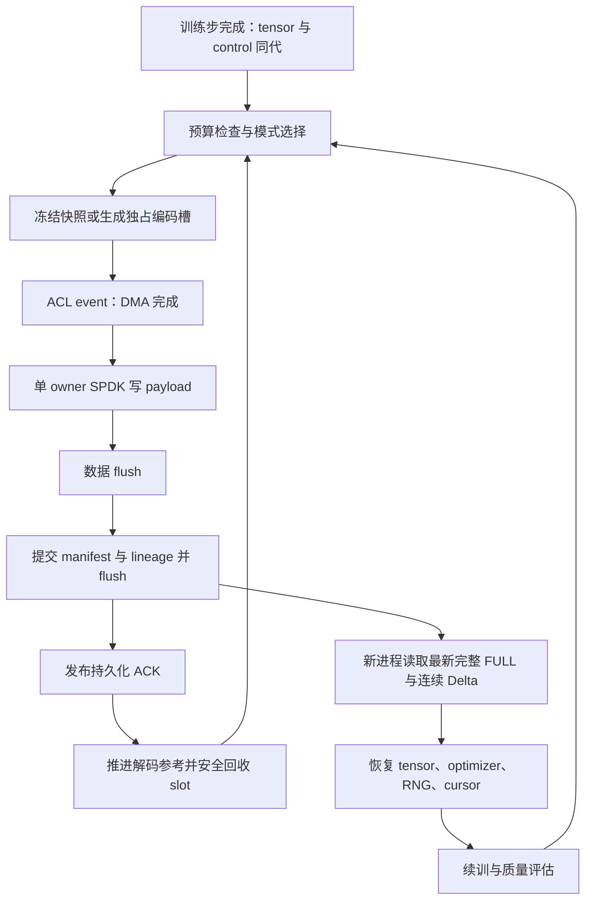

# NPU 检查点项目：现状核查、近期研究与发展规划

> 自 2026-09-11 起，后续实施顺序、契约与阶段状态统一以
> [长期开发与验收计划](LONG_TERM_DEVELOPMENT_PLAN.md) 为准。
> 本文保留历史事实及细分协议/研究假设；下文旧“唯一计划”和排期不覆盖长期计划。

核查日期：2026-09-11。代码基点：`83e8e9c` 加当前工作区改动；本次只新增研究材料，未运行 NPU/SPDK 实验。本文是方向建议，不替代现有执行计划或把历史实验重新标为通过。

## 1. 建议选题与完整故事

**建议题目：面向 NPU 大模型训练的恢复质量与资源预算约束检查点系统。**

核心问题是：**在 HBM、Host 缓冲和持久化带宽受限时，如何维持足够新、可恢复的训练状态，并使保存、恢复和恢复后训练的总代价最小？**

项目应围绕这一问题组织已有 SPDK 路径和下一阶段增量工作。SPDK 是可控制的数据面，增量/编码是调节数据产生量的手段；系统贡献需要通过持久化进度、训练干扰和恢复质量之间的联合决策来证明。

可用于开题、答辩或论文引言的叙述如下：

> 长时间 NPU 训练需要在故障、作业中断后继续执行，因此检查点必须同时保存模型、优化器和训练控制态。提高检查点频率能缩短回滚距离，但完整状态的生成和持久化会消耗 HBM、Host 内存、PCIe 和 SSD 带宽。后台异步可以隐藏一部分延迟，却不能消除持续供给大于存储服务能力时的积压；用户态 I/O 可以改善路径控制，却不能突破硬件吞吐上限。进一步减少写量时，稠密 Transformer 的大部分块都可能更新，传统脏块增量收益有限；直接对所有状态统一 Top-K/量化又可能破坏优化器，从而使“能加载”不等于“能可靠续训”。本项目据此研究状态语义、实际持久化进度和恢复质量共同约束的检查点：以完整状态和原子提交建立恢复契约，以可测量的 ACL/SPDK 流水线提供服务能力，以分类编码和有界增量链调节写量，在运行中依据资源与误差预算选择可行策略，最终以故障后的有效训练进度验证收益。

故事闭环：需求是少丢训练进度；约束是有限资源与恢复质量；发现是异步积压、稠密更新和优化器敏感性；方案是有明确恢复契约的自适应持久化；结果必须是**相同质量和故障条件下更短的任务完成时间或更高的有效训练吞吐**。

## 2. 核查结果：已有基础、有效证据和实际缺口

| 层次 | 代码与证据 | 本次判断 |
|---|---|---|
| 数据面 | `src/npu_nvme.c` 的异步提交、ACL event、NVMe completion、flush；`include/internal/io_task.h` | 已有真实异步实现基础。路径为 HBM → ACL → Host DMA buffer → SPDK → NVMe；不是 HBM–SSD 硬件 P2P 或完全零拷贝 |
| 完整状态 | `python/direct_checkpoint.py:save_state/load_state`、`python/training_state.py` | 已有模型、优化器、控制态编码与校验；框架随机状态是否完整仍须按模型/环境验证 |
| 持久化提交 | `DirectCheckpoint._persist_metadata()`、`flush_nvme()` | 有 A/B 元数据、superblock 提交与 NVMe flush。接口正确不自动等于全部故障模型已验证 |
| R0 增量 | `python/s2_r0_cell.py`、`python/r0_pipeline.py` | NPU 比较持久化参考态并输出变化标志，原始 dtype replacement，经 ACK 推进参考态。明确是同步正确性实现，capture 到 ACK 期间不得推进训练 |
| 分类策略 | `python/s2_policy.py`、`python/category_delta.py` | 已有分类比例、编码、刷新周期和最大年龄；主要为 NumPy 策略/帧生成基础 |
| 分类端到端实验 | `experiments/benchmarks/p8_p9_incremental.py` | producer 先 `snapshot_state()` 到 Host，CPU 编码后用 `write_batch_host` 保存；不构成图内分类压缩或减少大状态 D2H 的证据 |
| FULL 恢复 | `docs/NEXT_PHASE_C1_RESULTS_20260827.md`；2026-09-11 的 G1 汇总 | 历史完整状态 fresh-process 恢复有证据；最新 G1 的 772 参数摘要不能替代所有训练态续训验收 |
| 多 rank | `docs/NEXT_PHASE_C2_RESULTS_20260827.md` | 历史两 rank 是独立训练进程加 coordinator，未证明 HCCL 同步训练及故障后的全局一致恢复 |

### 2.1 最有价值的已有结果，恰好指向新的问题

1. **R0 能恢复，但没有自动带来少写。** `results/r0-gpt2-100-20260827/source_resume.json` 中，样本帧为 1,485,713,408 B，完整状态为 1,485,020,168 B，帧约为状态的 **100.05%**。这是帧与原始状态的比较，不是两个完整落盘方案的公平写放大比较，但足以反驳“增量天然很小”。该运行经过周期 FULL，不能描述为一次恢复连续应用 100 个 Delta。
2. **XL 已有单帧大状态 R0 恢复证据。** `docs/NEAR_TERM_WORK_PLAN.md` §9.24.5 记录 2318 fields、9,822,624,008 B，单帧 6,913,679,360 B，fresh-process 恢复与控制态一致。记录的 R0 阶段耗时 866,764 ms，而训练步约 288 ms，说明当前生成/同步路径需要细分剖析；不能把它解释为纯比较算子的硬件极限。
3. **统一 R2 的失败已经经过三 seed 验证。** `results/incremental-next-20260828/decision-gpt2-v2/result.json` 的结论是 `PIVOT`。Top-5%/INT8 候选写比中位数约 4.99%，但单步 NRMSE 中位数约 0.00661、Adam m 最大分类 NRMSE 约 1.012；另一 FP16 候选写比约 20.75%，10 步恢复 loss 最大相对误差约 6.73%。这些是策略回放口径，不能冒充真实 NPU 分类流水线结果。
4. **全局变化能量不能直接指导恢复质量。** 已有 GPT-2 轨迹中 Adam m 可主导变化能量，权重自身 Top-10% 覆盖却弱得多；XL 的类别分布又不同。状态类别的量纲、总能量和对下一次更新的影响并不等价。
5. **异步重叠存在，净收益仍待证明。** `results/quick-trend-20260830/QUICK_TREND_REPORT.md` 中 depth=4 有 DMA/NVMe 重叠，async 相对已有 queue 仅约 1.00–1.04×；辅助 diff 的“并行”版本没有优于串行。不能据 PMU 投影约 3% 推断整机 Vector 空闲，更不能推断压缩没有成本。
6. **I/O 比较仍需审慎。** 同一快速报告的四个 4 MiB 组合中 O_DIRECT 延迟均低于 SPDK Host；双盘校准存在性能差异。项目价值不能依赖“SPDK 总比 io_uring 快”。

### 2.2 报告与实验入口需要收口的地方

- 最新 `results/environment-upgrade-20260911/P1_P9_REVIEWED.md` 记录 P1 60 个主运行通过，P2 6 个 degraded，P3 只有 serial，P4–P9 无本轮主结果。不能拼接历史通过标记构成“新环境全通过”。
- P8/P9 consumer 依赖外部 `recovery_manifest.json` 指路；加载 FULL 的控制态后回放 tensor frame，没有显式恢复每个目标 Delta 同步保存的 RNG/data cursor。当前可支持特定实验的张量重建，距离仅依靠盘上内容恢复完整目标训练态还有缺口。
- P8/P9 使用 `DELTA_BASE=128 GiB` 等固定位置；产品化路径应统一到 superblock 声明的分区和分配器，并保证 ring 回收不破坏仍需要的链。
- `experiments/baselines/pccheck_spdk.py` 等为本地概念适配，不能不加说明地写成原论文实现。需审查完整状态、持久化 ACK、并发所有权和内存预算是否等价。
- 历史计划中仍有“尚未实现 async”的描述，而当前 C 代码已有异步接口。应以源码、对应版本结果和日期解释演进；本文不把旧结论直接套到当前工作区。

## 3. 近几年研究的主线与竞争关系

本次在线检索覆盖 2021–2026：USENIX/PMLR 官方会议页面、Crossref、arXiv API，以及部分论文 HTML 正文。正式发表状态见下表；未确认正式发表的条目按预印本处理。检索不等于穷尽所有 NPU 工作，不据此宣称“首个”。15 篇 arXiv 元数据及摘要保存在 `research/checkpoint_sources_20260911.json`。

| 工作与年份 | 发展方向 / 核心机制 | 对本项目的直接影响 |
|---|---|---|
| [CheckFreq，FAST 2021](https://www.usenix.org/conference/fast21/presentation/mohan) | 两阶段保存、在线调整频率、可恢复数据迭代器 | 频率自适应和快照/I/O 重叠已有先例；数据游标是恢复契约的一部分 |
| [Check-N-Run，NSDI 2022](https://www.usenix.org/conference/nsdi22/presentation/eisenman) | 推荐模型稀疏更新的 differential checkpoint 与量化 | 稀疏嵌入表的收益不可直接外推到稠密 Transformer；应作为语义对照 |
| [DataStates-LLM，HPDC 2024](https://arxiv.org/abs/2406.10707) | 利用 forward/backward 期间状态不变窗口做 lazy async snapshot | “利用训练语义减少停顿”已有成熟路径；NPU 方案须实测执行和内存干扰 |
| [FastPersist，MSR 技术报告 2024](https://www.microsoft.com/en-us/research/publication/fastpersist-accelerating-model-checkpointing-in-deep-learning/) | NVMe 优化、多 SSD 并行、与计算重叠 | 单纯优化 NVMe 持久化不是充分的新颖性；可作为数据面设计参照 |
| [Inshrinkerator，SoCC 2024](https://doi.org/10.1145/3698038.3698553) | 动态非均匀量化、敏感性搜索、量化感知差分 | 动态精度与恢复质量折中已有先例；参考其多次恢复的验证思路 |
| [ExCP，ICML 2024](https://proceedings.mlr.press/v235/li24m.html) | 相邻 checkpoint residual、权重与 momentum 联合裁剪、非均匀量化 | 原综述的重要遗漏。来自华为诺亚团队等；“首次关注优化器压缩”不成立 |
| [PCcheck，ASPLOS 2025](https://doi.org/10.1145/3669940.3707255) | persistent concurrent checkpointing、分块与并发流水 | 是高频异步系统的重要基线；本次确认正式书目信息，ACM 正文访问受限 |
| [ByteCheckpoint，NSDI 2025](https://www.usenix.org/conference/nsdi25/presentation/wan-borui) | 并行无关表示、加载时重分片、通用框架与后端 | 可作为上层接口/格式参照；本项目应提供可接入后端，避免重造整个分布式格式 |
| [Universal Checkpointing，ATC 2025](https://www.usenix.org/conference/atc25/presentation/lian) | 跨并行配置恢复和弹性重配置 | 弹性恢复是独立方向，当前本地路径尚不具备相应完整系统基础 |
| [ZipNN，2024 预印本](https://arxiv.org/abs/2411.05239) | 神经网络浮点分布专用的无损编码 | 必须纳入“无需误差预算也能减少写量”的对照；模型分发/归档收益不等于在线 Adam 状态收益 |
| [Prediction and Context Modeling，2025 arXiv](https://arxiv.org/abs/2506.12000) | 利用前一检查点进行预测与上下文编码，结合剪枝/量化 | 差分不一定要求脏块稀疏，也可利用数值/位分布；本次未独立核实其最终会议出版信息 |
| [LowDiff / LowDiff+，2025 起预印本，所读 v4](https://arxiv.org/abs/2509.04084) | 复用梯度构造差分，分层快照与增量合并，扩展到无梯度压缩情形 | “不再完整扫描，而复用训练更新”也已有直接竞争者；需处理 Adam、浮点执行与恢复重放语义 |
| [GoCkpt，2025 预印本](https://arxiv.org/abs/2511.07035) | 跨多个训练步搬运状态，再用梯度在 CPU 修复为同一版本 | 显存受限的跨步快照有替代方案；本项目选择冻结 slot 需说明内存/复杂度取舍 |
| [BitSnap，2025 预印本](https://arxiv.org/abs/2511.12376) | 异步引擎、模型 bitmask 稀疏化、优化器聚类量化 | 与“分类压缩 + 异步”直接重叠。正文还描述先压缩后复制到 shared memory，不能笼统说已有压缩都在 Host |
| [LLMTailor，PDSW/SC Workshops 2025；arXiv 2026](https://doi.org/10.1145/3731599.3767515) | 选择性保存 layer、合并不同 checkpoint 的权重与优化器状态 | 层级选择及异步状态版本组合也不是空白；注意其会议年份与 arXiv 年份不同 |
| [DataStates-LLM State Providers，2026 预印本](https://arxiv.org/abs/2601.16956) | 抽象异构训练态、聚合分片、重叠元数据序列化与 tensor I/O | 下一代优化延伸到状态抽象和碎片整理，说明 metadata 也需纳入性能预算 |
| [MoEvement，NSDI 2026](https://www.usenix.org/conference/nsdi26/presentation/gandhi) | expert 子集快照、稀疏转稠密、激活/梯度日志、局部恢复 | MoE 是可利用结构稀疏性的延伸方向，但“每步只激活部分专家”不自动保证完整训练态稀疏 |
| [TierCheck，2026 预印本](https://arxiv.org/abs/2605.17821)；[PHOENIX，2026 预印本](https://arxiv.org/abs/2607.01646) | 分层放置对应不同故障；内存冗余与失败节点热替换 | 当前趋势从“写快”走向故障域与恢复路径协同；本地 NVMe 只能承担其中一层 |
| [Brevis，2026 预印本](https://arxiv.org/abs/2608.02162) | 将无损 tensor 编码建模为可逆程序合成 | 可跟踪归档编码前沿；搜索/编码成本是否适合在线高频保存需要单独验证 |

由此可以归纳出五条发展线：**隐藏暂停 → 减少/重用状态 → 理解完整训练态 → 控制恢复代价 → 面向不同故障域分层恢复**。它们是并行演进的方向，并非后来的方法全面替代早期方法。

最需要精读和形成逐项对照表的工作是 ExCP、BitSnap、LowDiff(+)、PCcheck、DataStates-LLM。已有综述中“压缩多在 CPU”“把分类策略放进 NPU 就足以构成创新”等笼统判断应撤回。**本规划提出的联合约束机制只是候选研究贡献，其新颖性仍须通过这些工作的完整算法和实现对照确认。**

## 4. 从业务需求推导设计，而不是倒推 SPDK 的用途

### 4.1 先固定服务对象与故障模型

建议首个完整版本服务：**单节点、固定并行配置的 Ascend 稠密 Transformer 训练，故障后本地 NVMe 仍可读取**。GPT-2/XL 用于已知环境和回归验证，稳定环境下用 Qwen3 的实际配置检验泛化，再扩展真实 2/4 rank HCCL。

| 需求或故障 | 本阶段承诺 | 需要的机制 |
|---|---|---|
| 训练进程异常、NPU reset，SSD 存活 | 恢复最后完整提交的训练态 | 不可变快照、schema、控制态、原子提交、新进程恢复 |
| 节点重启后同一 SSD 可重新访问 | 恢复盘上完整链；具体重启/掉电结论以实际注入为准 | 数据持久化屏障、元数据提交、冷启动扫描 |
| SSD 损坏、节点永久失联 | 当前本地实现不提供此级容错 | 后续远端 FULL/副本，明确远端提交进度 |
| 数值异常需回退历史 | 恢复保留的历史一致状态 | 多代 FULL、保留策略；不能只保留最新一代 |
| 任意 rank 在同步训练中失败 | 扩展阶段保证所有 rank 恢复同一个全局 generation | shard 完整性、全局 commit、HCCL 重建及 cursor/RNG 恢复 |

不要把内存副本 ACK、本地 SSD ACK、远端存储 ACK 混成同一持久化级别。不同级别对应不同的可容忍故障。

### 4.2 一个足以解释问题的成本模型

设完整状态提交量为 S，检查点触发间隔为 τ 秒，每个周期有 F 次检查点，其中一次 FULL、其余为 Delta。D 是包含 descriptor、scale、control 和对齐的平均 Delta 提交量：

`平均提交量 W = [S + (F - 1) × D] / F`

若训练期间存储的有效服务带宽为 B，则持续运行的必要条件是：

`W / τ < B`，并需要为服务波动保留余量。

更完整地，各阶段都必须跟得上：`max(生成服务时间, D2H 服务时间, 持久化服务时间) < τ`，这是理想可重叠条件下的近似；共享 HBM、计算单元和串行 commit 会降低实际能力。

**增加队列深度只能缓冲突发，不能修复长期输入超过输出。** 若待写数据增长且不能缩减编码，系统只能增加触发间隔、增加服务资源或对训练施加背压，不能同时承诺任意新鲜度和零停顿。

额外内存也不能只写成 `slots × chunk`：

`额外 HBM = 持久化参考态 + 冻结快照/编码槽 + 算子 workspace`

`额外 Host 内存 = SPDK 固定开销 + DMA chunk 池 + Host frame/metadata + 其他 staging`

示例仅用于说明推导：若 S=10 GB、τ=2 s、训练中的有效 B=2 GB/s，FULL 要求 5 GB/s，不可能长期靠异步隐藏；若 D=2 GB、F=20，W=2.4 GB，需求降为 1.2 GB/s，才进入带宽可行区。但若生成和干扰代价很大，仍可能不值得压缩。这些数字不是本项目实测。

最终目标可写为：

`最小化：保存引入的训练时间 + 故障回滚重算 + 恢复加载/重建 + 近似恢复引入的质量补偿代价`

约束为 HBM/Host 峰值、持久化新鲜度、恢复时延和质量预算。经典 `C/τ + λτ/2 + λR` 可作直觉背景，但异步提交存在滞后、压缩存在干扰时，必须用实际最后提交步和故障注入评估，不能机械套最优间隔公式。

## 5. 推荐方案：双恢复契约、一套提交协议、一个受约束控制器

### 5.1 先把“精确恢复”和“近似恢复”定义清楚

**精确模式为默认。** 每个恢复状态对应同一个训练步，模型、优化器和可获取的可变控制态都必须恢复为该步保存的内容。可以使用原始 FULL、所有变化块的 replacement、可逆 XOR/字节分组/熵编码；不能因为数值变化小而跳过已改变块。浮点减法再加回不保证位级可逆，若声称 bit-exact，应使用可逆编码并做字节校验。

**近似模式是显式研究选项。** 未更新块和低精度状态构成该 generation 的近似训练态，必须记录其语义与误差。它不能再称为原始 step 的精确快照。RNG、global step、data cursor 等控制态仍精确保存，且其 generation 与 tensor payload 原子绑定。

把控制态设置为 step t，不会自动让部分来自旧 step 的优化器状态变得一致；这种误差是近似方案的研究对象。周期 FULL 可以重置编码参考和链长，但**无法消除此前从近似状态续训产生的训练轨迹偏移**。

### 5.2 编码与选择：先验证优化器更新误差，而非继续统一 Top-K

从三个有限候选开始，不立刻建立庞大的策略搜索器：

| 状态 | 首轮保守候选 | 要验证的问题 |
|---|---|---|
| control、小标量、步数与调度态 | 原始精确保存 | 能否从目标 Delta 恢复准确控制状态 |
| 模型权重 / master weight | 精确 FULL 或无损位差分为主；低精度/选择性 replacement 为研究对照 | 更新稠密时无损编码是否仍可压缩；权重滞后是否影响验证质量 |
| Adam m | 先全量无损；再比较每次刷新低比特编码 | 统一 Top-K 的失败是否来自 m；更保守保留是否改善续训 |
| Adam v | 先全量无损；再验证不同精度/刷新周期 | 小绝对变化是否仍显著改变更新分母；FP16 下溢是否造成失真 |

候选评分应考虑**恢复后优化器更新方向**。对 Adam，可用 `u = m_hat / (sqrt(v_hat) + eps)`，在同一批数据/梯度下比较原状态与重建状态的下一步更新，记录相对范数差、方向余弦和异常值。权重衰减、bias correction、loss scaling、clipping 和 master weight 必须与实际优化器一致。

这比把全局 tensor NRMSE 作为唯一指标更有动机，但仍只是可验证假设：不同误差可能被后续训练吸收，也可能被放大。在线廉价代理必须先与离线多步续训/验证集质量建立相关性；若不相关，就保留保守分类规则，不宣称代理能保证收敛。

R2 的参考应是**已 ACK 帧实际解码后的状态**。`current - decoded_persisted` 已包含未提交变化和过去量化误差，不能再叠加同一 residual。max-age 只在相应块持久化后清零，年龄还应区分训练步数、checkpoint 次数和墙钟时间。

### 5.3 编码位置：NPU 端的价值必须来自减少总成本

先比较四条路径：无检查点、原始异步 FULL、Host 分类编码、NPU 同策略编码。NPU 端首选粗粒度融合的 compare/reduce/pack，避免每块建立大量算子和 Host 同步；Top-K 与复杂聚类是否合适由 profile 决定，不预设它们优于阈值或位操作。

近似 break-even 条件为：

`新增编码与训练干扰 < 减少的关键路径 D2H/I/O 时间`

两个传输阶段充分流水时不能把两段带宽收益直接相加。最终用总训练 wall time、slot 等待、HBM 带宽、Host/DMA 字节及提交延迟测量。能量集中不意味着编码廉价；变化检测本身往往仍需读完整状态及参考态。

如果保留完整参考态导致 HBM 超预算，应优先比较无参考的分块 FULL 编码；复用 optimizer 更新/梯度可作为后续方向，但需正面对照 LowDiff 和 GoCkpt，并处理精确重放问题。

### 5.4 统一的 generation、持久化和恢复协议

必须保留的协议约束：

- schema、state ID、rank、目标 step、generation、FULL base、parent generation、encoding、dtype、shape、有效长度、checksum 都应自描述；恢复不能依赖 source 进程内存或外部实验 JSON。
- 首个完整版本只允许一个未 ACK 的 Delta，降低 lineage 复杂度；其阻塞时间如实计入性能。
- 后续若增加并发，分别维护“已持久化参考”和“排队后代参考”，按序提交；父帧失败时使后代失效。不能简单把共享参考指针改到最新提交请求。
- A/B metadata 不等于 payload 自动安全：写新一代前，旧的最后可恢复 FULL/Delta 链必须仍保留。回绕、FULL rollover 和 GC 都要遵循可达性约束。
- payload 完成 → 持久化屏障 → manifest/commit 发布 → 屏障 → ACK；所有失败均不提前推进参考态。具体顺序需按最终介质和提交点校验。
- 数据损坏或链中间缺失时，选择此前完整可恢复 generation；不能跳过缺口继续应用后代。
- slot 生命周期不等同于持久化链保留期。DMA 完成后是否能释放部分 buffer，取决于后续 checksum/ACK 是否还访问它；必须显式管理所有权。

### 5.5 控制器：把少写转化为更好的持久化进度

控制器观测：训练干扰、编码时间、实际提交字节、存储服务时间、pending 数、slot 占用、最新 ACK 训练步、链长及分类误差代理。

在**预先验证过**的少量配置中选择 FULL/raw、无损编码 FULL/Delta、可选近似分类帧及 FULL 周期，并决定是否允许本次 admission。未进入验证范围的精度不在线探索。

决策目标是在内存/质量约束内提高提交新鲜度或有效训练吞吐，而非盲目减少帧大小。恢复链接近 RTO 上限时触发 FULL/安全合并；编码收益不足时绕过编码；服务暂时变慢时使用缓冲，持续变慢时按契约调频或背压。

如果质量预算要求更大帧而 SSD 又无力承接，系统要报告当前配置不可行。切到 FULL 可能改善数值质量却恶化队列，不能把“回退 FULL”描述为能同时解决所有约束。

## 6. 如何把它写成可辨识的研究贡献

候选贡献只保留三项，且各自有可被推翻的假设：

| 候选贡献 | 假设 | 必须给出的证据 |
|---|---|---|
| 完整训练态的恢复敏感性分析 | 全局变化量/NRMSE 不足以预测 Adam 续训偏差，类别与更新误差能提供更好的信号 | 多模型、不同训练阶段、分类压缩消融；指标与恢复后质量的相关性 |
| 结合提交进度与恢复预算的模式选择 | 固定 Top-K、固定精度和固定 FULL 周期在带宽/阶段变化时浪费资源或失去质量 | 相同质量/内存/RTO 下，自适应优于固定方案；与离线最优候选比较并量化决策成本 |
| NPU 编码与有界持久化流水协同 | 在有明确收益区间时，数据离开 HBM 前编码可改善提交新鲜度和训练效率 | Host/NPU 同算法同数据对照，真实时间线、内存峰值、故障后的可恢复性 |

ACK、CRC、单 owner、本地裸盘分配等是支撑机制。若没有新的语义或量化收益，不宜把每个正确性机制分别列为论文创新。平台适配也不是自动成立的学术贡献。

明确不写入摘要的结论：SPDK 普遍优于内核路径、NPU Vector 压缩近乎免费、Top-10% 变化能量等价于保留 90% 训练质量、局部 NVMe 等价于集群容灾、能加载 tensor 等价于完整续训。

## 7. 最小充分实验：从需求一一闭环到方案

| 研究问题 | 实验与基线 | 成功或否证的含义 |
|---|---|---|
| 为什么需要新方案？ | 相同完整状态和 τ 下，原始 FULL 的训练干扰、pending 增长、内存峰值与最新 ACK 落后；扫带宽与 interval | 若已有异步 FULL 已满足所有约束且资源充足，压缩不应默认开启 |
| 增量到底能减多少？ | 同一真实轨迹：raw FULL、R0、无损字节编码、无损 XOR 编码、低比特 FULL、统一 R2、分类候选 | 同时算初始 FULL、周期 FULL、帧封装、对齐、元数据和 GC；区分模拟核算与实际提交 |
| 为什么需要类别/更新敏感性？ | 分别只压权重、只压 m、只压 v，再联合压；控制同样字节预算 | 看下一步更新偏差、多步 loss/PPL 和达标时间；不能只看全局 NRMSE |
| 为什么在 NPU 做？ | Host/NPU 完全相同编码，串行/重叠对照，固定 core/NUMA/buffer | 编码开销、D2H 节省和训练干扰的净收益；不依赖 PMU 空闲推断 |
| 控制器有什么用？ | 最佳固定配置、简单 backlog 阈值策略、完整控制器；自然负载和受控服务波动 | 持久化进度、吞吐、质量和 RTO 的改善是否超出简单调频 |
| 保存后是否真能恢复？ | fresh-process、source-side 文件移除、控制态校验、连续链和 rollover；FULL 对照 | 精确模式加载后逐字节一致；近似模式重建值与编码 oracle 一致并满足独立质量预算 |
| 故障后是否省总时间？ | 固定有用训练目标，加入可复现故障时刻；比较 FULL 与候选的重算/恢复/总 wall time | 同精度/质量下的有效吞吐与任务完成时间。故障率扫参是实验假设，不冒充真实故障统计 |

关键执行规范：

1. 同一环境、相同训练步数/token、数据、seed、warmup、完整状态范围；主模型至少 3 seeds。环境升级与算法对照分开，GPT-2 证据不能直接外推现代 Qwen。
2. 原生保存、充分优化的异步 FULL 是必需基线。存储消融使用相同 snapshot/codec，对比 io_uring/O_DIRECT 与 SPDK；统一持久化边界、物理请求规格、CPU 核和队列预算。无法同盘对照时明确设备混杂，不能直接解释为软件加速比。
3. ExCP、BitSnap 等优先使用作者代码；移植或只复现机制时标明 adapted/reimplementation，列出缺失功能。ByteCheckpoint 若仅 Host 适配，不能当作官方 NPU 性能。
4. 记录 frontend pause、普通 step 干扰、admission wait、snapshot/encode/DMA/write/flush/commit/ACK，p50/p95/p99 及 run-level 置信区间。30 个相关的 checkpoint 样本不能当作 30 次独立训练重复。
5. “有效吞吐”按固定有用训练工作除以含故障恢复的 wall time；另报最新 committed step 的滞后。近似方案还需要相同验证质量或 time-to-quality，不能仅拿 step 数替代效果。
6. 分类张量误差与优化器更新偏差是诊断指标；应用质量以预注册的 loss/PPL/下游阈值、连续训练基线波动为准。在正式前设阈值，不能为通过结果事后放宽。
7. 至少覆盖 FULL 后第一帧、链中段、FULL 前最后一帧、回绕边界的恢复；近似候选反复“恢复→续训→再保存→再恢复”，以验证真实轨迹偏移。100 Delta/100 步是工程门槛，不代表充分的收敛验证。
8. 故障注入覆盖数据中断、flush/metadata 失败、坏 CRC、重复/错序 ACK、ring/slot 耗尽、父帧失败、owner 退出、GC/rollover 中断。`kill -9` 不等于掉电，不据进程崩溃声称掉电完整证明。
9. 分开报告逻辑 payload、Host 提交量、控制器 host writes 和厂商可用的 media writes。NVMe SMART Data Units Written 本身不是 NAND 写量，不能用于直接声称 SSD 寿命延长。

建议最终保留六张核心图：需求与积压；状态类别/更新误差；编码收益与成本交点；时间线和内存；质量–写量–恢复时延 Pareto；带故障的有效训练吞吐。所有图服务同一故事，不为凑模块分别画峰值带宽。

## 8. 推进计划与停止条件

以下是按单节点资源与稳定环境估计的 **8 周研究安排**，不是已有任务的完成承诺；环境/模型阻塞时顺延。跨节点容灾和完整弹性恢复不放进首轮交付。

| 阶段 | 时间参考 | 交付与退出条件 |
|---|---|---|
| A. 收口恢复契约和数据基线 | 第 1–2 周 | 一个可信环境与完整状态 FULL→fresh-process→续训入口；P9 目标控制态和盘上自描述补全；公平 FULL/I/O 基线。恢复不可靠则先修复，不跑论文性能矩阵 |
| B. 判断是否值得减少状态 | 第 3–4 周 | GPT-2/XL 及一个现代模型的类别特征；无损、低比特 FULL、统一/分类增量的 Pareto；真实恢复点验证。先做小样本筛选，只对少数候选做长程 |
| C. 证明 NPU 生成的净收益 | 第 5–6 周 | 最多 1–2 个候选的融合生成、真实 D2H/写入/干扰核算；完善独占 slot 与 ACK。若 CPU 侧上限都无收益，不投入 NPU 融合 |
| D. 联合控制、故障与论文闭环 | 第 7–8 周 | 固定策略/控制器对照，FULL/Delta rollover 与反复恢复，故障下有效吞吐；资源允许再做真正 2/4 rank HCCL 全局提交 |

**前三个具体动作：**

1. 将 `decision-gpt2-v2` 的 PIVOT 和 P8/P9 的状态范围差异汇总到统一证据清单，把“已实现/历史通过/当前未验证”分开。
2. 在相同真实状态上比较五个候选：raw FULL、无损 FULL、无损 XOR Delta、全量低比特编码、保守 Adam 的分类增量。先回答“稀疏选择是否真的优于全量编码”，然后才选择 NPU 算子路线。
3. 完成一次不依赖外部 recovery manifest 的目标 Delta 控制态恢复，包含 optimizer、RNG、cursor，并与 FULL 重启基线比较续训。

**改变方向的明确条件：**

- 若精确增量几乎等于 FULL，则保留 R0 为正确性 oracle，主性能路线转无损全量编码/分块快照，不再强求“增量”标签。
- 若近似分类方案无法在多次恢复中维持质量，则停止有损方向。不能以仅有一次 loss 接近为理由继续堆 NPU 实现。
- 若压缩率好但编码/额外 HBM 导致训练变慢，则选择更轻的编码、Host 编码或按需绕过。压缩收益不是系统收益。
- 若固定最佳方案已达到自适应控制器相同效果，则控制器不作为创新点，缩小贡献到特征分析和 NPU 实现；必要时进一步转向专门工作负载。
- 若现代稠密模型始终缺少少写空间，可探索 MoE/稀疏 embedding；应重新从激活、梯度、优化器和 weight decay 验证真实可恢复状态稀疏性。LoRA 则先与“只保存 adapter 和其 optimizer”的强基线比，不能拿整个冻结底座作分母夸大收益。

## 9. 面向导师或评审的一分钟版本

> 我们研究的是 NPU 训练在有限资源下的可恢复进度。现有 SPDK 路径已经提供可控制的本地持久化基础，但异步不能解决持续写入积压。我们进一步发现，稠密模型的无损脏块增量可能几乎等于全量；统一稀疏化虽然显著减少写量，却可能严重损伤 Adam 状态。因此，下一阶段不把固定 Top-K 当答案，而是研究恢复敏感性与持久化进度共同约束的编码和调度：精确模式保证完整训练态，近似模式显式限制恢复质量；在 NPU 数据离开 HBM 前执行经验证划算的编码，通过 generation 和持久化 ACK 保持参考态与磁盘一致，并控制 Delta 链及内存占用。最后以真实故障后的任务完成时间和训练质量闭环，证明系统在什么条件下有效，也明确什么时候应退回更简单的 FULL 保存。

## 10. 核查范围与出处说明

项目证据：`README.md`、`docs/NEAR_TERM_WORK_PLAN.md` §9.24–9.26、`docs/EXPERIMENT_CREDIBILITY_REVIEW.md`、C1/C2 报告、quick-trend 与 environment-upgrade 汇总，及上述源码和机器可读结果。历史报告中引用的大型 oracle 并未在本次重新运行，不能据此升级证据级别。

论文核查：ExCP 的 ICML/PMLR、MoEvement 的 NSDI 2026、CheckFreq/Check-N-Run/ByteCheckpoint/UCP 的 USENIX 页面已在线确认；Inshrinkerator、PCcheck、LLMTailor 的正式出版元数据经 Crossref 核查。ExCP、BitSnap、LowDiff 正文选段用于确认关键机制，其余以摘要/官方页面为主，未声称全部阅读全文或复现。Gemini 的官方机构页面此次未返回可读正文，因此作为已有综述的背景保留，不作为新增关键证据。

检索排除了仅涉及 activation checkpointing、KV cache、模型选择或 agent workflow 的同名主题。本文中的吞吐/压缩优势除明确标注的项目历史数据外，均为研究假设或论文所讨论方向，不是本项目已经达成的结果。
