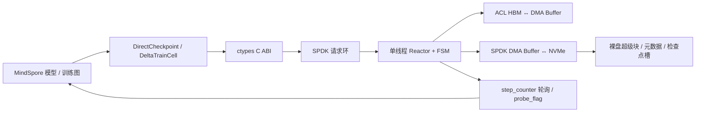

# NPU-NVMe 项目总览与首轮审计

> 审计日期：2026-07-29  
> 审计范围：工作区结构、`python/`、`src/`、`include/`、构建与实验入口  
> 审计方式：静态阅读与语法检查；当前没有 Ascend、MindSpore、SPDK、NVMe 运行环境

## 1. 项目定位

本项目面向 Ascend NPU 训练场景，目标是绕过传统文件系统检查点路径，使用
SPDK 将模型数据在 NPU HBM、Host DRAM 与裸 NVMe 设备之间直接传输，并在此基础上
实现全量检查点、训练步触发的后台持久化，以及 Top-K INT8 增量检查点。

当前主线可分为两层：

- C 数据面：`src/npu_nvme.c` 与 `include/`，负责 SPDK reactor、DMA 缓冲池、
  NVMe 队列、批量读写和训练步轮询。
- Python 控制面：`python/`，负责 ctypes 绑定、裸盘布局、模型参数布局、全量及
  增量检查点语义、MindSpore 训练单元和实验入口。



## 2. 工作区结构

| 目录 | 定位 | 当前判断 |
|---|---|---|
| `python/` | Python 主线，共 15 个文件、约 3275 行 | 核心控制面 |
| `src/` | C 实现与测试，共 5 个文件、约 2119 行 | 核心数据面 |
| `include/` | 公共 C API 与内部状态结构，约 525 行 | 核心接口 |
| `experiments/` | 基线、FaF、Delta、分布式及诊断实验 | 混合了当前入口和历史原型 |
| `docs/` | Reactor 论文式说明和项目总览 | 后续报告素材主目录 |
| `kernels/trigger_probe/` | 旧 TriggerProbe 自定义算子 | 兼容/历史路径 |
| `wait_probe/` | 旧 WaitProbe 工程 | 已被 step-counter poller 替代 |
| `experiments/ascendc/` | Delta 自定义算子探索 | 研究原型，未接入当前 Python 主线 |
| `dataset_prepare/` | GPT-2/LLaMA 数据准备 | 辅助工具 |
| `scripts/` | 阶段验证脚本 | 依赖目标机器环境 |
| `tools/` | 历史代码清理脚本 | 非运行主线 |
| `third_party/spdk` | SPDK Git 子模块 | 当前工作区未展开 |
| `fig/`、`experiments/output/` | 已有实验结果与图表 | 可作为报告素材，但需复核版本 |

建议暂不直接移动 `experiments/`、`kernels/` 和 `wait_probe/`：大量脚本使用基于仓库
根目录的导入和路径。应先建立测试与入口清单，再进行一次可回归的目录重构。

## 3. Python 主线

### 3.1 模块职责

| 文件 | 职责 |
|---|---|
| `direct_checkpoint.py` | 总入口；初始化 C 层、挂载裸盘、全量保存/加载、FaF 注册、Delta 保存/恢复 |
| `c_bindings.py` | `libnpu_nvme.so` 与 `libascendcl.so` 的 ctypes 签名 |
| `disk_layout.py` | 超级块、双元数据槽、Delta 帧等常量 |
| `chunk_helpers.py` | 4 KiB 对齐分块及 ctypes 数组构造 |
| `training_cell.py` | 在 MindSpore 图内递增 `step_counter` |
| `delta_cell.py` | Top-K 块选择、INT8 量化、上一版本缓冲更新 |
| `delta_protocol.py` | Delta 帧序列化、反序列化和 CPU 恢复 |
| `noop_init.py` | 恢复前跳过随机初始化 |
| `_legacy_compat.py` | WaitProbe/TriggerProbe 旧接口兼容 |
| `bench.py` | GPT-2 XL 的 Baseline、Delta、FULL 三阶段基准 |
| `format_npu_disk.py` | 初始化裸盘超级块与元数据槽 |
| `inspect_npu_disk.py` | 查看裸盘布局与检查点元数据 |
| `export_model.py` | 将多 rank 分片汇总到裸盘 Heap 区 |
| `profiler.py` | Python/C 性能数据聚合与导出 |

### 3.2 全量保存路径

1. `_prepare_params()` 获取 MindSpore 参数 HBM 指针。
2. 按 `step % keep_last_n` 选择 rank 私有的全量检查点槽。
3. `build_chunks()` 将参数切成不超过 `chunk_size` 的 4 KiB 对齐块。
4. Python 后台线程调用 `npu_nvme_write_batch()`。
5. C 层将请求送入 `write_ring`，reactor 上的写 FSM 依次执行
   HBM→DMA buffer 和 DMA buffer→NVMe。
6. rank 0 在写入后更新 JSON 元数据槽，再切换超级块中的活动槽。

### 3.3 全量加载路径

1. 从活动元数据槽选择目标 step。
2. 根据参数名重建目标 HBM 指针和 NVMe 分块。
3. `npu_nvme_read_batch()` 通过读 FSM 执行 NVMe→DMA buffer→HBM。
4. 没有设备指针的参数原计划走 Host DRAM 回退路径。

### 3.4 FaF 路径

`ProbeTrainOneStepCell` 或 `DeltaTrainCell` 在图内递增 `step_counter`。C reactor
每 10 ms 读取该 HBM 计数器，到达检查点间隔时，以预注册任务启动后台写 FSM；
完成后写入 `probe_flag`。

### 3.5 Delta 的设计目标与当前实际状态

设计目标是“最近的 FULL + 连续 Delta 帧”恢复。当前实现包含两套尚未闭合的路径：

- `DeltaTrainCell` + FaF：把量化数据、scale 和索引三个 HBM 缓冲直接写入 NVMe。
- `delta_protocol.py` + `delta_save()`：在 CPU 侧构造带 header、参数名和校验和的
  Delta 帧，再通过 Host 批量接口写入。

`recover()` 只理解第二种带 header 的帧，而当前基准使用第一种原始缓冲路径。因此，
“图内检测→FaF 持久化→链式恢复”还不是一条端到端闭环。

## 4. C/SPDK 主线

### 4.1 核心结构

- `NPUNVMEContext`：持有 NVMe controller/namespace/qpair、ACL context、DMA 池、
  reactor、请求环、读写 FSM、元数据 qpair、监听器与 Delta 布局。
- `write_ring` / `read_ring` / `meta_ring`：Python 线程到 reactor 的请求通道。
- `free_ring`：DMA buffer 槽位的 SPSC 空闲环。
- `write_fsm`：HBM/Host→DMA buffer→NVMe。
- `read_fsm`：NVMe→DMA buffer→目标内存。
- `step_poller_fn`：训练步检测与 FaF 写触发。
- `meta_poller_fn`：使用独立 qpair 处理超级块和 JSON 元数据。

所有主数据 qpair 操作集中到 reactor pthread，方向正确，避免了旧版由多个线程竞争
非线程安全 qpair 的问题。

### 4.2 公共接口

公共头文件已覆盖：

- 生命周期：`npu_nvme_init()`、`npu_nvme_cleanup()`
- 设备/Host 批量读写
- 同步元数据读写
- FaF 任务、步计数器和 probe flag 注册
- Delta 区域初始化与查询
- 最近一次批量 I/O 的 C 层耗时

## 5. 裸盘布局

当前元数据区域：

```text
0                         : 4 KiB Superblock
4 KiB                     : Metadata Slot A (400 KiB)
404 KiB                   : Metadata Slot B (400 KiB)
804 KiB                   : Heap 起点
磁盘尾部                  : FULL rank/step 槽与 Delta ring
```

FULL 区域由 Python 按
`world_size * keep_last_n * slot_size` 从磁盘尾部向前分配；Delta 区域由 C 按
`delta_slot_count * delta_slot_size` 同样从磁盘尾部向前分配。两者当前没有统一分区表，
默认配置会发生物理地址重叠。

## 6. 首轮风险清单

### P0：会导致错误结果、损坏或安全问题

1. `experiments/clean_room_tests.py` 同时存在 Python 语法错误和硬编码 sudo 凭据。
   应删除凭据、轮换密码，并改为只从未跟踪的凭据文件或交互输入读取。
2. Host 读接口没有把“目标是 Host”传入读 FSM；读完成路径始终调用
   `ACL_MEMCPY_HOST_TO_DEVICE`。`npu_nvme_read_batch_host()`、Delta 帧读取和
   `export_model.py` 的 Host 读取因此不可信，并可能无限重试。
3. `meta_qpair` 在 reactor 退出时释放，`npu_nvme_cleanup()` 中再次释放，存在
   double-free 风险。
4. `npu_nvme_init()` 启动 reactor 后的多个失败分支直接 `free(ctx)`，没有停止并
   join reactor，也没有按已分配资源逆序回收，存在 use-after-free 与资源泄漏风险。
5. FULL 尾部槽与 Delta ring 默认重叠，Delta 写入可能破坏全量检查点。
6. `build_layout_for_delta()` 把大缓冲作为单个任务注册；写 FSM 对大于
   `chunk_size` 的任务直接标记完成但不写入。默认量化缓冲远大于 4 MiB。
7. FaF Delta 固定注册一个槽，不推进 ring slot，也不写 Delta frame header；
   `recover()` 无法消费其输出。
8. `DeltaTrainCell` 的 `P_old` 只保存 INT8 数据，没有保存全量 per-block scale；
   下一步比较时直接将 INT8 cast 为 FP16，不能正确还原上一版本权重。小参数路径也
   尚未接入。
9. NVMe completion 和部分提交错误只打印日志，批量 API 仍返回 0；调用方可能在
   数据未落盘时提交元数据。部分 ACL 失败路径会持续重试而没有超时。

### P1：功能不完整或难以验证

1. 多 rank 元数据只由 rank 0 提交，内容只包含 rank 0 当前 layout；其余 rank 的
   加载和导出语义没有闭合。`base_offset_bytes`、`shard_span_bytes` 尚未使用。
2. `export_model.py` 使用设备读接口读取 Host 数组，并使用全局 shape 承载局部分片
   size，分布式汇总仍需重新设计和验证。
3. `direct_checkpoint.load()` 已有 Host 读 C API，却仍按旧注释跳过 host chunks。
4. Python 后台保存线程只打印 C 层错误，异常不会传回调用线程；`save()` 返回值也
   不能表示最终持久化成功。
5. `pipeline.h` 仍声明已移除的 `run_write_pipeline()` 和
   `run_read_pipeline()`；若干注释仍描述旧 listener 实现。
6. C 测试中的批量 I/O 主测试仍标记 `TBD`；现有 V2 smoke test 正好依赖当前有问题
   的 Host 读路径。

### P2：工程化与可复现性

1. 没有 Python 依赖清单、测试配置或 CI。
2. CMake 硬编码 `/tmp/mp_ring_fix/librte_mempool_ring_fixed.a`，构建不可移植。
3. `.build_config` 保存了特定机器的绝对 SPDK 路径。
4. `experiments/` 混合当前实验、诊断脚本和已废弃方案，容易误用。
5. 已跟踪结果文件来自不同版本；例如当前 `bench_full.json` 中
   `p_old_nonzero=false`、`quant_nonzero=false`，不能作为 Delta 正确性的证据。

## 7. 已完成的静态验证

- Git 工作树在审计开始时干净，当前分支为 `master`。
- `python/` 全部文件通过 Python 3.14 parser 的语法编译检查。
- `experiments/clean_room_tests.py` 在第 38 行附近存在语法错误。
- SPDK 子模块记录为 gitlink，但当前工作区未展开；本机也没有项目运行依赖。
- 未执行 CMake、C 编译、MindSpore 图编译、SPDK I/O 或 NPU 实验。

静态检查只能证明代码可读和部分语法成立，不能替代目标 ARM64/Ascend 机器上的
编译、运行与数据一致性验证。

## 8. 建议推进顺序

### 阶段 A：安全与可验证基线

1. 移除硬编码凭据并轮换；修复实验脚本语法。
2. 建立 `tests/`，先覆盖不依赖硬件的磁盘布局、分块、Delta 帧和恢复算法。
3. 增加最小依赖/环境清单和“目标机信息采集脚本”。
4. 标记唯一主实验入口，将历史脚本列入 archive 清单，暂不直接移动。

### 阶段 B：C 数据面正确性

1. 为 read request 增加 Host/NPU 目标类型与统一错误码。
2. 修复 cleanup 所有权和 init 失败回滚。
3. 增加 offset、size、alignment、capacity、timeout 检查。
4. 用可配置的 CMake 选项替换 `/tmp` 静态库硬编码。
5. 完成 Host 与 NPU 四条读写路径的可校验 smoke test。

### 阶段 C：全量检查点闭环

1. 明确同步/异步保存语义，向 Python 传播后台错误。
2. 统一 rank 元数据格式和分区分配器。
3. 完成 FULL 保存→进程重启→加载→逐参数校验。
4. 再验证吞吐、训练停顿和后台重叠比例。

### 阶段 D：Delta 方案收敛

1. 先确定唯一磁盘协议：原始 HBM 缓冲协议或自描述 Delta frame。
2. 建立全局块索引到参数名、参数内偏移的稳定映射。
3. 保存并恢复量化 scale，处理零块和小参数。
4. 让 Delta 注册任务按 `chunk_size` 分块，并正确推进 ring slot。
5. 完成 FULL + N 个 Delta 的端到端数值恢复测试，再做性能优化。

### 阶段 E：实验与毕业报告

建议报告按以下问题组织实验：

1. C/SPDK 数据面的峰值与端到端带宽是多少？
2. 单线程 reactor 相比旧锁方案消除了多少死锁风险和 CPU 消耗？
3. FULL 检查点给训练 step time 带来多少阻塞与隐藏开销？
4. Delta 的压缩率、恢复误差、图内计算开销和持久化带宽分别是多少？
5. 不同模型规模、Top-K 比例、block size、pipeline depth 下的权衡如何？

只有通过正确性门槛的结果才进入最终论文图表。

## 9. 下一次有目标环境时需采集的信息

- CPU 架构、NUMA、内核、GCC/CMake 版本
- Ascend 型号、CANN 与驱动版本、MindSpore 精确构建信息
- NVMe 型号、固件、PCI BDF、LBA size、容量
- SPDK/DPDK commit、hugepage 数量、IOMMU 和设备绑定状态
- NPU 与 NVMe 的 PCIe/NUMA 拓扑
- 构建命令、运行用户、权限策略和原始日志目录

这些信息应作为每组实验结果的固定元数据，保证毕业报告可复现。
