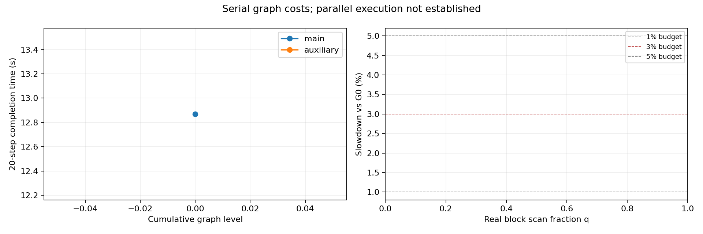
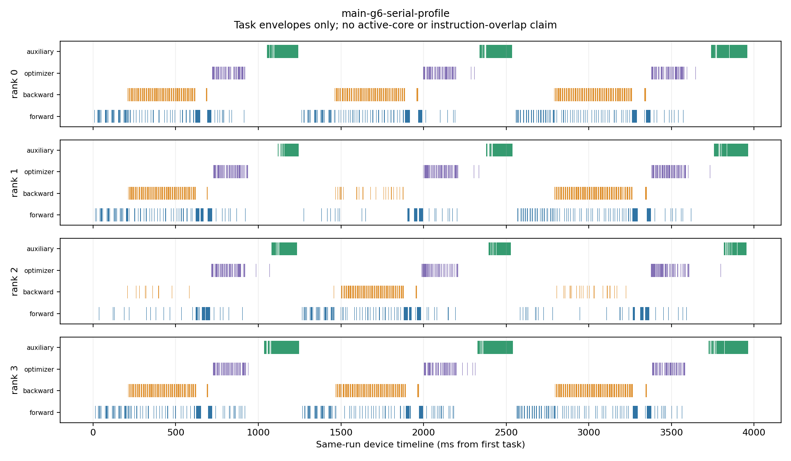

# 图内 Top-K 实验最终报告

main = Qwen3-8B；auxiliary = Qwen3-4B。两者 TP4、seq128、micro-batch1、FP32 权重/BF16 计算。

结果仅属于图内检测成本实验。目标并行布局必须通过设备轨迹验收；未验收数据不作为实际并行容量证据。固定参考不代表持续保存参考语义，设备结果不代表持久化。

|配置|模型|20 步总完成秒|相对 G0 区间|相对 G1|独立辅助 ms|峰值 HBM GiB|训练 loss 一致|
|---|---|---:|---:|---:|---:|---:|---|
|auxiliary-g0-warm12|auxiliary|12.615505|0.000%～13.658%|待定|—|19.459|True|
|auxiliary-g0-warm12-rep1|auxiliary|11.099527|-12.017%～0.000%|待定|—|19.459|True|
|auxiliary-g1-serial|auxiliary|11.535115|-8.564%～3.924%|待定|2.882|19.459|True|
|auxiliary-g6-serial-k10-q0.125|auxiliary|12.602852|-0.100%～13.544%|9.256%|111.423|23.207|True|
|auxiliary-g6-serial-k10-q1|auxiliary|13.592504|7.744%～22.460%|17.836%|170.475|23.213|True|
|main-g0-warm12|main|12.869301|0.000%～5.981%|待定|—|39.305|True|
|main-g0-warm12-rep1|main|12.143034|-5.643%～0.000%|待定|—|39.305|True|
|main-g1-compute-128|main|13.155767|2.226%～8.340%|4.439%|10.934|39.305|True|
|main-g1-serial-timing|main|12.596617|-2.119%～3.735%|待定|2.854|39.305|True|
|main-g2-serial-k10-q1-attempt2|main|15.082846|17.200%～24.210%|19.737%|140.299|46.937|True|
|main-g3-serial-k10-q1|main|15.374498|19.466%～26.612%|22.053%|135.014|46.937|True|
|main-g4-serial-k10-q1|main|15.761893|22.477%～29.802%|25.128%|140.972|46.937|True|
|main-g5-serial-k10-q1-attempt1|main|15.022691|16.733%～23.714%|19.260%|158.116|46.937|True|
|main-g6-serial-k10-q0.125|main|13.985386|8.672%～15.172%|11.025%|124.651|46.934|True|
|main-g6-serial-k10-q0.25|main|14.605348|13.490%～20.278%|15.947%|138.743|46.935|True|
|main-g6-serial-k10-q0.5-attempt1|main|14.127195|9.774%～16.340%|12.151%|136.526|46.936|True|
|main-g6-serial-k10-q1-attempt1|main|15.373705|19.460%～26.605%|22.046%|150.779|46.937|True|
|main-g6-serial-k20-q1|main|14.982719|16.422%～23.385%|18.942%|160.261|46.937|True|
|main-g6-serial-k5-q1|main|14.607155|13.504%～20.292%|15.961%|151.923|46.937|True|

auxiliary G0 spread：12.785%。超过 3% 时不宣布预算通过；对两次基线均超预算的配置仍可排除。

main G0 spread：5.807%。超过 3% 时不宣布预算通过；对两次基线均超预算的配置仍可排除。

每配置默认一次、必要时最多两次；4 个 rank 不作为 4 次独立重复。未完成和失败启动不进入上表。

G0 区间是相对两次独立基线的敏感性范围，不是统计置信区间。独立辅助时间在正式区间之外测量，不能直接等同训练关键路径增量。

主预算 3%，参考 1%/5%。在稳定基线、输出校验及依赖验证完成前，不宣布预算通过。

完整 G6 的设备轨迹已确认串行依赖和 0 任务重叠，详见 BOTTLENECKS.md。独立的截止点等待、无 profiler 训练计算段变化和窗口 HBM 指标仍缺失，不用 Host 提交耗时代替。

## 扫描负载与预算

|模型|q|候选块|全局 W/R 输入 GB|TP 片段合计|内部归约 tile|3% 判定|
|---|---:|---:|---:|---:|---:|---|
|auxiliary|0.125|7690|4.031775|99490|938284|未定：基线不足或波动|
|auxiliary|1.0|61375|32.178176|792178|7432540|对两次基线均超预算|
|main|0.125|15622|8.190427|160774|305926|对两次基线均超预算|
|main|0.25|31244|16.380854|321548|611852|对两次基线均超预算|
|main|0.5|62488|32.761709|643096|1223704|对两次基线均超预算|
|main|1.0|124976|65.523417|1286192|2447408|对两次基线均超预算|

表中 q<1 是跨层、跨参数类型的真实逻辑块子集；仍常驻完整参考。K 比例固定为候选块数的 10%，与 q 独立。曲线不预设单调，不外推未测负载。

## 结论边界

两次目标并行图未通过 MindSpore StepParallel 编译；因此本表仅报告串行图附加成本，不能回答有多少成本可以被下一步前向/反向隐藏。

G7/G8 按条件入口决定：当前主模型最小 q=1/8 对两次基线均超出 5%，没有通过或接近预算的配置，未进入其硬件验证。设备端实现及 CPU 几何测试保留，不作为持久化或持续运行证据。

仅分配参考控制因未能证实正式区间 HBM 驻留而排除；主模型完整参考的有效内存证据来自 G2–G6 实测额外峰值约 7.63 GiB/卡。峰值差不能证明没有差分、平方等中间张量：串行辅助临时空间可低于训练峰值而被掩盖。

NVMe、D2H、socket、payload SHA、介质回读和影子 loss 不在本轮主计时中。旧完整保存路径仅保留为独立工程证据。

## 全量扫描的 Top-K 比例对照

|K 比例|选中块|20 步秒|独立检测 ms|峰值 HBM GiB|
|---:|---:|---:|---:|---:|
|5%|6249|14.607155|151.923|46.937|
|10%|12498|15.373705|150.779|46.937|
|20%|24996|14.982719|160.261|46.937|

三档都扫描全部 124976 个逻辑块，读取全局 W/R 共 65.523417 GB/轮；本轮只输出设备索引和分数，没有搬运选中权重。TopK 后显式设备 Sort 的成本包含在上述时间内。

独立辅助调用在计时后执行三次，表中是四卡调用样本中位数；它不是三次独立训练重复，也不能替代总完成时间。独立调用使用已分片参数的 stand_alone 图上下文，可能与训练图中的融合、复制及调度不同。

## 空间预算（全量扫描 K10）

|模型|每卡参考 GiB|保留分数/索引/值字节|额外峰值 GiB|总峰值 GiB|采样板卡最少剩余 GiB|
|---|---:|---:|---:|---:|---:|
|auxiliary|3.746|294608|3.754|23.213|35.335|
|main|7.628|599892|7.631|46.937|11.550|

无显式用户快照或权重输出缓冲；编译器复制和差分/平方中间张量见 BOTTLENECKS.md。索引常量、选择 workspace 等不能只用保留输出大小概括；其同时存活上限未单独测得。板卡剩余空间来自 1 秒采样，可能漏掉瞬时峰值。

## 审计与产物

[逐 rank 最终审计](FINAL_AUDIT.json) · [瓶颈归因](BOTTLENECKS.md) · [机器可读测量](measurements.json) · [条件入口](consumer-entry-gate.json)

