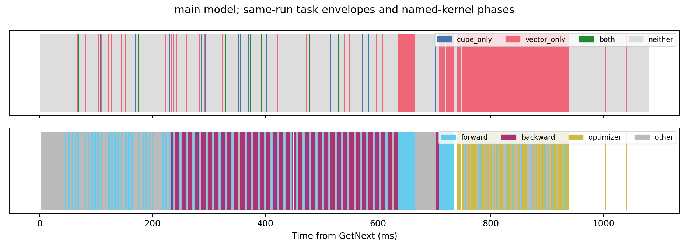
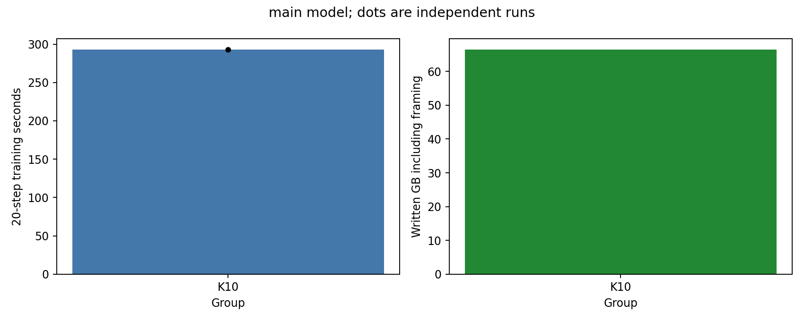

# 增量检查点第一阶段实验报告

当前状态：执行中，未完成项不计为通过。已完成 5/34 项覆盖。

实验固定 TP4、序列长度 128、micro-batch 1、FP32 权重/BF16 计算、AdamW、种子 42。各组从相同初始 FULL 恢复模型、优化器和随机状态，预热后连续运行 20 个优化器 step，每步保存。主模型 Qwen3-8B，辅模型 Qwen3-4B；两者同属 Qwen3，不据此声称跨模型家族泛化。

后续每配置默认一次有效运行，必要时最多两次。调度策略与初始 FULL 身份分离。失败尝试保留，不进入性能汇总。计时运行与媒体读回、影子 loss 验证运行分开。

## 五组 demo

| 模型 | 组 | 次数 | 20 步训练/s | 全部保存完成/s | 相对 B0 减速 | 实际写入/GB | 训练 loss 完全一致 |
|---|---|---:|---:|---:|---:|---:|---|
| main | B0 | 1 | 22.392 | 22.392 | 0.00% | 0.000 | True |
| main | B1 | 1 | 1387.319 | 1449.158 | 6095.69% | 661.271 | True |
| main | K10 | 1 | 292.710 | 300.700 | 1207.23% | 66.409 | True |
| main | K5 | 1 | 194.118 | 198.266 | 766.92% | 33.252 | True |

写入量包含帧元数据、对齐和提交页；初始化 FULL 单独保留，不混入每步增量比例。主要性能预算为 3%，同时展示 1% 和 5%。单次运行及有波动的基线不能提供精确置信区间。

## Vector/Cube 资源与时间窗口

主模型保留同一次采集的全部 19 个完整区间，以及排除 profiler 启动首区间后的 18 个区间。下表采用后者；阶段边界由内核命名识别。混合任务同时计入两种引擎的任务包络，不能解释为指令同时执行。

| 卡 | Cube-only | Vector-only | 两者任务包络重合 | 两者均无任务 | 更新后候选窗口/μs |
|---|---:|---:|---:|---:|---:|
| 0 | 1.716% | 26.079% | 0.849% | 71.356% | 0.0 |
| 1 | 1.720% | 26.190% | 0.851% | 71.238% | 0.0 |
| 2 | 1.720% | 26.168% | 0.850% | 71.262% | 0.0 |
| 3 | 1.716% | 26.084% | 0.849% | 71.351% | 0.0 |

未获取核数量占用及候选窗口内同步 HBM 带宽，明确标记为缺失。两者均无任务的区间可能包含通信、Host 调度或依赖等待，不作为可插入能力的证明。主模型同一步内尚未发现优化器更新结束后的 Cube-only 候选窗口。跨到下一步前向/反向、并阻止下一次更新直至检测完成，仍可能形成合法窗口；当前同步检测实现未验证这种重叠能力。

## 计算与搬运边界

保留 0.5×、1×、2× 的评分和评分加选择，以及两种粒度的打包和 D2H。真实训练注入放在优化器更新后的合法边界；当前为同步探针。固定循环缓冲、rank-local 选择不能替代真实全模型工作集和 TP 全局选择，其差异在原始记录中保留。standalone 图仅表示独立执行耗时。

## 保存状态保真度

| 组 | 校验 step 数 | 末步相对 L2 | 末步 loss 差 | 最大块年龄 |
|---|---:|---:|---:|---:|

影子状态由实际媒体读回的数据更新；逐块检查映射、覆盖范围及选中值，与设备参考状态交叉核验。误差按真实完整权重计算。未指定质量预算，故只报告误差及组间差异，不宣布质量通过。

## 成本与空间

实际链路分开记录稳定等待、评分、全局选择、打包/D2H、校验、存储提交及参考推进。阶段执行时间不直接相加作为训练关键路径；累计消融与总训练时间共同用于归因。

额外空间包括参考副本、输出缓冲、分数/索引、框架工作区及临时张量。框架峰值与整卡采样峰值分开报告，禁止将不同时间的峰值简单相加。完整训练状态仅做容量预算，不算已完成优化器增量实验。

## 待完成项

- main-K20
- auxiliary-B0
- auxiliary-B1
- auxiliary-K5
- auxiliary-K10
- auxiliary-K20
- fidelity-B1
- fidelity-K5
- fidelity-K10
- fidelity-K20
- p2-score-0.5
- p2-score-1.0
- p2-score-2.0
- p2-score_select-0.5
- p2-score_select-1.0
- p2-score_select-2.0
- p2-copy-0.5-262144
- p2-copy-0.5-4194304
- p2-copy-1.0-262144
- p2-copy-1.0-4194304
- p2-copy-2.0-262144
- p2-copy-2.0-4194304
- p5-ablation-1
- p5-ablation-2
- p5-ablation-3
- p5-ablation-4
- p5-ablation-5
- p5-ablation-6
- auxiliary-profile

## main 空间与工作量预算

权重 32.763 GB，可选择块 124976，小参数 1232896 字节；每次扫描约 65.523 GB。三档 Top-K 均需评分全量候选。

完整训练状态对应扫描量约 196.600 GB，仅为预算，未扩展实际检测范围。

## 图表

## 已测链路分段

| 组 | 评分/ms | 全局选择/ms | 打包流/ms | D2H 流/ms | payload 校验/ms | 上次提交等待/ms |
|---|---:|---:|---:|---:|---:|---:|
| main:B1 | 0.000 | 0.000 | 12.471 | 441.006 | 5502.367 | 60721.170 |
| main:K10 | 2976.039 | 1548.085 | 未采集 | 未采集 | 547.812 | 7326.757 |
| main:K5 | 2953.015 | 1512.176 | 17.098 | 20.486 | 276.592 | 3309.774 |

数值为 step/rank 观测的中位数，不将其作为独立实验重复。打包与 D2H 使用 ACL 流事件，包含可能的 Host 提交间隙；总捕获时间还包含分配和描述符构建。
