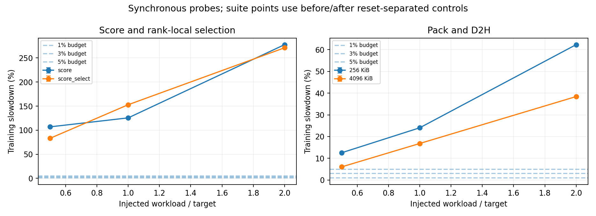
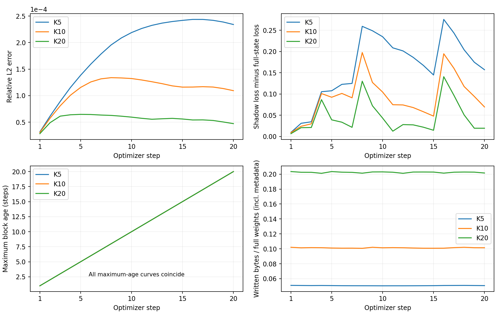
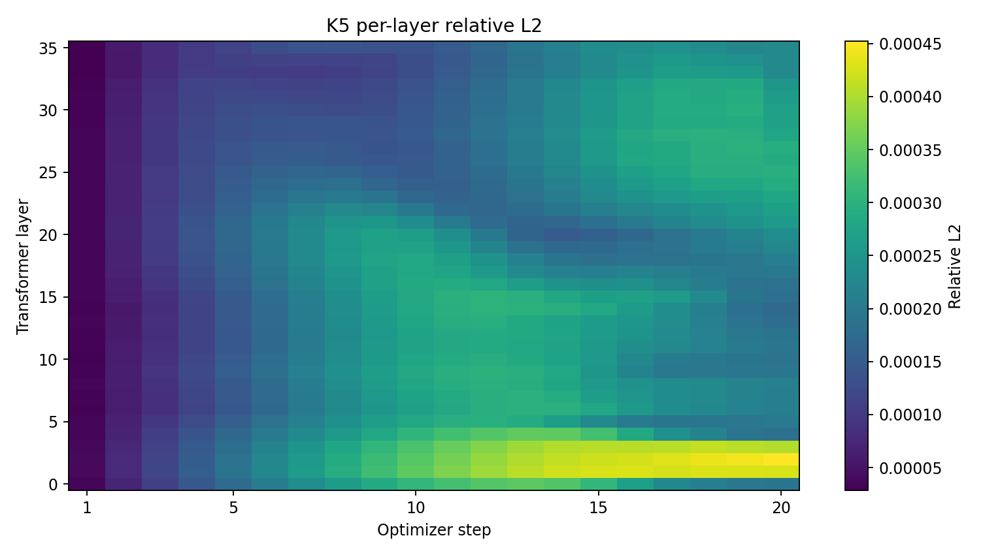
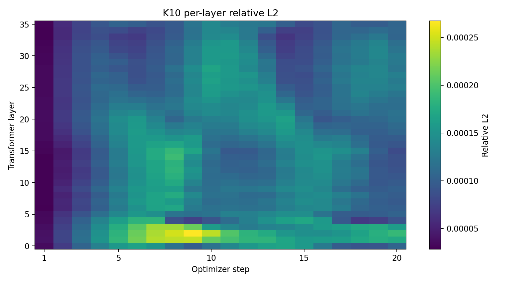
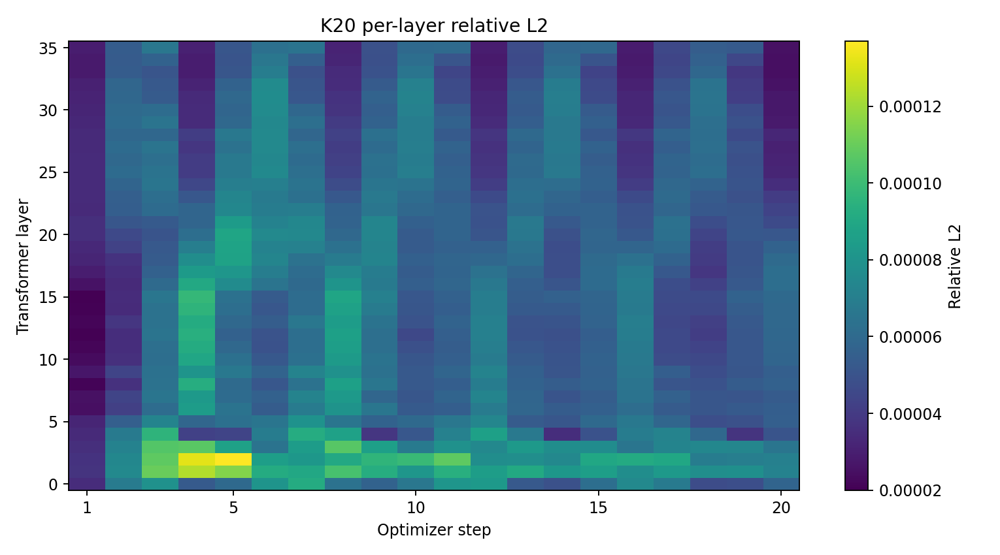
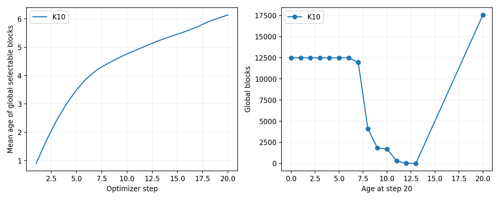
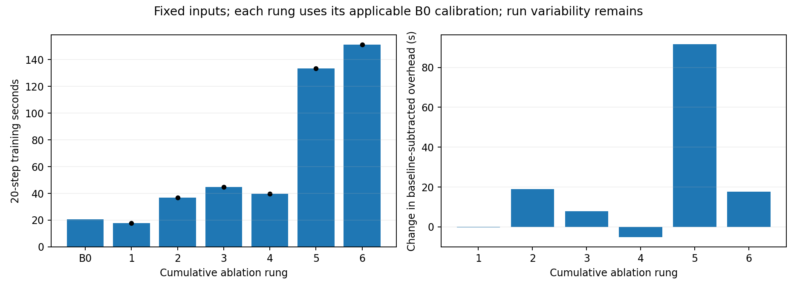
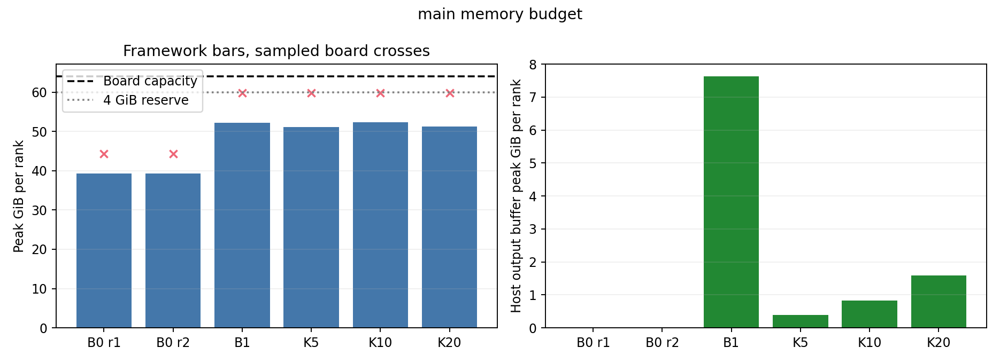
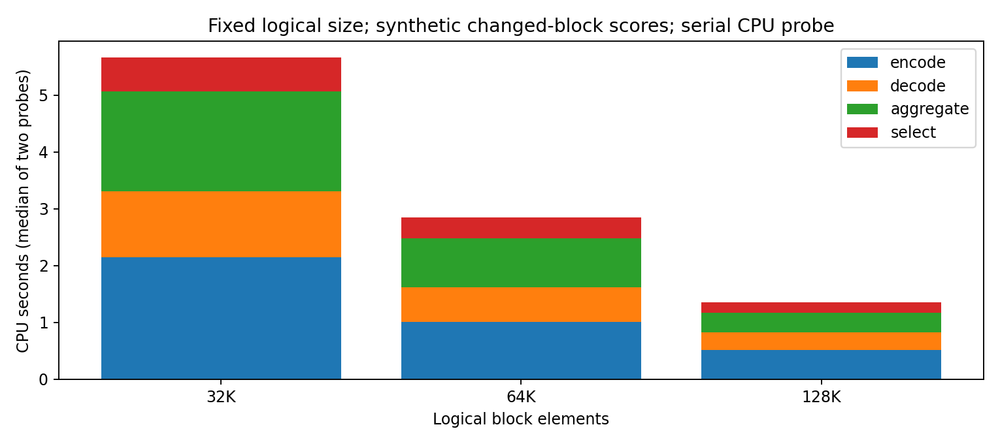

# 增量检查点第一阶段实验报告

当前状态：执行中，未完成项不计为通过。已完成 28/35 项覆盖。

实验固定 TP4、序列长度 128、micro-batch 1、FP32 权重/BF16 计算、AdamW、种子 42。各组从相同初始 FULL 恢复模型、优化器和随机状态，预热后连续运行 20 个优化器 step，每步保存。主模型 Qwen3-8B，辅模型 Qwen3-4B；两者同属 Qwen3，不据此声称跨模型家族泛化。

后续每配置默认一次有效运行，必要时最多两次。调度策略与初始 FULL 身份分离。失败尝试保留，不进入性能汇总。计时运行与媒体读回、影子 loss 验证运行分开。

## 五组 demo

| 模型 | 组 | 次数 | 20 步训练/s | 保存提交完成/s | 全部工作完成/s | 相对 B0 减速 | 实际写入/GB | 训练 loss 完全一致 |
|---|---|---:|---:|---:|---:|---:|---:|---|
| main | B0 | 2 | 20.506 | 20.506 | 20.506 | 0.00% | 0.000 | True |
| main | B1 | 1 | 1387.319 | 1449.158 | 1451.150 | 6665.29% | 661.271 | True |
| main | K10 | 1 | 292.710 | 300.700 | 311.173 | 1327.41% | 66.409 | True |
| main | K20 | 1 | 462.672 | 475.138 | 485.437 | 2156.23% | 132.636 | True |
| main | K5 | 1 | 194.118 | 198.266 | 213.042 | 846.62% | 33.252 | True |

main 的独立 B0 时间为 22.392, 18.621 秒；极差/中位数为 18.39%，是否达到 3% 时间稳定性门槛：False。

rank 0 训练回调分解：[{"run": "main-b0-rep0", "first_formal_step_seconds": 9.939812181, "remaining_19_step_seconds": 12.316924385000002}, {"run": "main-b0-rep1", "first_formal_step_seconds": 6.687196841, "remaining_19_step_seconds": 11.794522780999998}]。首步仍计入正式结果；回调分解不等同于跨卡全局总区间。

基线数值轨迹单独验证；时间稳定性不足不记为稳定通过。按缩减重复次数的执行要求保留该波动，以较慢基线计算保守减速下界，并对预算附近的探针使用套件前后校准及最多一次补跑。

写入量包含帧元数据、对齐和提交页；初始化 FULL 单独保留，不混入每步增量比例。主要性能预算为 3%，同时展示 1% 和 5%。单次运行及有波动的基线不能提供精确置信区间。

## Vector/Cube 资源与时间窗口

主模型保留同一次采集的全部 19 个完整区间，以及排除 profiler 启动首区间后的 18 个区间。下表采用后者；阶段边界由内核命名识别。混合任务同时计入两种引擎的任务包络，不能解释为指令同时执行。

| 卡 | Cube-only | Vector-only | 两者任务包络重合 | 两者均无任务 | 更新后候选窗口/μs |
|---|---:|---:|---:|---:|---:|
| 0 | 1.716% | 26.079% | 0.849% | 71.356% | 0.0 |
| 1 | 1.720% | 26.190% | 0.851% | 71.238% | 0.0 |
| 2 | 1.720% | 26.168% | 0.850% | 71.262% | 0.0 |
| 3 | 1.716% | 26.084% | 0.849% | 71.351% | 0.0 |

未获取核数量占用及候选窗口内同步 HBM 带宽，明确标记为缺失。两者均无任务的区间可能包含通信、Host 调度或依赖等待，不作为可插入能力的证明。主模型同一步内尚未发现优化器更新结束后的 Cube-only 候选窗口。跨到下一步前向/反向、并阻止下一次更新直至检测完成，仍可能形成合法窗口；当前同步检测实现未验证这种重叠能力。

## 计算与搬运边界

保留 0.5×、1×、2× 的评分和评分加选择，以及两种粒度的打包和 D2H。真实训练注入放在优化器更新后的合法边界；当前为同步探针。固定循环缓冲、rank-local 选择不能替代真实全模型工作集和 TP 全局选择，其差异在原始记录中保留。standalone 图仅表示独立执行耗时。

## 保存状态保真度

下表及影子误差、固定 batch loss 曲线对应主模型；辅模型按规划执行基础资源分析与五组 demo。

| 组 | 校验 step 数 | 末步相对 L2 | 峰值相对 L2 | 末步 loss 差 | 峰值绝对 loss 差 | 最大块年龄 |
|---|---:|---:|---:|---:|---:|---:|
| B1 | 20 | 0 | 0 | 0 | 0 | 0 |
| K10 | 20 | 0.00010939587 | 0.0001339007 | 0.069645479 | 0.19772068 | 20 |
| K20 | 20 | 4.7277996e-05 | 6.4732218e-05 | 0.019592419 | 0.14084913 | 20 |
| K5 | 20 | 0.00023406241 | 0.00024365486 | 0.15726605 | 0.27565689 | 20 |

K10 全局块平均年龄 6.142，未选中过的块 17571 个，其中末步评分为零的块 9477 个。年龄统计不按 TP 片段重复计数；年龄本身不等同于保存误差。

K20 全局块平均年龄 3.793，未选中过的块 13602 个，其中末步评分为零的块 9477 个。年龄统计不按 TP 片段重复计数；年龄本身不等同于保存误差。

K5 全局块平均年龄 10.096，未选中过的块 25850 个，其中末步评分为零的块 9477 个。年龄统计不按 TP 片段重复计数；年龄本身不等同于保存误差。

影子状态由实际媒体读回的数据更新；逐块检查映射、覆盖范围及选中值，与设备参考状态交叉核验。误差按真实完整权重计算。固定评估 batch 与训练固定样本相同，衡量状态数值差异，不作为留出集泛化质量指标。未指定质量预算，故只报告误差及组间差异，不宣布质量通过。

## 成本与空间

实际链路分开记录稳定等待、评分、全局选择、打包/D2H、校验、存储提交及参考推进。阶段执行时间不直接相加作为训练关键路径；累计消融与总训练时间共同用于归因。

额外空间包括参考副本、输出缓冲、分数/索引、框架工作区及临时张量。框架峰值与整卡采样峰值分开报告，禁止将不同时间的峰值简单相加。完整训练状态仅做容量预算，不算已完成优化器增量实验。

## 待完成项

- auxiliary-B0
- auxiliary-B1
- auxiliary-K5
- auxiliary-K10
- auxiliary-K20
- auxiliary-profile
- actual-checkpoint-profile

## 候选窗口分布

主模型稳定区间内共 9738 个 Cube-only 任务窗口，总计 360.094 ms，最长 381.500 μs。

长度分位数（μs）：{"0": 10.0, "0.25": 15.75, "0.5": 28.5, "0.75": 39.0, "0.95": 105.75, "1": 381.5}。

这些是任务包络窗口；核数量占用、窗口内带宽与精确计算指令重合均缺失，不能凭平均指标宣布辅助任务可插入。

稳定区间内，约 9.600 秒的 neither 时间与 HCCL 任务包络重合。HCCL 包络也可能包含等待；该重合不能解释为通信硬件持续满载。

PipeUtilization 导出的计数器（样本为任务，不是独立重复）：{"aic_mac_ratio": {"samples": 236060, "minimum": 0.0, "median": 0.0, "maximum": 0.802}, "aiv_vec_ratio": {"samples": 236060, "minimum": 0.0, "median": 0.04, "maximum": 0.681}, "cube_utilization(%)": {"samples": 236060, "minimum": 0.0, "median": 0.0, "maximum": 98.462}}。

HBM 导出表只有本次采集汇总：[{"Device_id": "0", "Metric": "Average", "Read(MB/s)": "24873.584", "Write(MB/s)": "22010.855"}]；没有候选窗口内带宽。

在该次完整采集的 Cube 任务包络内，存在 Vector 任务包络的时间比例为 33.096%。这是任务存在与否的时间统计；实际 Vector 占用核数分布缺失。

## main 空间与工作量预算

权重 32.763 GB，可选择块 124976，小参数 1232896 字节；每次扫描约 65.523 GB。三档 Top-K 均需评分全量候选。

完整训练状态对应扫描量约 196.600 GB，仅为预算，未扩展实际检测范围。

完整状态各卡实存大小（字节）：[{"model": 8191660032, "adam_m": 8191660032, "adam_v": 8191660032, "other": 612}, {"model": 8191660032, "adam_m": 8191660032, "adam_v": 8191660032, "other": 612}, {"model": 8191660032, "adam_m": 8191660032, "adam_v": 8191660032, "other": 612}, {"model": 8191660032, "adam_m": 8191660032, "adam_v": 8191660032, "other": 612}]。

完整状态输出近似量（包含常驻副本，元数据待定）：[{"ratio": 0.05, "payload_bytes": 4929053481.6, "metadata_bytes": null, "policy": "Physical state estimate including replicas; all local tensors below 64K elements saved fully. Global TP blocks and selected tails require mapping before extension."}, {"ratio": 0.1, "payload_bytes": 9843309763.2, "metadata_bytes": null, "policy": "Physical state estimate including replicas; all local tensors below 64K elements saved fully. Global TP blocks and selected tails require mapping before extension."}, {"ratio": 0.2, "payload_bytes": 19671822326.4, "metadata_bytes": null, "policy": "Physical state estimate including replicas; all local tensors below 64K elements saved fully. Global TP blocks and selected tails require mapping before extension."}]。

按实际 TP 几何推导的单个活动评分输出缓冲（各卡，字节）：[16384, 49152, 49152, 16384]。

全局 FP64 分数的紧凑表示为 999808 字节；选择及描述符索引位于 Host，当前实现不分配设备选择索引。Python 对象、JSON 元数据及编译缓存另计；该单输出尺寸不能替代实测 workspace 峰值。

## 图表

## 已测链路分段

| 组 | 评分/ms | 全局选择/ms | 打包流/ms | D2H 流/ms | payload 校验/ms | 上次提交等待/ms |
|---|---:|---:|---:|---:|---:|---:|
| main:B1 | 0.000 | 0.000 | 12.471 | 441.006 | 5502.367 | 60721.170 |
| main:K10 | 2976.039 | 1548.085 | 未采集 | 未采集 | 547.812 | 7326.757 |
| main:K20 | 2974.633 | 1608.098 | 16.377 | 78.870 | 1095.563 | 13891.212 |
| main:K5 | 2953.015 | 1512.176 | 17.098 | 20.486 | 276.592 | 3309.774 |

数值为 step/rank 观测的中位数，不将其作为独立实验重复。打包与 D2H 使用 ACL 流事件，包含可能的 Host 提交间隙；总捕获时间还包含分配和描述符构建。

## 结论与边界

资源可行性按 3% 训练减速预算判断，另列 1% 和 5% 参考线。当前实现同步完成检测与捕获，只把之后的保存与下一步训练重叠；结果限定于这条实现路径。

恢复 FULL 后首个正式 step 仍有数据就绪及框架开销；本轮未完全消除这部分首步效应，预热隔离并不完整。全部 20 步总时间照实保留，不从比较结果中扣除。该限制尤其影响 3% 附近的判断。B0 的两次运行用于展示基线变化范围；变化范围不是统计置信区间。

main：已测 Top-K 中，即使用较慢的 B0 作为分母，最小减速仍为 766.92%。这些配置未满足 3% 资源预算。

状态保真度依据实际保存状态的权重误差和固定 batch loss 差异判断。没有预设任务质量预算，因此不把误差曲线标记为质量通过，也不推断恢复续训的收敛性。

## 各组空间占用与剩余容量

| 模型:组 | 参考副本/GiB | 独立快照/GiB | HBM 输出/GiB | Host 输出峰值/GiB | 框架额外峰值/GiB | 整卡采样最少剩余/GiB |
|---|---:|---:|---:|---:|---:|---:|
| main:B0 | 0.000 | 0.000 | 0.000 | 0.000 | 0.000 | 19.706 |
| main:B0 | 0.000 | 0.000 | 0.000 | 0.000 | 0.000 | 19.706 |
| main:B1 | 7.629 | 0.000 | 0.250 | 7.629 | 12.840 | 4.198 |
| main:K10 | 7.629 | 0.000 | 0.250 | 0.824 | 13.023 | 4.194 |
| main:K20 | 7.629 | 0.000 | 0.250 | 1.592 | 11.942 | 4.195 |
| main:K5 | 7.629 | 0.000 | 0.250 | 0.399 | 11.786 | 4.194 |

每列取各卡对应量的最大值，剩余空间取最小值；不同列不要求来自同一卡或同一时刻，不将列值相加当作总峰值。框架额外峰值相对同模型 B0 的各卡最小峰值计算。整卡轮询可能漏掉短暂峰值，图中另列 64 GiB 容量与 4 GiB 预留线。

评分按参数生成差分和平方中间结果，没有生成整个模型大小的单一差分张量。主模型最大单参数差分约 0.580 GiB；未假设编译器将减法、平方完全融合。评分/索引的逻辑表示与框架 workspace 不等同，workspace 无法单独归属，保留为缺失并纳入实测总峰值。

main 直接把现有权重参考扩展为完整训练状态参考，沿用现有 workspace 假设，投影峰值为 65.405～67.836 GiB/卡。这是当前实现的扩展预算，不是优化后的理论最低内存需求。

## main：Top 10% 的前三项直接成本

| 阶段 | 每步/卡中位耗时/ms | rank 0 的 20 步累计/s | 与下一训练 step 重叠 | 降低 Top 比例的影响 |
|---|---:|---:|---|---|
| 等待上次保存并推进参考 | 7326.757 | 140.509 | 等待发生在下一次检测前；后台保存此前可能与训练重叠 | 通常减少输出、传输和参考推进，但不消除扫描 |
| 评分与片段汇总 | 2976.039 | 57.983 | 当前同步回调内为零 | 三档均扫描全部候选，不能同比降低 |
| 全局 Top-K 选择 | 1548.085 | 33.848 | 当前同步回调内为零 | 候选数不变，元数据和全局排序基本保留 |

rank 0 的检查点请求生命周期累计 416.361 秒，与训练 step 回调区间交集 12.101 秒。请求触发包含等待先前请求的时间，因此生命周期可以重叠，不能累加为关键路径或解释为硬件并行率。

表中累计值是该实现阻止后续训练进入的回调耗时，不是将某阶段删去后训练一定减少的反事实估计。后台传输、通信及 Host 调度相互影响；累计消融给出固定输入下的增量证据，实际路径 profiler 给出同一时钟的活动证据。

Owner 端各段中位耗时（ms）：{"request_ready": 8024.245, "prefix_write": 48.455, "payload_receive_and_write": 4929.397, "flush_commit_descriptor_encoding": 1053.601}。接收与写入包含 socket、校验、数据复制和原始存储；提交段包含描述符编码，不直接归因于 NVMe。

## 候选块数定向探针

固定逻辑元素总量，采用实际 64K 块分数；32K 分数由父块等分、128K 分数由相邻块合并。该 CPU 探针测元数据与全局选择成本，不测改变块大小后的真实评分、训练减速或保真度。四卡输入在单个进程内依次编码，不能把此耗时直接等同于分布式训练关键路径。

## Host 分数汇总定向探针

使用 rank 0 的真实 TP 几何，共 316940 个片段、1267760 字节固定分数输入。两次逐片段循环汇总中位数 2.9274 秒，向量化汇总 0.0502 秒，完整输出逐项相等且摘要相同。

这解释了实际评分阶段中 Host 汇总耗时的来源。探针不改变正式计时算法，其速度差不能直接当作训练加速；端到端收益仍需后续实现后测量。

## 训练内注入与累计消融实测

| 配置 | 20 步训练/s | 校准 B0/s | 减速 | 基线变化对应范围 | 辅助回调中位/ms |
|---|---:|---:|---:|---:|---:|
| ablation-5 | 133.486 | 20.506 | 550.95% | 496.14%～616.85% | 5453.155 |
| ablation-6 | 151.066 | 20.506 | 636.68% | 574.65%～711.26% | 5638.890 |
| copy-0.5-262144 | 19.841 | 17.629 | 12.54% | 4.37%～22.11% | 85.147 |
| copy-0.5-4194304 | 18.695 | 17.629 | 6.04% | -1.66%～15.06% | 44.154 |
| copy-1.0-262144 | 21.868 | 17.629 | 24.05% | 15.03%～34.59% | 178.428 |
| copy-1.0-4194304 | 20.595 | 17.629 | 16.82% | 8.33%～26.76% | 103.584 |
| copy-2.0-262144 | 28.612 | 17.629 | 62.30% | 50.50%～76.10% | 375.476 |
| copy-2.0-4194304 | 24.401 | 17.629 | 38.41% | 28.35%～50.18% | 252.056 |
| score-0.5 | 36.480 | 17.629 | 106.92% | 91.89%～124.52% | 557.173 |
| score-1.0 | 39.768 | 17.629 | 125.58% | 109.18%～144.76% | 927.560 |
| score-2.0 | 66.574 | 17.629 | 277.63% | 250.18%～309.74% | 2013.502 |
| score_select-0.5 | 32.279 | 17.629 | 83.09% | 69.79%～98.66% | 604.058 |
| score_select-1.0 | 44.581 | 17.629 | 152.88% | 134.50%～174.38% | 1136.310 |
| score_select-2.0 | 65.427 | 17.629 | 271.12% | 244.15%～302.68% | 1952.712 |
| ablation-1 | 17.901 | 18.191 | -1.60% | -10.24%～8.88% | 0.074 |
| ablation-2 | 36.851 | 18.191 | 102.57% | 84.78%～124.15% | 907.769 |
| ablation-3 | 44.784 | 18.191 | 146.18% | 124.57%～172.41% | 1190.530 |
| ablation-4 | 39.587 | 18.191 | 117.61% | 98.50%～140.79% | 1034.944 |

| 配置 | 评分/ms | 选择及结果处理/ms | 打包/ms | D2H/ms |
|---|---:|---:|---:|---:|
| ablation-5 | 994.312 | 0.601 | 1.955 | 47.456 |
| ablation-6 | 995.492 | 0.503 | 1.860 | 47.640 |
| copy-0.5-262144 | — | — | 29.548 | 55.804 |
| copy-0.5-4194304 | — | — | 1.997 | 41.688 |
| copy-1.0-262144 | — | — | 52.839 | 112.205 |
| copy-1.0-4194304 | — | — | 3.742 | 98.320 |
| copy-2.0-262144 | — | — | 102.777 | 238.768 |
| copy-2.0-4194304 | — | — | 7.095 | 221.392 |
| score-0.5 | 556.847 | 0.208 | — | — |
| score-1.0 | 927.138 | 0.232 | — | — |
| score-2.0 | 2012.733 | 0.349 | — | — |
| score_select-0.5 | 603.646 | 0.327 | — | — |
| score_select-1.0 | 1135.594 | 0.473 | — | — |
| score_select-2.0 | 1951.851 | 0.751 | — | — |
| ablation-1 | — | — | — | — |
| ablation-2 | 907.478 | 0.204 | — | — |
| ablation-3 | 1189.833 | 0.415 | — | — |
| ablation-4 | 1031.583 | 0.421 | 1.793 | 0.000 |

阶段和辅助回调中位数取四卡的 20 步观测，描述分段执行耗时，不作为 80 次独立重复，也不直接相加为全局训练减速。

suite 在同一已编译进程中分隔配置，每个配置开始前恢复共同 FULL，并重置计时与峰值统计；每个区间仍包含连续 20 个优化器 step，逐步 loss 必须与套件内 B0 完全一致。前后 B0 用于校准环境漂移。套件中图及分配器缓存可能跨区间保留，峰值不是每配置独立进程的峰值。它们不是多次独立进程重复。

同步注入的辅助回调时间全部位于下一步训练之前；不存在尚未完成的评分或搬运任务。评分的设备输出及搬运输出被实际消费。未采集各注入点的同步 HBM 带宽，因此带宽变化标记缺失，不能用理论扫描量冒充带宽实测。 探针的 selection_ns 包含分数拼接与结果消费；纯 score 组未执行 Top-K，只有 score_select 及对应消融阶段执行选择。

## 固定输入累计消融的关键路径差值

| 累计阶段 | 有效运行数 | 20 步校准后额外时间/s | 相邻阶段变化/s |
|---|---:|---:|---:|
| 1 | 1 | -0.291 | -0.291 |
| 2 | 1 | 18.659 | 18.950 |
| 3 | 1 | 26.593 | 7.934 |
| 4 | 1 | 21.396 | -5.197 |
| 5 | 1 | 112.979 | 91.584 |
| 6 | 1 | 130.560 | 17.581 |

阶段 1～6 分别为最小依赖、评分、选择、打包、搬运保存、参考推进。差值由固定输入下的累计配置对照获得；各配置有环境波动，阶段 5～6 使用独立进程 B0，因此负差值不能解释为该阶段必然加速。固定循环输入没有真实 TP 片段汇总及大规模块描述符成本。 相邻组差值还包含评分执行及训练自身的波动，不能全部归给新增运算；分段实测用于交叉检查。

## 大模型理论预算

Qwen3.5-27B-original 未执行训练。按本地存储张量总数 27,781,427,952 和假设的 FP32 参数、Adam、梯度估算，TP4 每卡仅这三项就需 103.494 GiB，尚未包括激活及检查点参考。该模型家族也超出现有 Qwen3 入口的验收范围。

权重全量评分扫描约 222.251 GB；权重加 Adam 扫描约 666.754 GB。仅作为容量与流量预算。

## 下一阶段优化优先级

依据实际链路优先减少 Host 保存路径的等待、串行校验和大体积描述符处理；接着将逐 TP 片段的 Python 评分汇总改为批量归约，并减少全局选择的 JSON 协调开销。打包、D2H 的设备流耗时需与这些 Host 成本分开，不能把整段保存时间都归因于 NVMe。待这些成本降低，再验证跨下一步前向的合法异步扫描。当前结果不支持直接扩展到完整优化器状态增量。

## 执行源码追溯

各次运行均记录开始和结束的源码摘要，运行中源码变化会使验收失败。`source-publication-index.json` 进一步将摘要匹配到结果分支历史中的源码版本，原生扩展二进制另存摘要。

尚未在已发布源码历史中找到完全匹配版本的早期运行：main-k10-rep0-attempt2。这些运行保留了原始源摘要和测量记录，但不能声称已完整归档其精确源码版本。

计时与独立媒体验证运行交叉检查：main-b1-rep0：80 份四卡载荷/描述符/字节数比对，pass, main-k10-rep0-attempt2：80 份四卡载荷/描述符/字节数比对，pass, main-k20-rep0：80 份四卡载荷/描述符/字节数比对，pass, main-k5-rep0：80 份四卡载荷/描述符/字节数比对，pass。该比对确认本轮轨迹的保存内容及布局一致，不代替缺失的历史源码归档，也不声称旧原始设备数据仍被保留。
